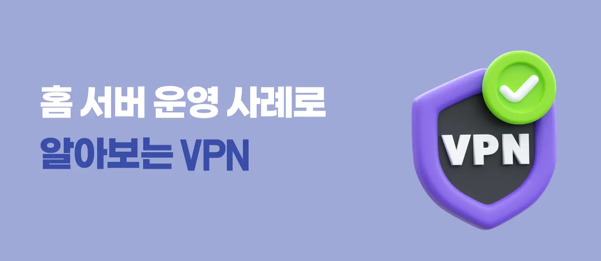
## 1 ) 외부에서 집에 있는 컴퓨터에 접속할 일이 생겼다

---

부트캠프 실습 환경을 구성해둔 데스크톱이 맥북보다 빠르고 편했다. 문제는 밖에서도 이 데스크톱으로 실습하고 싶었다는 것이다. 집에는 그 외에도 사용 중인 서버가 몇 대 더 있었다.

홈 네트워크는 다음과 같이 구성되어 있었다.

```text
외부의 맥북
    │
    │ 인터넷
    ▼
ipTIME 공유기
    │
    ├── Server 1
    ├── Server 2
    └── Server 3
```

처음에는 Windows RDP, Chrome Remote Desktop, VNC, SSH와 SFTP 등 여러 방법을 사용했다. 직접 접속해야 하는 서비스는 공유기에서 포트 포워딩도 설정했다. 외부 포트를 각 서버의 서비스 포트와 연결해두는 방식이다. 참고로 SFTP는 SSH를 기반으로 동작하므로 보통 SSH와 같은 연결 포트를 사용한다.

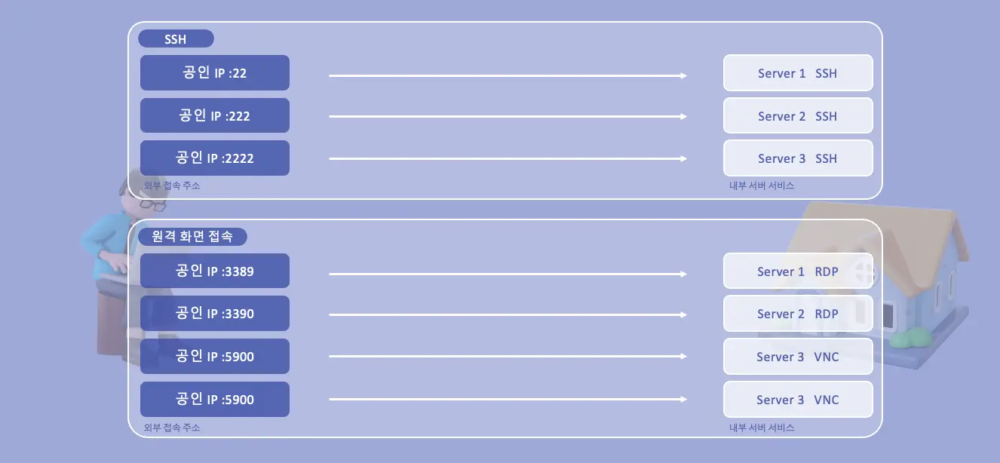

그런데 사용하다 보니 불편한 점이 생겼다.

1. SSH, RDP, VNC처럼 필요한 서비스마다 포트 포워딩을 설정해야 했다.

2. 외부에 포트를 열어둔 몇몇 서버에는 알 수 없는 IP의 접속 시도 로그가 남았다.

3. 여러 서버가 같은 서비스 포트를 사용하면 외부 포트를 다르게 정하고 기억해야 했다.

그러던 중 ipTIME 공유기에서 L2TP VPN 서버를 만들 수 있다는 것을 알게 됐다. 원래 나만 접속할 용도였기 때문에 기존 포트 포워딩은 전부 비활성화하고, 외부에서는 먼저 VPN에 연결한 뒤 각 서버의 사설 IP로 접속하도록 바꿨다.

그럼 VPN에 연결했을 뿐인데, 밖에 있는 맥북에서 어떻게 집 안의 사설 IP로 접속할 수 있었을까? 여러 VPN 형태 중 내가 사용한 **Remote Access VPN**을 기준으로 알아보자.

## 2 ) 사설 IP는 왜 밖에서 바로 사용할 수 없을까?

---

먼저 VPN을 연결하기 전부터 생각해보자. 홈서버가 `192.168.0.10`이라는 주소를 사용한다고 가정하겠다.


`192.168.0.10`은 집 안에서만 사용하는 사설 IP다. 인터넷에서는 이 주소만 보고 어느 집에 있는 서버인지 찾아갈 수 없다.

학교에 비유하면 이렇다.

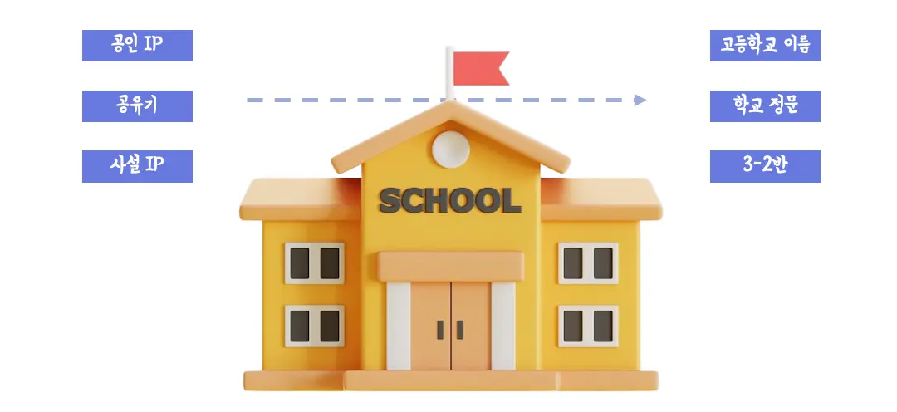

학교 밖에서는 학교 주소를 알아야 그 학교까지 찾아갈 수 있다. `3학년 2반`이라는 교실 번호만 가지고는 어느 학교인지 알 수 없다. 사설 IP도 마찬가지다. `192.168.0.10`은 어느 네트워크에 속한 주소인지 알아야 의미가 있다.

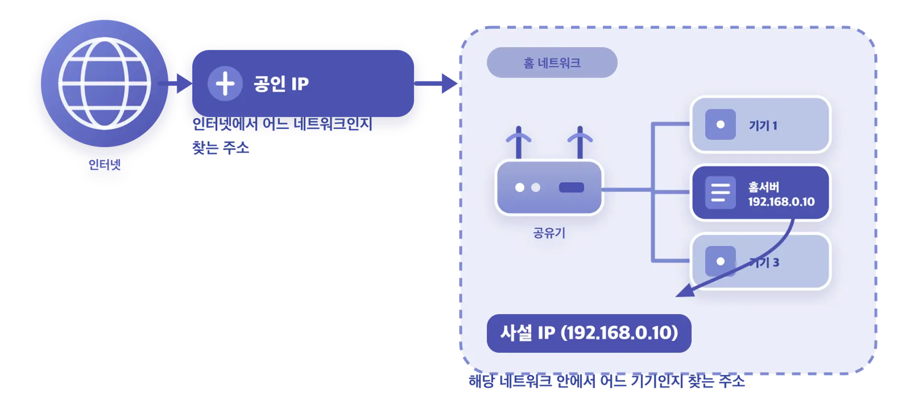

```text
공인 IP
→ 인터넷에서 어느 네트워크인지 찾는 주소

사설 IP (192.168.0.10)
→ 해당 네트워크 안에서 어느 기기인지 찾는 주소
```


## 3 ) VPN을 연결하면 무엇이 달라질까?

---

VPN을 학교 참관 수업에 참석하려는 학부모의 출입증이라고 생각해보자. 출입증을 확인받으면 학교 안으로 들어가 필요한 교실까지 갈 수 있다.

VPN도 비슷하다. VPN에 연결했다고 맥북이 실제로 집 안에 들어가는 것은 아니다. 대신 맥북과 집 공유기 사이에 홈 네트워크용 패킷을 보낼 수 있는 전용 경로가 생긴다. 그래서 밖에서도 집 안의 사설 IP를 목적지로 사용할 수 있다.

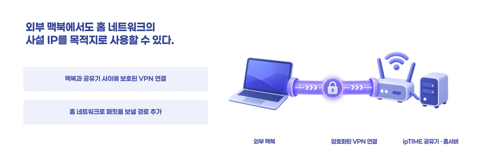

실제 연결을 기준으로 보면 다음 네 단계다.

![[36.webp]]

1. 맥북이 인터넷을 통해 ipTIME VPN 서버에 접속한다.

2. 공유기가 VPN 비밀키와 사용자 계정을 확인한다.

3. 맥북과 공유기 사이에 암호화로 보호된 터널이 만들어진다.

4. 맥북에 홈 네트워크로 패킷을 보낼 경로가 추가된다.

여기서 터널과 경로라는 말이 조금 막연하게 느껴질 수 있다. 뒤에서 패킷이 실제로 어떻게 이동하는지 하나씩 살펴보겠다.

## 4 ) 포트 포워딩과는 뭐가 다를까?

---

먼저 포트 포워딩부터 똑같이 학교와 비교해보자. 포트 포워딩은 외부의 특정 포트로 들어온 요청을 내부 서버의 포트로 전달한다.

```text
외부 사용자
    │
    │ 공인 IP:2222
    ▼
공유기
    │
    │ 192.168.0.10:22
    ▼
SSH 서버
```

학교로 치면 특정 교실의 창문에 사다리를 놓아 외부에서 바로 들어올 수 있게 만드는 것과 비슷하다. SSH를 위한 창문, 웹 서버를 위한 창문, DB를 위한 창문이 따로 있는 셈이다. 서비스가 늘어날수록 사다리를 놓고 관리할 창문도 늘어난다.

VPN은 교실마다 외부 출입구를 만들지 않는다. VPN이라는 정문 하나로 들어온 뒤, 신원을 확인받은 사람이 필요한 교실로 이동한다.

| 포트 포워딩 | VPN |
| --- | --- |
| 서비스별 외부 포트를 공개한다 | VPN 진입점을 공개한다 |
| 공인 IP와 외부 포트로 접근한다 | VPN 연결 후 사설 IP로 접근한다 |
| 공개한 서비스마다 공격에 대비해야 한다 | VPN 인증을 먼저 통과해야 한다 |

그렇다면 포트가 하나도 열리지 않은 것일까? 그렇지는 않다. 홈서버의 SSH, RDP, VNC 포트를 각각 공개하지 않을 뿐, ipTIME의 VPN 서버는 외부 연결을 받는 진입점으로 남아 있다.

## 5 ) VPN 프로토콜은 뭘까?

---

VPN이라고 해서 모두 같은 방법으로 연결되는 것은 아니다. 연결을 시작하는 방법, 사용자를 확인하는 방법, 패킷을 감싸고 보호하는 방법이 서로 다를 수 있다. 이렇게 통신할 때 지켜야 하는 약속을 **프로토콜(Protocol)**이라고 한다.

택배를 보내는 방법에도 일반 택배와 등기가 있듯이 VPN에도 데이터를 전달하고 보호하는 여러 방식이 있다고 생각하면 된다.

대표적인 VPN 프로토콜에는 다음과 같은 것들이 있다.

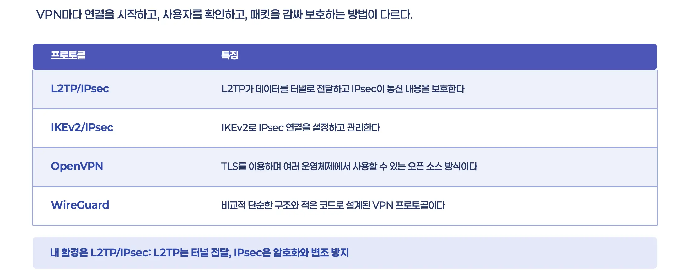

내가 ipTIME 공유기에서 사용하는 방식은 **L2TP/IPsec**이다. 이름에 두 기술이 함께 들어가는 이유는 맡은 일이 다르기 때문이다.

```text
L2TP
→ PPP 데이터를 터널로 전달한다

IPsec
→ L2TP 통신을 암호화하고 변조를 방지한다
```

L2TP 자체가 데이터를 암호화하는 것은 아니다. 지금 사용하는 환경에서는 IPsec이 L2TP 통신을 보호한다. 각 프로토콜의 패킷 구조나 암호화 알고리즘까지 들어가면 내용이 너무 길어지므로, 여기서는 VPN 연결을 만드는 방법이 여러 가지라는 것만 알고 넘어가겠다.

## 6 ) 암호화된 통로, 터널은 뭘까?

---

앞에서 맥북과 공유기 사이에 암호화로 보호된 터널이 생긴다고 했다. 여기서 터널은 땅을 뚫어 만든 실제 통로가 아니다. **원래 패킷을 다른 패킷 안에 넣어 두 지점 사이로 운반하는 방식**을 말한다.

맥북이 홈서버에 SSH 요청을 보낸다고 가정하자.

```text
원래 패킷

출발지: 맥북의 VPN IP
목적지: 홈서버 192.168.0.10
내용: SSH 요청
```

목적지인 `192.168.0.10`은 사설 IP라서 인터넷이 이 패킷을 그대로 홈서버까지 배달할 수 없다. 그래서 VPN은 원래 패킷을 집 공유기까지 전달할 수 있는 외부 패킷 안에 넣는다.

```text
외부 패킷
├── 목적지: 집 공유기의 공인 IP
└── IPsec으로 보호된 내용
    └── 원래 패킷
        ├── 목적지: 홈서버 192.168.0.10
        └── 내용: SSH 요청
```

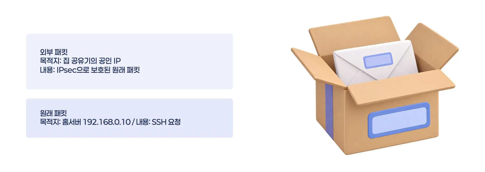

쉽게 말하면 편지를 택배 상자에 넣어 보내는 것과 비슷하다. 내부 패킷은 집 안에서 사용할 편지이고, 외부 패킷은 그 편지를 집까지 운반할 택배 상자다.

```text
택배 상자의 주소: 집 공유기의 공인 IP
상자 안 편지의 주소: 홈서버 192.168.0.10
```

택배 기사 역할을 하는 인터넷은 상자 바깥에 적힌 주소를 보고 집 공유기까지 배달하면 된다. 중간 네트워크에서는 외부 IP 헤더나 패킷 크기 같은 정보는 볼 수 있지만, IPsec으로 보호된 내부 내용은 직접 읽기 어렵다.

공유기는 자신에게 도착한 외부 패킷을 검증하고 복호화한 뒤, 그 안에서 원래 패킷을 꺼낸다. 편지에 적힌 목적지 `192.168.0.10`을 확인하고 홈서버로 전달하는 것이다.

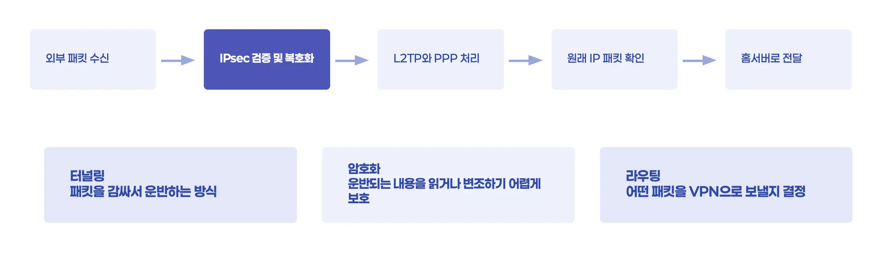

내가 사용하는 L2TP/IPsec에서는 각 기술이 맡은 일이 다르다.

| 구성 요소 | 역할 |
| --- | --- |
| L2TP | PPP 데이터를 터널로 전달한다 |
| IPsec | L2TP 통신을 암호화하고 변조를 방지한다 |
| 라우팅 | 어떤 패킷을 VPN으로 보낼지 결정한다 |

여기서 터널링과 암호화는 같은 개념이 아니다. 터널링은 패킷을 감싸서 운반하는 방식이고, 암호화는 그 내용을 보호하는 방식이다. L2TP/IPsec VPN은 이 둘을 함께 사용한다.

## 7 ) “홈 네트워크로 가는 경로가 추가된다”는 건 무슨 뜻일까?

---

VPN 터널이 만들어졌다고 모든 패킷이 자동으로 터널에 들어가는 것은 아니다. 맥북은 패킷을 보낼 때마다 목적지를 보고 어느 길로 보낼지 먼저 결정한다.

이때 사용하는 것이 **라우팅 테이블(Routing Table)**이다. 목적지에 따라 어느 길을 이용할지 적어둔 길 안내표라고 보면 된다.

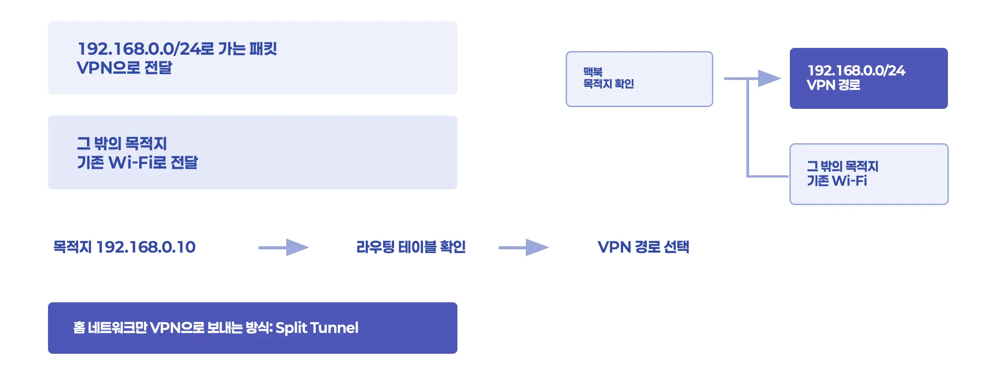

예를 들어 VPN에 연결한 뒤 다음과 같은 경로가 추가될 수 있다.

```text
192.168.0.0/24로 가는 패킷 → VPN으로 전달
그 밖의 목적지로 가는 패킷 → 기존 Wi-Fi로 전달
```

맥북에서 홈서버 `192.168.0.10`으로 SSH 접속을 시도해보자. 이 주소는 `192.168.0.0/24` 홈 네트워크에 포함되므로 맥북은 VPN 경로를 선택한다.

```text
목적지 192.168.0.10
    ↓
라우팅 테이블 확인
    ↓
VPN 경로 선택
    ↓
터널로 집 공유기까지 전달
```

이처럼 홈 네트워크로 가는 트래픽만 VPN으로 보내고, 일반 인터넷 트래픽은 기존 네트워크로 보내는 방식을 **Split Tunnel**이라고 한다.

```text
맥북
├── 홈 네트워크 → VPN → 집 공유기 → 홈서버
└── 일반 인터넷 → 기존 Wi-Fi → 인터넷 서비스
```

반대로 홈 네트워크뿐 아니라 일반 인터넷 트래픽까지 전부 VPN으로 보내는 방식도 있다. 이것을 **Full Tunnel**이라고 한다.

```text
맥북
├── 홈서버 ─┐
├── 검색 ───┼──→ VPN → 집 공유기
└── 동영상 ─┘
```

내 환경이 어느 방식으로 동작하는지는 VPN 설정과 라우팅 테이블을 직접 확인해야 한다. macOS에서는 다음 명령으로 VPN 연결 전후의 경로를 비교할 수 있다.

```bash
netstat -rn -f inet
route -n get default
route -n get 192.168.0.10
```

## 8 ) 지금까지의 과정을 한 번에 보면

---

맥북에서 홈서버 `192.168.0.10`으로 SSH 패킷을 보낸다면 다음 순서로 처리된다.

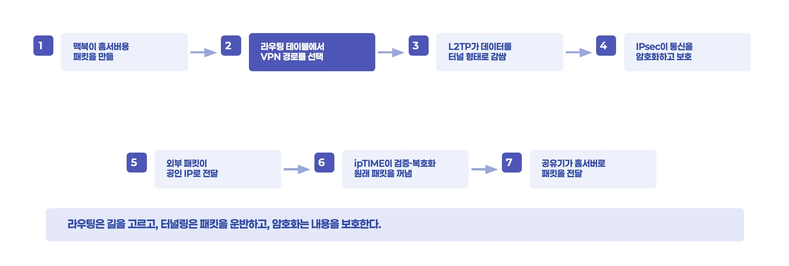

```text
① 맥북이 홈서버를 목적지로 하는 패킷을 만든다.

② 라우팅 테이블에서 홈 네트워크용 VPN 경로를 선택한다.

③ L2TP가 데이터를 터널로 전달할 형태로 감싼다.

④ IPsec이 L2TP 통신을 암호화하고 보호한다.

⑤ 외부 패킷이 인터넷을 통해 집 공유기의 공인 IP로 전달된다.

⑥ ipTIME이 패킷을 검증하고 복호화한 뒤 원래 패킷을 꺼낸다.

⑦ 공유기가 원래 목적지인 홈서버로 패킷을 전달한다.
```

헷갈리기 쉬운 세 가지 역할만 다시 구분하면 된다.

- **라우팅**은 어떤 패킷을 VPN으로 보낼지 결정한다.

- **터널링**은 선택된 패킷을 다른 패킷 안에 넣어 공유기까지 운반한다.

- **암호화**는 운반되는 내용을 외부에서 읽거나 변조하기 어렵게 보호한다.

## 9 ) VPN은 실제로 어디에 쓰일까?

---

지금까지는 내가 외부 맥북에서 홈서버에 접속한 과정을 기준으로 살펴봤다. 이것은 외부에 있는 사용자 한 명이 사설 네트워크에 접속하는 **Remote Access VPN**이다.

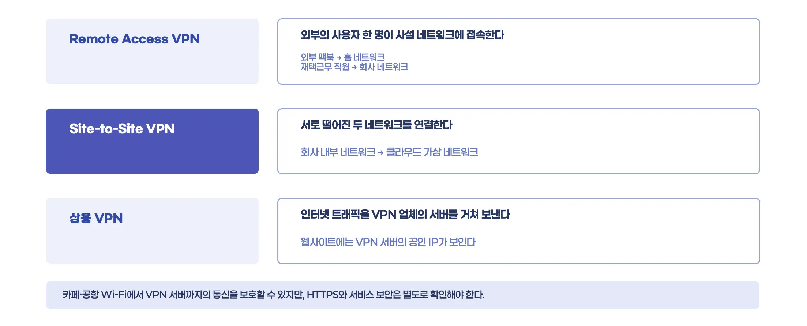

회사에서 재택근무를 하는 직원이 사내 서버나 업무 시스템에 접속할 때도 같은 형태를 사용할 수 있다. 집 대신 회사 네트워크에 접속한다는 점만 다르다.

반대로 사용자 한 명이 아니라 서로 떨어진 두 네트워크를 연결할 수도 있다. 본사와 지사 네트워크를 연결하거나, 회사 내부 네트워크와 클라우드의 가상 네트워크를 연결하는 **Site-to-Site VPN**이 여기에 해당한다.

```text
회사 내부 네트워크
        │
        │ Site-to-Site VPN
        ▼
클라우드의 가상 네트워크
```

이 경우에는 각 사용자가 VPN에 접속하기보다 양쪽 네트워크의 VPN 장비가 연결을 유지한다. 사용자는 목적지에 맞는 경로만 설정되어 있으면 반대편 네트워크의 서버와 통신할 수 있다.

일반 사용자가 사용하는 상용 VPN 서비스는 인터넷 트래픽을 VPN 업체의 서버를 거쳐 보내는 경우가 많다.

```text
사용자
   │
   │ VPN 터널
   ▼
VPN 업체의 서버
   │
   ▼
인터넷 서비스
```

웹사이트에서는 사용자의 원래 공인 IP 대신 VPN 서버의 공인 IP에서 요청이 온 것으로 보게 된다. 그래서 VPN이 흔히 IP를 바꾸거나 숨기는 도구로 소개되기도 한다. 하지만 VPN의 기본 동작은 떨어져 있는 두 지점 사이에 보호된 통신 경로를 만드는 것이다. 트래픽이 VPN 서버를 거쳐 나가면서 외부에 VPN 서버의 IP가 보이는 것이다.

카페나 공항처럼 내가 관리하지 않는 Wi-Fi에서 기기와 VPN 서버 사이의 통신을 보호하려고 사용할 수도 있다. 다만 VPN 서버를 지난 뒤의 구간까지 전부 VPN이 보호하는 것은 아니다. 접속한 웹사이트가 HTTPS를 사용하는지, 서비스 자체가 안전한지는 따로 확인해야 한다.

정리하면 내가 사용한 홈서버 VPN, 회사의 원격 접속 VPN, 네트워크를 서로 연결하는 VPN과 상용 VPN은 목적은 달라도 모두 떨어진 두 지점 사이에서 패킷을 전달한다는 공통점이 있다.

## 10 ) 그럼 VPN만 사용하면 안전할까?

---

VPN을 사용하면 홈서버의 여러 관리 포트를 외부에 하나씩 노출하지 않아도 된다. 외부 진입점을 VPN 서버로 모으고, 인증을 통과한 사용자만 홈 네트워크에 접근하게 만들 수 있다.

하지만 VPN을 쓴다고 무조건 안전해지는 것은 아니다. VPN 서버 자체도 외부 연결을 받는 서비스이고, 비밀키나 사용자 계정이 유출되면 공격자가 내부 네트워크에 접근할 수 있다. 그래서 다음과 같은 관리는 여전히 필요하다.

- 충분히 긴 VPN 비밀키와 계정 암호를 사용한다.

- 사용하지 않는 VPN 계정은 제거한다.

- 공유기 펌웨어를 최신 상태로 유지한다.

- VPN에 연결한 뒤에도 SSH나 RDP의 자체 인증을 유지한다.

내가 포트 포워딩 대신 VPN을 사용했을 때 일어난 일은 생각보다 단순하다. 맥북은 라우팅 테이블을 보고 홈 네트워크로 가는 패킷을 VPN에 보낸다. 패킷은 터널링과 암호화 과정을 거쳐 집 공유기까지 이동하고, 공유기는 그 안의 원래 목적지를 확인해 홈서버로 전달한다.

이 덕분에 여러 서버의 관리 포트를 하나씩 외부에 공개하지 않고도 사설 IP로 접속할 수 있었다. 다만 외부 진입점이 사라진 것은 아니다. 이제는 그 진입점이 VPN 서버로 모인 것이므로 VPN 계정과 공유기 자체를 계속 안전하게 관리해야 한다.


## 11 ) 느낀 점

---


처음에는 포트 포워딩을 여러 개 설정하는 것이 불편했고, 외부에서 들어오는 접속 시도도 신경 쓰여서 VPN을 사용하기 시작했다. VPN에 연결한 뒤 사설 IP로 접속이 되니 편하게 사용했지만, 정작 그 연결이 어떻게 만들어지는지는 제대로 알지 못했다.

이번에 알아보면서 VPN에 연결된 맥북이 실제로 집 안의 네트워크로 들어가는 것은 아니라는 점을 알게 됐다. 맥북에 홈 네트워크로 가는 경로가 추가되고, 그 패킷이 터널을 통해 집 공유기까지 전달되고 있었던 것이다.

평소에는 연결 버튼 한 번 누르고 사용하던 기능이지만, 그 뒤에서는 라우팅과 터널링, 암호화가 각자 맡은 일을 하고 있었다. 

내가 홈서버를 사용하면서 궁금했던 VPN의 내용은 여기까지지만, 앞으로도 다양한 곳에서 더 깊은 기술로 접할 때 빠르게 이해하고 적용할 수 있도록 깊은 내용을 공부해야할 필요를 느꼈다.