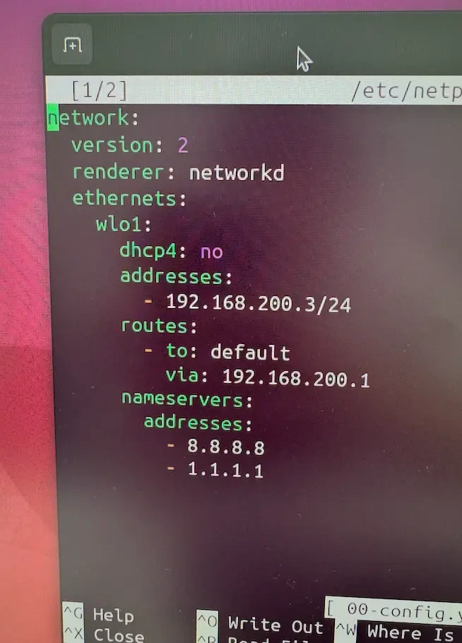
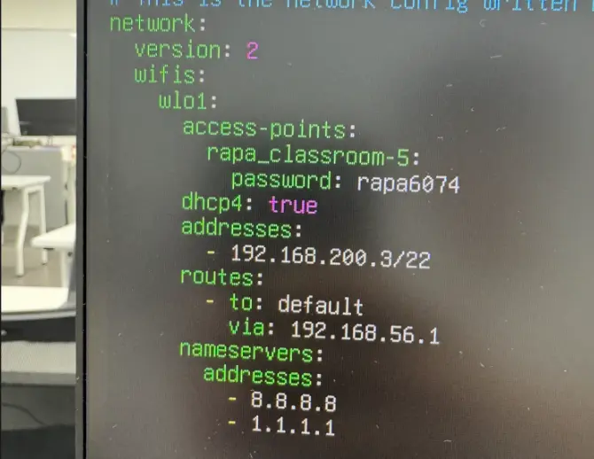
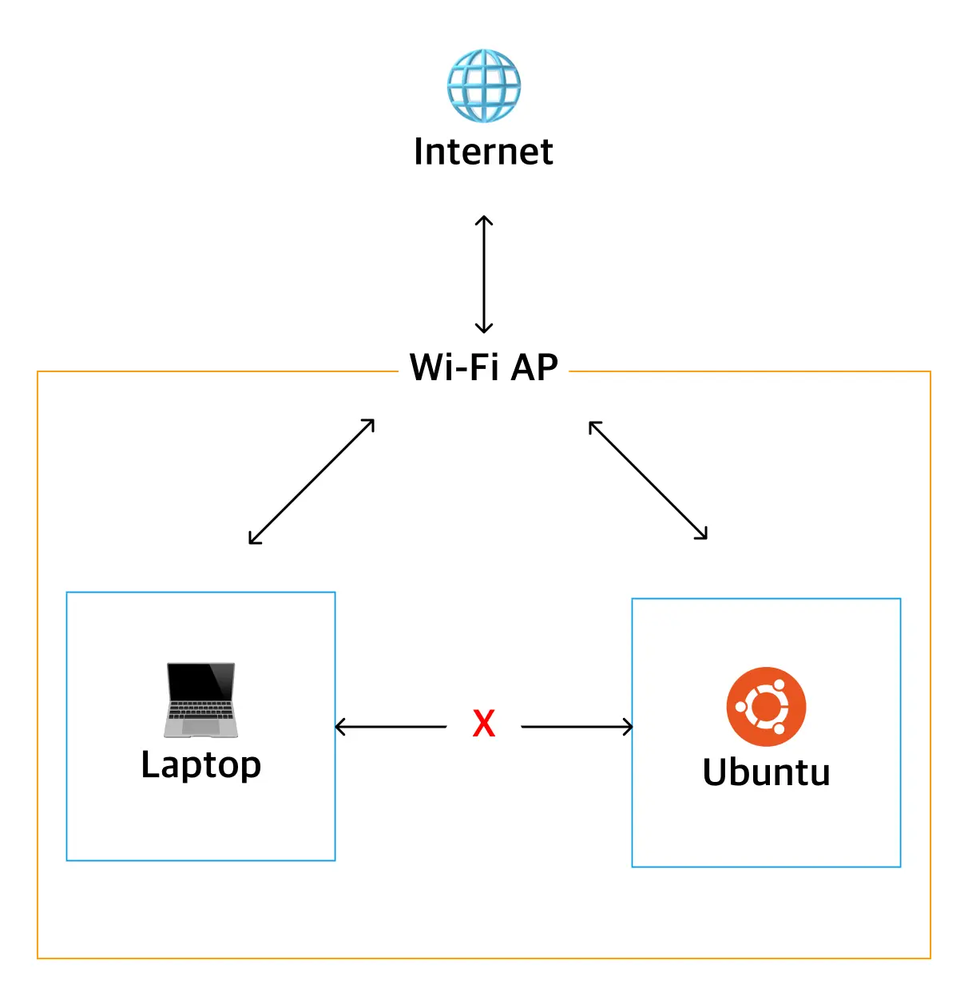

---
 
## 요약
> Ubuntu Server 구축 후 동일한 Wi-Fi에 연결된 MacBook에서 서버로 SSH 접속 및 Ping이 되지 않는 문제가 발생했다.
> 
> 서버에서 외부 네트워크 연결은 정상적으로 이루어졌지만, 동일한 Wi-Fi에 연결된 MacBook에서 Ubuntu서버로, 심지어 반대로도 SSH 접속 및 Ping이 불가능했다.
> 
> 처음에는 이전 기수에서 사용하던 고정 IP 설정을 그대로 참고하면서 네트워크 설정 문제라고 판단했다. 확인 결과 기존 환경과 현재 환경의 네트워크 구성 및 서브넷이 달랐으며, 이를 현재 환경에 맞게 수정했다.
> 
> 하지만 네트워크 설정을 정상화한 이후에도 단말 간 통신은 불가능했다. 추가 확인 결과 강의실 Wi-Fi에 적용된 **Client Isolation**으로 인해 동일 Wi-Fi에 연결된 클라이언트 간 직접 통신이 차단되고 있음을 확인했다.
#### 더 짧은 요약
**SSH 접속 실패**  
→ 네트워크 설정 문제를 의심  
→ 이전 기수에서 사용하던 네트워크 환경과 다른 것을 인지  
→ 서브넷 설정을 현재 환경에 맞게 수정 → 여전히 실패  
→ 조사 결과 WiFi Client Isolation이 원인임을 확인  
→ 우리의 권한으로는 해결 불가능 → 우회를 해보자

#### 해결 방법

찾아보니 우회의 방법이 존재함 → TailScale 등의 VPN 활용(이미 다른 팀의 서버에 이전 기수가 설치한 내용이 발견됨)

AP에 대한 관리 권한이 없어 Client Isolation 자체를 해제할 수는 없으므로, 현재 환경에서는 필요한 내부 포트를 모두 강사님을 통해 개방시키거나, 최소한의 포트를 유지한 채로 **Tailscale과 같은 VPN/Overlay Network를 통한 우회가 필요하다.**

## 1. 문제 상황

> 기존 Ubuntu Desktop 서버를 Ubuntu Server로 재설치한 뒤 Wi-Fi 네트워크를 설정했다.  
> 서버에서 외부 네트워크 연결은 정상적으로 이루어졌지만, 동일한 Wi-Fi에 연결된 MacBook에서 서버로 SSH 접속 및 Ping이 불가능했다.

AutoEver Cloud Scool의 지난 기수에서 사용하던 서버를 받게 되었는데, 포맷이 되지 않은 상태였다.

Ubuntu Desktop이 설치된 서버에 Ubuntu Server를 설치하기 전, 기존의 `netplan.yaml` 에 DHCP가 아닌 고정 IP로 할당이 되어있는 것으로 보아 추후 할당 가능한 IP를 확인하고 네트워크 설정하는 과정이 줄어들 것이라 판단해 백업했다.



이후 Ubuntu Server 를 설치했고, 해당 설정을 참고하여 네트워크를 구성했지만, 다른 노트북에서 서버로 SSH 접속이 되지 않았다.

또한 SSH뿐만 아니라 서버 IP를 대상으로 한 Ping에도 응답이 없었다.

반면 서버 자체에서는 외부 네트워크 연결이 가능했다.

즉 문제 상황은 다음과 같았다.

```bash
Server → Internet     정상
MacBook → Internet    정상

MacBook → Server Ping 실패
MacBook → Server SSH  실패
```

단순한 인터넷 연결 문제가 아니라 **동일 네트워크에 연결된 단말 간 통신에서 문제가 발생하고 있는 상황**이었다.

---

## **2. 기존 환경과 현재 환경 비교**

문제를 확인하는 과정에서 이전 기수의 네트워크 환경과 현재 환경에 차이가 있다는 것을 확인했다.

기존 설정에서는 서버가 **유선 LAN**을 사용하고 있었지만, 현재 서버는 **Wi-Fi**를 통해 네트워크에 연결하고 있었다. 

현재 서버의 유선 LAN 카드 상태가 확실하지 않았고 강의실 바닥의 LAN 포트가 Wi-Fi AP와 동일한 네트워크를 사용하는지도 확인되지 않았기 때문에, 우선 Wi-Fi를 기준으로 문제를 분석하기로 했다.

현재 Netplan 파일을 확인했다.

```bash
cd /etc/netplan
ls
```

확인된 파일:

```
00-installer-config.yaml
```

설정을 변경하기 전 기존 파일을 백업했다.

```bash
sudo cp 00-installer-config.yaml ~/.backup-netplan.yaml
```


---

## **3. 네트워크 설정 확인**

현재 서버의 IP를 확인했다.

```bash
hostname -I
```

Netplan 설정도 확인했다.

```bash
sudo nano /etc/netplan/00-installer-config.yaml
```

처음에는 이전 설정을 참고하여 서버에 다음과 같이 Static IP를 설정했다.

```
Server
192.168.200.3/24
```

하지만 MacBook의 네트워크 설정을 확인한 결과 다음과 같은 주소를 사용하고 있었다.

```
MacBook
192.168.201.x/22
```

`/24`와 `/22`는 서로 다른 서브넷 범위를 의미한다.

`192.168.200.3/24`의 네트워크 범위는:

```
192.168.200.0 ~ 192.168.200.255
```

반면 `192.168.201.x/22`가 포함되는 네트워크는 아래와 같았다.

```
192.168.200.0/22

192.168.200.x
192.168.201.x
192.168.202.x
192.168.203.x
```

이 내용을 확인하고 나니, 지난 기수가 사용하던 강의실과 현재 사용중인 강의실이 다르다는 것이 떠올랐다. 교육장에는 강의실마다 AP를 나눠서 사용하고 있었고, 이로인해 이전 기수와 서브넷이 달랐던 것이다.
따라서 이전 기수에서 사용하던 `/24` 설정을 현재 네트워크에 그대로 적용하는 것은 적절하지 않았다.

---

## **4. DHCP를 통한 실제 네트워크 설정 확인**

Static IP를 임의로 지정하기보다 현재 강의실 네트워크의 DHCP 서버가 어떤 설정을 제공하는지 먼저 확인하기로 했다.

Netplan을 DHCP 기반으로 변경했다.

```yaml
network:
  version: 2
  wifis:
    wlo1:
      access-points:
        "RAPA_Classroom-5":
          password: "********"
      dhcp4: true
```

기존에 직접 지정했던 다음 설정은 제거했다.

```yaml
addresses:
routes:
nameservers:
```

설정을 검증하고 적용했다.

```bash
sudo netplan generate
sudo netplan try
```

이후 실제 할당된 IP와 라우팅 정보를 확인했다.

```bash
ip -4 addr show wlo1
ip route
```

이를 통해 현재 강의실 네트워크에서 사용하는 IP 대역과 서브넷 정보를 확인할 수 있었다.

하지만 네트워크 설정을 현재 환경에 맞게 수정한 이후에도 MacBook에서 서버로 Ping과 SSH가 되지 않았다.

따라서 **서브넷 설정만의 문제는 아니라고 판단했다.**

---

## **5. SSH 및 방화벽 확인**

SSH 서비스 및 방화벽 문제도 확인했다.

UFW 상태를 확인했다.

```bash
sudo ufw status
```

SSH에 사용되는 TCP 22번 포트가 허용되어 있었다.

```
22/tcp    ALLOW
```

따라서 SSH 접속 실패의 직접적인 원인이 UFW에서 TCP 22번 포트를 차단했기 때문은 아니었다.

또한 SSH뿐만 아니라 Ping을 통한 단말 간 기본 통신 자체가 실패하고 있었기 때문에 문제 범위를 SSH 애플리케이션 계층보다 아래의 네트워크 계층으로 좁힐 수 있었다.

---

## **6. 동일 Wi-Fi 단말 간 통신 확인**

서버와 MacBook은 모두 동일한 Wi-Fi에 연결되어 있었으며 각각 인터넷 연결도 정상적이었다.

구조상 다음과 같은 상태였다.




각 장비에서 AP 및 외부 네트워크로의 통신은 가능하지만 두 클라이언트 사이의 직접 통신은 불가능했다.

즉 다음과 같은 특징을 보였다.

```
Server  → Gateway    정상
MacBook → Gateway    정상

Server  → Internet   정상
MacBook → Internet   정상

MacBook → Server     실패
Server  → MacBook    실패
```

이 시점에서 개별 서버의 IP, SSH 또는 방화벽 설정보다는 **AP에서 클라이언트 간 통신을 제한하고 있을 가능성**을 의심했다.

---

## **7. 원인 — Client Isolation**

조사 결과 현재 Wi-Fi 환경에서 **Client Isolation(AP Isolation)**으로 인해 무선 클라이언트 간 직접 통신이 제한되고 있는 것으로 판단했다.

Client Isolation은 동일한 AP에 연결된 클라이언트가 서로 직접 통신하지 못하도록 격리하는 기능이다.

따라서 동일한 SSID를 사용하고 동일한 IP 서브넷에 속하더라도 다음과 같은 통신이 제한될 수 있다.

```
MacBook ──X── Ubuntu Server
```

반면 AP를 통해 외부로 나가는 트래픽은 정상적으로 처리될 수 있다.

```
MacBook ──→ AP ──→ Internet
Server  ──→ AP ──→ Internet
```

이 때문에 서버와 MacBook 모두 인터넷 연결에는 문제가 없었지만, MacBook에서 서버로 직접 접근하는 Ping과 SSH는 실패했다.

---

## **8. 해결 여부 및 우회 방법**

이번 문제는 서버 자체의 설정을 변경하여 해결할 수 있는 문제가 아니었다.

Client Isolation은 AP 측에서 적용되는 정책이므로 이를 직접 해제하려면 해당 네트워크 장비에 대한 관리 권한이 필요하다.

현재는 AP에 대한 관리 권한이 없기 때문에 **Client Isolation 자체는 해결할 수 없는 상태**다.

다만 네트워크를 우회하는 방법은 존재한다.

서버를 확인하는 과정에서 다른 팀의 서버에 이전 기수가 설치한 **Tailscale** 관련 구성이 발견되었다. 이는 이전 환경에서도 동일하거나 유사한 네트워크 제약을 우회하기 위해 사용했을 가능성이 있다.

Tailscale과 같은 Overlay Network를 사용하면 각 장비에 별도의 가상 네트워크 인터페이스와 IP를 구성하여 물리적인 로컬 네트워크의 직접 통신에 의존하지 않고 장비 간 연결을 구성할 수 있다.

구조는 다음과 같다.

```
Ubuntu Server
     │
     │ Tailscale Network
     │
  MacBook
```

따라서 현재 환경에서는 다음과 같은 방법을 고려할 수 있다.

- Tailscale 등의 Overlay Network 사용
- Client Isolation이 적용되지 않은 별도 네트워크 사용
- 유선 LAN을 통한 별도 네트워크 구성
- 관리 가능한 별도의 AP/공유기 구성

---

## **9. 결론**

초기에는 SSH 접속 실패를 서버의 SSH, UFW 또는 Static IP 설정 문제로 판단했다.

네트워크 설정을 확인하는 과정에서 이전 기수의 `/24` 기반 설정과 현재 강의실의 `/22` 기반 네트워크 환경이 다르다는 것을 확인했고, DHCP를 사용하여 현재 환경에 맞는 네트워크 설정을 다시 구성했다.

그러나 설정 정상화 이후에도 동일 Wi-Fi에 연결된 단말 간 Ping 및 SSH가 실패했다.

각 단말에서 게이트웨이와 외부 네트워크로의 통신은 정상인 반면 클라이언트 간 직접 통신만 실패한다는 점을 통해 문제 범위를 AP 정책으로 좁혔으며, 최종적으로 **Wi-Fi Client Isolation에 의한 단말 간 통신 제한이 원인인 것으로 판단했다.**

## 10. 해야 할 것

TailScale이 조직으로도 사용이 가능한지, 다른 Overlay Network 또는 VPN으로 구축이 가능한지 찾아보기