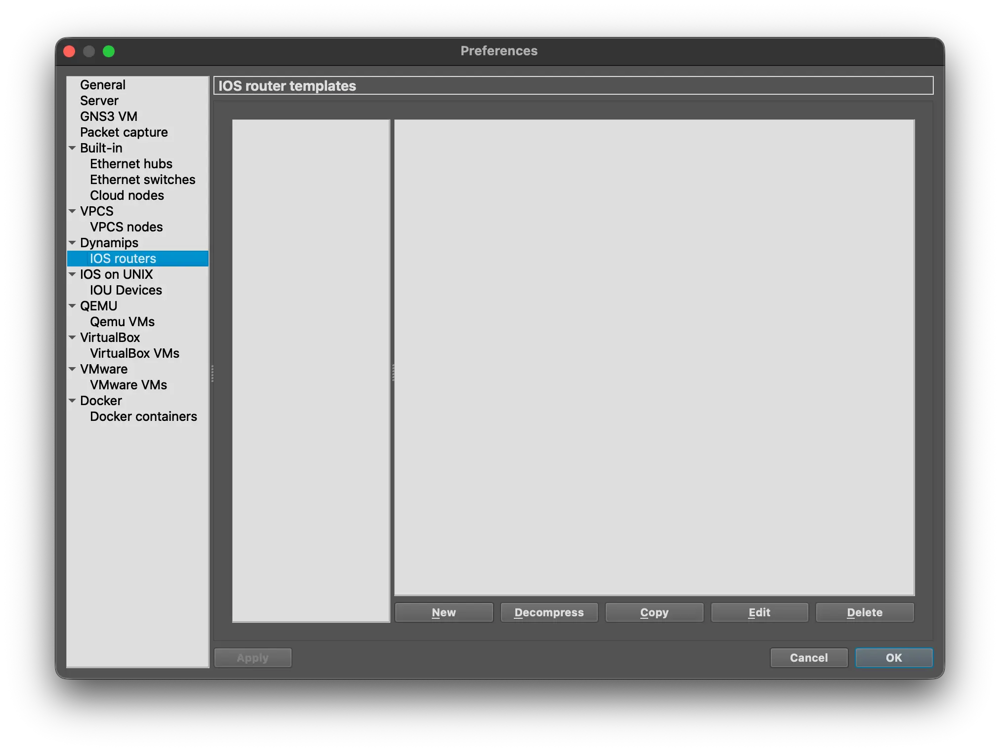
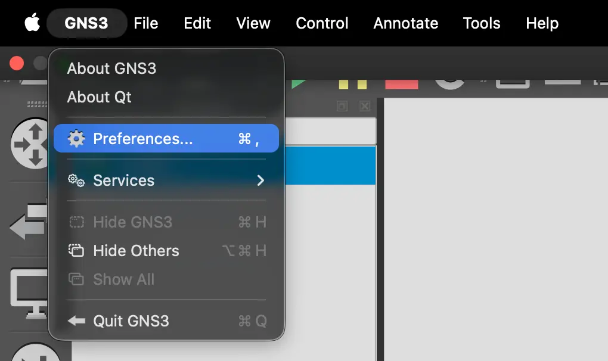
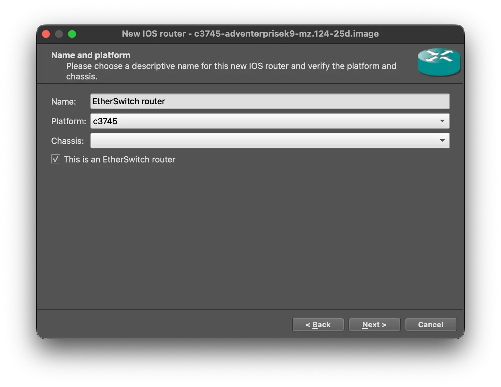
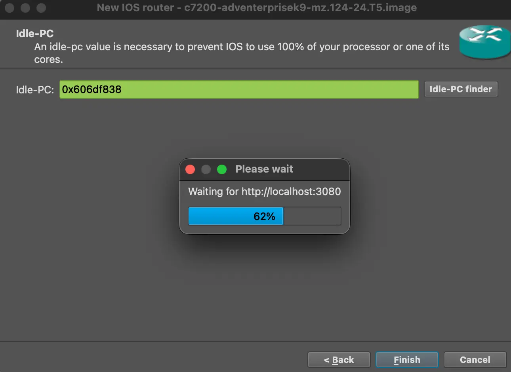
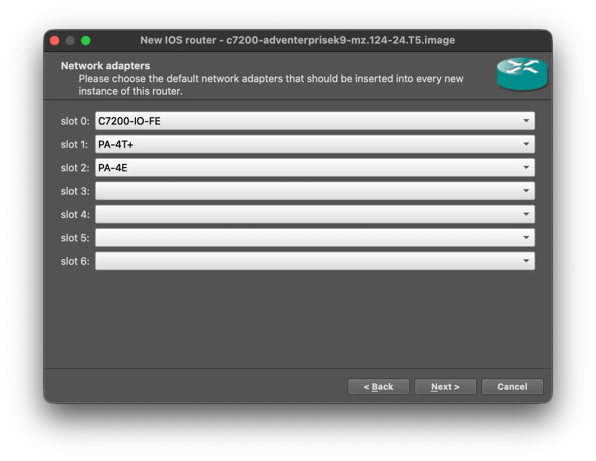
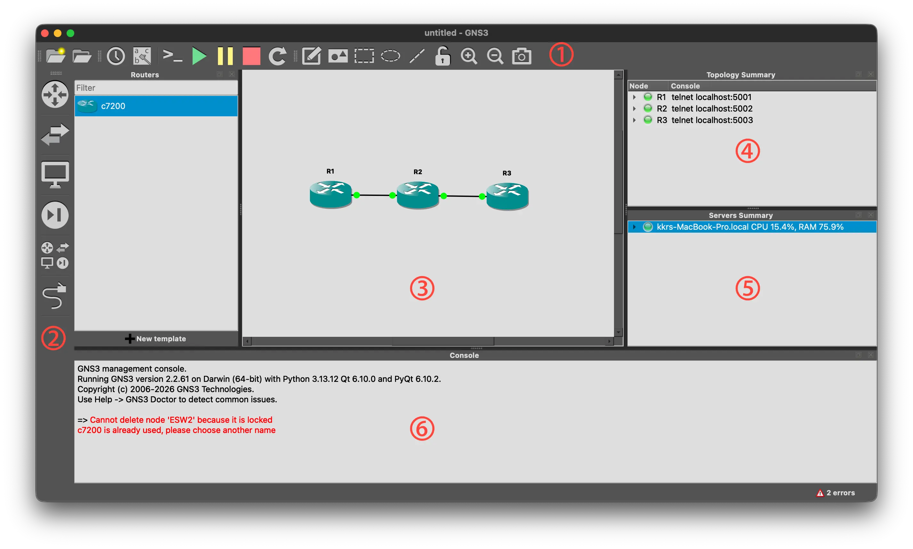
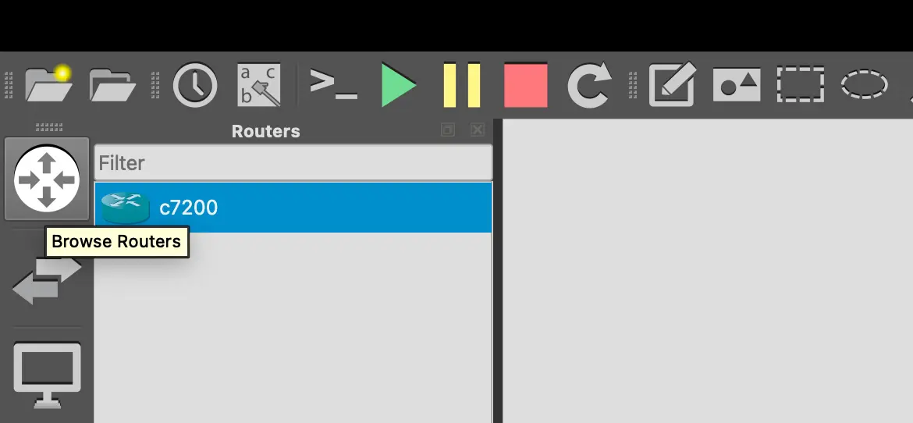
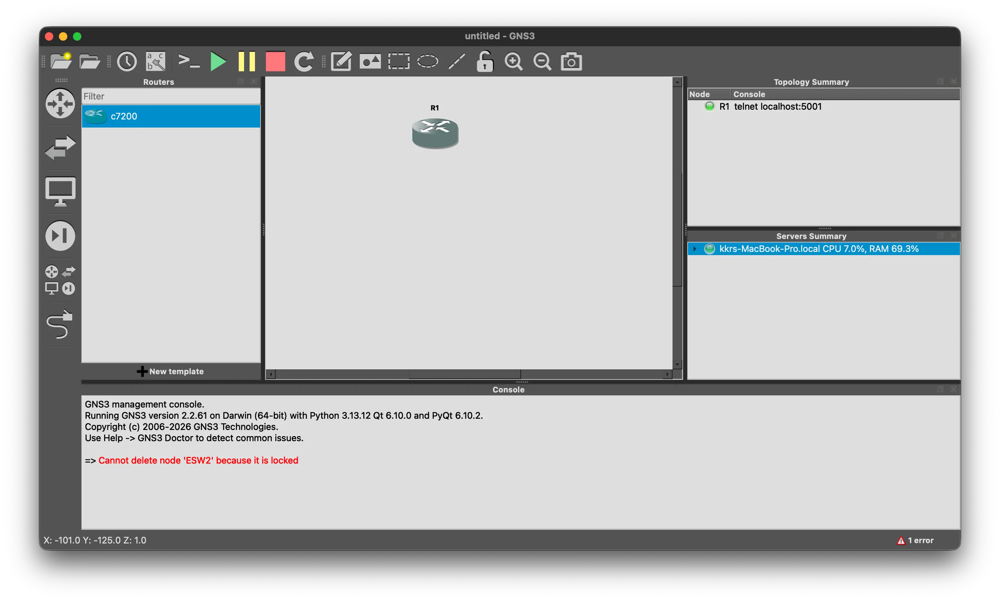
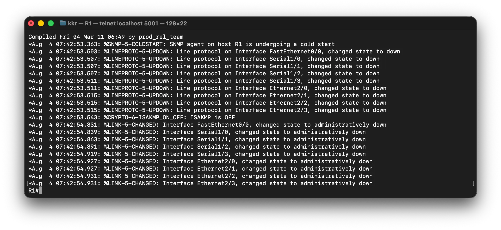
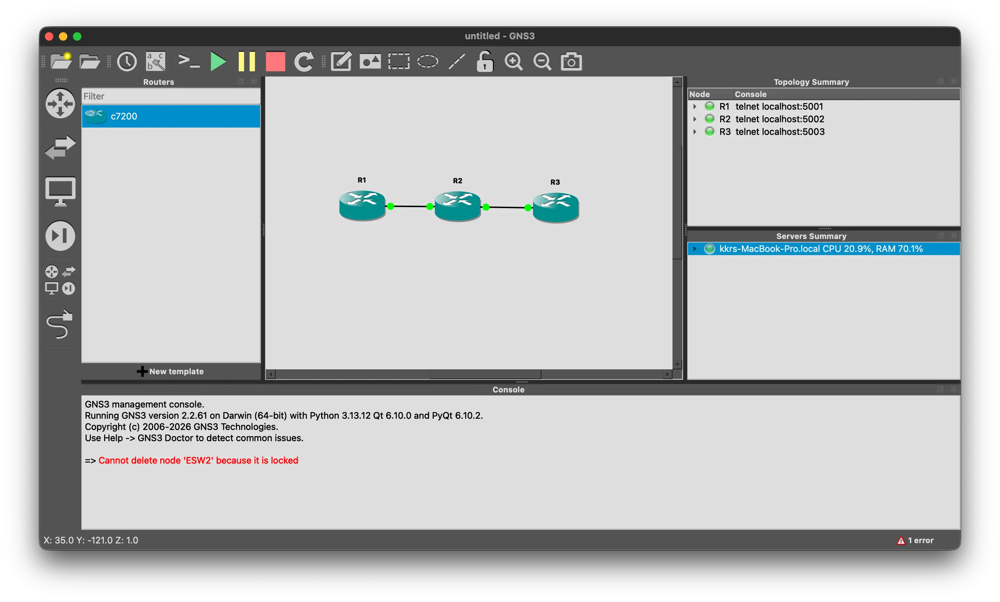

# Router & Switch Lab

---

## 1. GNS3

### 개요

GNS3는 실제 네트워크 장비의 운영체제(IOS)를 가상으로 실행하여 네트워크를 설계하고 실습할 수 있는 네트워크 에뮬레이터이다.

### 특징

- Cisco IOS를 그대로 실행하여 실제 장비와 동일한 명령어 사용
- Router, Switch뿐 아니라 Docker, VirtualBox, VMware 연동 가능
- 실제 PC 및 외부 네트워크와 연결 가능
- Wireshark와 연동하여 패킷 분석 가능

---

### 설치

#### GNS3

https://www.gns3.com/software/download

또는

https://github.com/GNS3/gns3-gui/releases

---

### IOS 이미지 다운로드

#### Router (Cisco 3745)

https://mega.nz/file/RZtA0SwD#XBjqI5Dkrienz7tHaYg601Dwq-ypAqWZv8Ut3mFuKoI

#### Switch (Cisco 7200)

https://mega.nz/file/lR8Q1SpD#5j3lYt9roopuTK6NgHBp9HRM6YP3hq8RiK_nHA7Tktw

압축을 해제한 뒤 사용한다.

---

### 2. Router / Switch 등록

#### Router(3745)
- `(MacOS)시스템 바의 Edit → Preferences → Dynamips → IOS Routers → New`

- 3745(router) 이미지를 선택한다.


- 이름, 메모리 설정 후 `This is an EtherSwitch router` 체크


- Slot은 기본값을 사용한다.
- 마지막에 **Idle-PC Finder**를 실행하여 Idle-PC 값을 설정한다(대기 후 완료됨).



---

#### Switch(7200)

- 동일하게 추가하되,
- `This is an Ethernet Switch Router`옵션은 체크하지 않는다.
- `Slot`은 강의에서 사용한 설정으로 지정했다.
- `Idle-PC Finder`를 실행한다.

> **Slot?**
> - 슬롯은 네트워크 장비에서 모듈을 장착하는 위치를 의미한다.
> - 실습에서는 필요한 네트워크 인터페이스를 추가하기 위해 슬롯을 선택했다.
> - 선택한 슬롯에 장착된 모듈에 따라 사용할 수 있는 포트와 인터페이스가 생성된다.


---

#### GNS3 UI

- **1. Toolbar** : 프로젝트 생성, 저장, 장비 실행/중지, 연결 도구 등 주요 기능을 제공한다.
- **2. Device List** : 라우터, 스위치, PC 등의 장비를 선택하여 토폴로지에 추가한다.
- **3. Workspace** : 네트워크 토폴로지를 구성하는 작업 영역이다.
- **4. Topology Summary** : 현재 프로젝트에 추가된 장비와 콘솔 정보를 확인한다.
- **5. Servers Summary** : GNS3 서버 상태(CPU, 메모리 사용량 등)를 확인한다.
- **6. Console** : 실행 로그와 오류 메시지를 확인하는 콘솔 창이다.

- 각 컴포넌트들은 마우스 호버 툴팁으로 확인 가능하다.




### 프로젝트 생성 해보기

새 프로젝트를 만든 뒤,
좌측 패널에서 Router와 Switch를 드래그하여 배치한다.


라우터를 우클릭하여 **Start**를 선택하면 IOS가 부팅된다.

더블클릭하면 콘솔 창이 열린다.



---

### 3. Cisco IOS 기본 명령

## 실행 모드

| 프롬프트                 | 설명                           |
| -------------------- | ---------------------------- |
| `Router>`            | User EXEC Mode               |
| `Router#`            | Privileged EXEC Mode         |
| `Router(config)#`    | Global Configuration Mode    |
| `Router(config-if)#` | Interface Configuration Mode |

---

#### 모드 전환

```
enable
```

User → Privileged

```
disable
```

Privileged → User

```
configure terminal
```

Global Configuration Mode 진입

```
Ctrl + Z
```

상위 모드 복귀

---

#### 인터페이스 설정 모드

```
interface Ethernet2/0
```

인터페이스 설정 모드 진입

```
Router(config-if)#
```

---

#### 설정 저장

```
copy running-config startup-config
```

현재 Running Configuration을 Startup Configuration으로 저장한다.

---

### 4. Router 실습

### Router 3대 연결
- `Device List` 패널의 케이블로 연결하려는 대상인 A와 B 각각 클릭하면 연결된다.

구성

```
R1 -------- R2 -------- R3

Eth2/0     Eth2/0
            Eth2/1     Eth2/1
```



---

#### 인터페이스 활성화

라우터의 인터페이스는 기본적으로 Shutdown 상태이다.

통신하려면 반드시

```
no shutdown
```

명령을 수행해야 한다.

#### R1

```text
configure terminal

interface ethernet2/0

no shutdown

show interface ethernet2/0
```

#### R2

```text
configure terminal

interface ethernet2/0
no shutdown

interface ethernet2/1
no shutdown

show interface ethernet2/0
show interface ethernet2/1
```

#### R3

```text
configure terminal

interface ethernet2/1

no shutdown

show interface ethernet2/1
```

---

### 5. CDP

Cisco 장비끼리 연결된 이웃 장비 정보를 확인하는 Cisco 전용 프로토콜이다.

#### 이웃 확인

```text
show cdp neighbors
```

#### CDP 트래픽 확인

```text
show cdp traffic
```

---

### 6. LLDP

LLDP는 CDP와 동일한 목적의 표준 프로토콜이다.

기본적으로 비활성화되어 있으므로 먼저 활성화한다.

```text
lldp run
```

이후 LLDP 관련 show 명령으로 이웃 정보를 확인할 수 있다.

---

### 7. Router IP 설정

인터페이스 모드에서 IP를 할당한다.

```text
ip address <IP> <SubnetMask>
```

예시

```text
interface ethernet2/0

ip address 192.168.10.1 255.255.255.0

no shutdown
```

---

#### 설정 확인

```text
show ip interface brief
```

---

#### 참고

라우터의 각 인터페이스는 각각 하나의 독립적인 네트워크이다.

같은 인터페이스에 연결된 장비들은 동일한 네트워크 대역의 IP를 사용해야 한다.