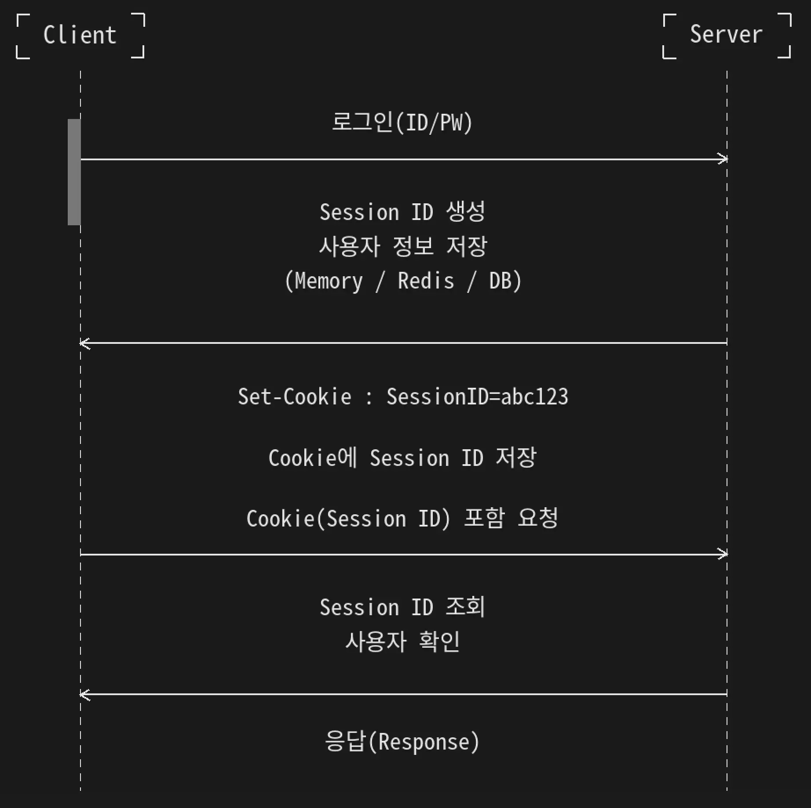
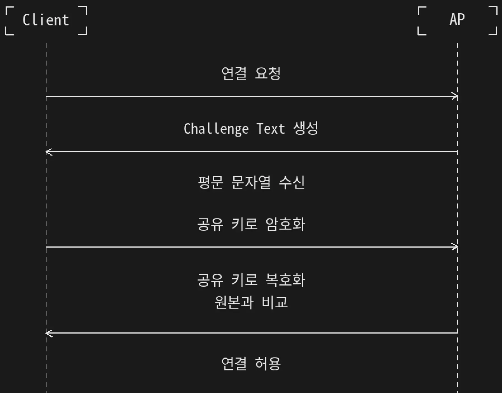

## 2) 네트워크 위협
---

#### 개요

네트워크는 서비스 거부 공격, 악성 코드, 서버 해킹, 사회공학적 피싱, 생성형 AI 악용 등 다양한 위협에 노출된다.

| 위협 | 설명 |
|---|---|
| DDoS 공격 | 다수의 시스템을 이용하여 서비스를 정상적으로 사용할 수 없도록 만든다. |
| 악성 코드 | 시스템 침해, 정보 탈취, 데이터 암호화 등을 목적으로 동작한다. |
| 서버 해킹 | 홈페이지, 웹 서버, 애플리케이션의 취약점을 이용한다. |
| 사회공학적 피싱 | 자극적인 제목이나 메시지로 사용자의 행동을 유도한다. |
| 생성형 AI 악용 | 피싱 메시지, 허위 정보, 악성 콘텐츠 생성 등에 이용될 수 있다. |

---

### 악성 코드

#### 개요

악성 코드(Malware)는 시스템에 피해를 주거나 공격자의 목적을 수행하기 위해 제작된 프로그램이다.

악성 코드는 수행 목적에 따라 다음과 같이 구분할 수 있다.

| 종류 | 주요 목적 |
|---|---|
| Ransomware | 데이터 암호화 후 금전 요구 |
| Backdoor | 인증 절차 우회 및 재접속 경로 생성 |
| Exploit | 운영체제나 프로그램의 취약점 공격 |
| Bot | 감염된 시스템을 DDoS 등에 이용 |
| Scareware | 공포심을 이용한 구매나 설치 유도 |
| Downloader | 추가 프로그램이나 악성 코드 다운로드 |
| Dropper | 기존 파일에서 새로운 악성 파일 생성 |
| Launcher | 생성되거나 다운로드된 악성 코드 실행 |
| Adware | 광고 표시 |
| Spyware | 사용자 정보 수집 및 외부 유출 |

#### Ransomware

랜섬웨어(Ransomware)는 사용자의 데이터를 암호화한 뒤 복구를 대가로 금전을 요구하는 악성 코드이다.

#### Backdoor

백도어(Backdoor)는 시스템의 유지보수나 문제 해결을 위해 정상적인 보안 절차를 우회하여 접근할 수 있도록 만든 도구이다.

비인가된 접근을 허용하므로 공격자는 일반적인 인증 절차를 거치지 않고 프로그램이나 시스템에 접근할 수 있다.

공격자가 시스템에 침입한 뒤 재접속을 위해 백도어를 설치하기도 하며, 개발자나 관리자가 유지보수 목적으로 만들어 두고 제거하지 않은 백도어가 악용되기도 한다.

#### Exploit

익스플로잇(Exploit)은 운영체제나 특정 프로그램의 취약점을 이용하여 공격을 수행하는 코드이다.

#### Bot

봇(Bot)은 감염된 시스템이 공격자의 명령에 따라 DDoS 등의 공격을 수행하도록 만드는 악성 코드이다.

악성 코드에 감염되어 공격자의 명령을 수행하는 PC를 좀비 PC(Zombie PC)라고 하며, 여러 좀비 PC가 연결된 네트워크를 봇넷(Botnet)이라고 한다.

#### Scareware

스케어웨어(Scareware)는 사용자를 놀라게 하거나 겁을 주어 원하는 행동을 유도하는 악성 코드이다.

실제로 악성 코드에 감염되지 않았음에도 감염되었다고 경고한 뒤, 특정 안티바이러스 제품의 구매나 설치를 유도하는 방식이 대표적이다.

#### Downloader

다운로더(Downloader)는 네트워크를 통해 데이터나 프로그램을 내려받는 악성 코드이다.

내려받은 프로그램은 실제 공격을 수행하는 악성 코드이거나 공격 명령의 집합일 수 있다.

#### Dropper

드로퍼(Dropper)는 현재 시스템에 존재하는 파일이나 내부 데이터를 이용하여 새로운 악성 파일을 생성하는 프로그램이다.

#### Launcher

런처(Launcher)는 Downloader나 Dropper가 생성한 파일을 실행하는 악성 코드이다.

#### Adware

애드웨어(Adware)는 광고가 포함된 소프트웨어이다.

일부는 정상적인 프로그램이지만, 사용자의 의사와 관계없이 과도한 광고를 표시하거나 다른 악성 행위를 수행하기도 한다.

#### Spyware

스파이웨어(Spyware)는 사용자의 정보를 몰래 수집하여 동의 없이 외부로 유출하는 것을 목적으로 하는 악성 코드이다.

> **정리**
>
> - 악성 코드는 데이터 암호화, 인증 우회, 취약점 공격, 정보 수집 등의 목적으로 사용된다.
> - Downloader, Dropper, Launcher는 각각 다운로드, 파일 생성, 실행 역할을 수행한다.
> - Bot에 감염된 시스템은 좀비 PC가 되며, 여러 좀비 PC가 Botnet을 구성한다.

---

### 주요 네트워크 공격 기법

#### 개요

네트워크 공격은 대상 정보 수집, 패킷 가로채기, 주소 위조, 서비스 자원 고갈 등의 방식으로 수행된다.

| 공격 | 설명 |
|---|---|
| IP Scanning | 대상의 IP 정보와 운영체제를 확인한다. |
| Port Scanning | 열려 있는 포트와 실행 중인 서비스를 확인한다. |
| ARP Spoofing | 공격자를 Gateway처럼 속여 패킷을 가로챈다. |
| IP Spoofing | 출발지 IP를 위조하여 신뢰 관계를 악용한다. |
| DNS Spoofing | 위조된 DNS 응답으로 가짜 사이트 접속을 유도한다. |
| ARP Redirect | 위조된 ARP 정보를 이용하여 패킷 경로를 변경한다. |
| MAC Flooding | 스위치의 MAC 주소 테이블을 고갈시킨다. |
| SSL Sniffing | HTTPS 연결을 가로채거나 HTTP로 유도한다. |
| SSH Sniffing | SSH 패킷이나 비밀키 탈취를 시도한다. |
| Ping of Death | 비정상적인 대형 패킷으로 시스템 오류를 유발한다. |
| SYN Flooding | 대량의 SYN 요청으로 연결 자원을 고갈시킨다. |
| LAND Attack | 출발지와 목적지를 동일하게 설정한다. |
| DDoS | 좀비 PC를 이용하여 대량의 패킷을 전송한다. |
| Slowloris Attack | 불완전한 HTTP 연결을 장시간 유지한다. |

#### IP Scanning

IP 스캐닝(IP Scanning)은 공격 대상의 IP 주소, 활성 호스트, 운영체제 등의 정보를 확인하는 행위이다.

#### Port Scanning

포트 스캐닝(Port Scanning)은 대상 시스템에서 열려 있는 포트와 실행 중인 서비스를 확인하는 행위이다.

열린 포트 정보는 이후 취약점 공격 대상을 선정하는 데 사용될 수 있다.

---

### 서비스 거부 공격

#### 개요

서비스 거부 공격(DoS, Denial of Service)은 합법적인 사용자가 특정 네트워크나 웹 자원에 접근하지 못하도록 방해하는 공격이다.

다른 공격에 비해 비교적 구조가 단순하며, 서비스에 훼방을 놓는 형태로 이해할 수 있다.

공격자는 대량의 트래픽으로 웹 서버에 과부하를 발생시키거나 비정상적인 요청을 전송하여 서비스가 오작동하거나 완전히 중단되도록 만든다.

DoS 공격은 크게 취약점 공격형과 자원 고갈형으로 구분한다.

| 구분 | 설명 |
|---|---|
| 취약점 공격형 | 비정상적인 패킷을 처리하는 과정의 오류를 이용한다. |
| 자원 고갈형 | 세션, 대역폭, CPU, 메모리, 저장 공간 등을 소모한다. |

---

### 취약점 공격형 DoS

#### 개요

취약점 공격형은 특정 형태의 네트워크 패킷을 처리하는 로직의 오류를 이용하여 대상 시스템의 오작동을 유발한다.

대표적인 공격에는 Boink, Bonk, Teardrop, LAND Attack 등이 있다.

#### Boink

Boink는 연속된 패킷의 목적지 포트 등을 비정상적으로 변경하여 취약한 시스템의 패킷 처리 과정에서 오류를 유발하는 고전적인 DoS 공격이다.

#### Bonk

Bonk는 오래된 Unix나 Windows 시스템을 대상으로 패킷의 단편화 오프셋(Offset) 값을 비정상적으로 조작하여 오류를 발생시키는 공격이다.

#### Teardrop

Teardrop은 단편화된 IP 패킷의 일부 영역이 서로 겹치도록 오프셋 값을 조작하여 패킷 재조립 과정에서 오류를 발생시키는 공격이다.

#### LAND Attack

LAND(Local Area Network Denial) Attack은 출발지와 목적지 IP 주소를 공격 대상의 동일한 주소로 설정하는 공격이다.

취약한 시스템은 자신이 전송한 것처럼 보이는 패킷에 스스로 응답하면서 반복 처리나 자원 고갈이 발생할 수 있다.

강의 자료의 Rand Attack 설명도 출발지와 목적지를 동일하게 설정한다는 점에서 LAND Attack과 유사한 형태로 볼 수 있다.

운영체제와 네트워크 장비의 보안 패치를 적용하여 대응한다.

#### Ping of Death

Ping of Death는 허용 범위를 초과하는 큰 패킷을 여러 조각으로 전송하여 대상 시스템의 패킷 재조립 과정에서 오류를 발생시키는 공격이다.

단순히 많은 Ping을 전송하는 공격이라기보다, 비정상적으로 큰 ICMP 패킷의 처리 취약점을 이용하는 공격이다.

---

### 자원 고갈형 DoS

#### SYN Flooding

SYN Flooding은 공격자가 TCP 연결 요청인 SYN 패킷만 반복적으로 전송하여 서버의 연결 자원을 고갈시키는 공격이다.

서버가 사용할 수 있는 세션 수에는 한계가 있으므로, 연결 요청이 계속 누적되면 정상 클라이언트의 요청을 처리하지 못하게 된다.

IPS(Intrusion Prevention System) 등의 침입 방지 시스템을 이용하여 탐지하고 차단할 수 있다.

#### UDP Flooding

UDP Flooding은 대량의 UDP 패킷을 임의의 포트로 전송하여 대상 시스템이 지속적으로 응답 메시지를 생성하게 만드는 공격이다.

서비스가 없는 포트에 패킷이 도착하면 ICMP 오류 응답이 생성될 수 있으며, 공격자는 출발지 주소를 위조하여 응답이 자신에게 전달되지 않도록 만들기도 한다.

이 과정이 반복되면 네트워크와 시스템 자원이 고갈된다.

#### Smurf Attack

Smurf Attack은 출발지 IP 주소를 공격 대상의 주소로 위조한 뒤 네트워크 전체에 ICMP Echo Request를 브로드캐스트하는 공격이다.

브로드캐스트를 수신한 여러 시스템의 응답이 공격 대상에게 집중되면서 네트워크가 마비될 수 있다.

공격에 이용되는 제3의 네트워크를 바운스 사이트(Bounce Site)라고 한다.

라우터에서 Directed Broadcast를 차단하여 대응할 수 있다.

#### Ping of Death

Ping of Death는 큰 패킷을 의도적으로 대상 시스템에 전송하여 시스템이 서비스를 제공하지 못하도록 만드는 공격이다.

내부 네트워크에서 불필요한 ICMP 요청을 방화벽으로 제한할 수 있지만, 정상적인 네트워크 진단 기능도 영향을 받을 수 있으므로 정책에 따라 적용해야 한다.

#### HTTP GET Flooding

HTTP GET Flooding은 HTTP GET 메서드로 특정 페이지를 반복 요청하여 웹 서버에 과부하를 발생시키는 공격이다.

GET 요청 자체는 정상적인 요청이므로 서버는 계속 응답을 생성하려고 한다.

공격자가 동일한 URL을 반복 요청하면 웹 서버는 해당 데이터를 조회하고 클라이언트에게 전달하기 위해 CPU, 메모리, 데이터베이스 연결 등의 자원을 사용한다.

#### HTTP CC Attack

HTTP CC Attack은 HTTP의 캐시(Cache) 기능을 사용하지 못하도록 하여 웹 서버의 부하를 증가시키는 공격이다.

HTTP/1.1에서는 `Cache-Control` 헤더를 이용하여 캐시 사용 여부를 제어할 수 있다.

공격자는 캐시를 사용하지 않도록 요청을 반복적으로 전송하여 웹 서버가 동일한 데이터를 계속 생성하고 처리하도록 만든다.

```http
Cache-Control: no-store, must-revalidate
```

캐시를 사용하지 못하면 동일한 요청에도 웹 서버는 데이터를 다시 조회하고 응답을 생성해야 하므로 CPU와 메모리 등의 자원이 지속적으로 소모된다.

#### Mail Bomb

메일 폭탄(Mail Bomb)은 대량의 메일을 전송하여 메일 서버의 처리 능력과 저장 공간을 고갈시키는 공격이다.

메일 서버는 메일이 폭주하여 디스크 공간이 모두 사용되면 새로운 메일을 수신할 수 없게 된다.

이를 방지하기 위해 일반적으로 사용자별 메일함 용량을 제한하고 스팸 메일을 필터링한다.

#### Slowloris Attack

Slowloris Attack은 대량의 트래픽을 발생시키는 대신, 다수의 HTTP 연결을 생성한 후 요청을 끝내지 않고 오랫동안 유지하여 웹 서버의 연결 자원을 모두 점유하는 공격이다.

공격자는 HTTP 헤더를 매우 느리게 전송하여 서버가 연결을 계속 유지하도록 만든다.

웹 서버의 연결 수가 한계에 도달하면 정상 사용자의 요청을 처리하지 못하게 된다.

> **정리**
>
> - HTTP GET Flooding은 정상적인 GET 요청을 반복하여 서버 자원을 소모시킨다.
> - HTTP CC Attack은 캐시 기능을 사용하지 못하도록 하여 서버 부하를 증가시킨다.
> - Mail Bomb은 메일 서버의 저장 공간과 처리 능력을 고갈시킨다.
> - Slowloris Attack은 HTTP 연결을 장시간 유지하여 연결 자원을 점유한다.

---

### DDoS 공격

#### 개요

DDoS(Distributed Denial of Service)는 다수의 시스템을 이용하여 하나의 대상을 동시에 공격하는 분산 서비스 거부 공격이다.

DoS가 단일 시스템에서 수행되는 공격이라면, DDoS는 여러 대의 시스템이 동시에 공격을 수행한다는 차이가 있다.

강의에서는 1999년 미국 미네소타 대학교에서 초기 DDoS 공격 사례가 발생했으며, Yahoo, NBC, CNN 등의 서비스가 공격을 받은 사례를 소개하였다.

DDoS 공격은 공격자의 위치와 실제 발원지를 추적하기 어렵고, 현재도 완벽한 대응이 쉽지 않은 공격으로 알려져 있다.

#### 초기 DDoS 구성

초기의 DDoS 공격은 다음과 같은 구조로 구성되었다.

| 구성 요소 | 역할 |
|---|---|
| 공격자(Attacker) | 공격을 계획하고 명령을 내리는 시스템 |
| 마스터(Master) | 공격자의 명령을 받아 여러 에이전트를 관리 |
| 핸들러 프로그램(Handler Program) | 마스터 역할을 수행하는 프로그램 |
| 에이전트(Agent) | 실제 공격을 수행하는 시스템 |
| 데몬 프로그램(Daemon Program) | 에이전트에서 공격을 수행하는 프로그램 |

초기의 DDoS에서는 마스터와 에이전트 역할을 수행하는 시스템 역시 공격자에게 감염된 피해 시스템이었다.

#### 최근 DDoS 공격 과정

최근의 DDoS 공격은 봇넷(Botnet)을 이용하는 방식이 일반적이다.

공격 과정은 다음과 같다.

1. 공격자가 인터넷을 통해 전파 가능한 악성 코드를 제작한다.
2. 공격 대상과 공격 시점을 악성 코드에 포함하거나 별도의 명령으로 전달한다.
3. 인터넷을 통해 악성 코드를 유포한다.
4. 감염된 시스템은 별다른 동작 없이 잠복한다.
5. 악성 코드에 감염된 PC가 좀비 PC(Zombie PC)가 된다.
6. 여러 대의 좀비 PC가 봇넷(Botnet)을 구성한다.
7. 공격자의 명령이나 미리 설정된 일정에 따라 모든 좀비 PC가 동시에 공격을 수행한다.

#### 특징

- 여러 대의 시스템이 동시에 공격을 수행한다.
- 공격 출발지가 분산되어 추적이 어렵다.
- 정상 트래픽과 공격 트래픽을 구분하기 어렵다.
- 대량의 네트워크 자원을 동시에 소모시킬 수 있다.

> **정리**
>
> - DDoS는 다수의 시스템이 동시에 수행하는 서비스 거부 공격이다.
> - 초기에는 Master와 Agent 구조를 사용하였다.
> - 현재는 Botnet과 Zombie PC를 이용한 공격이 일반적이다.
> - 공격자의 실제 위치와 발원지를 추적하기 어렵다.

---

### Sniffing 공격

#### 개요

스니핑(Sniffing)은 다른 사람의 통신 내용을 몰래 엿듣거나 도청하는 공격이다.

공격자가 별다른 동작 없이 네트워크를 지나는 패킷을 수집하기만 해도 되므로 **수동적 공격(Passive Attack)** 이라고도 한다.

과거에는 전화선이나 UTP 케이블을 태핑(Tapping)하여 전기 신호를 분석하거나, TEMPEST 장비를 이용해 전기적 신호를 분석하는 방식도 사용되었다.

#### 공격 원리

네트워크 카드는 수신한 패킷의 MAC 주소와 IP 주소를 확인한 후 자신의 정보와 일치하는 경우에만 패킷을 운영체제로 전달한다.

즉, 자신의 주소와 관계없는 패킷은 일반적으로 모두 버린다.

하지만 스니핑을 수행하는 공격자는 모든 패킷을 확인해야 하므로 이러한 필터링을 우회해야 한다.

이를 위해 랜카드의 설정을 변경하거나 스니핑 드라이버를 설치하여 **프러미스큐어스 모드(Promiscuous Mode)** 로 동작하도록 만든다.

프러미스큐어스 모드는 데이터 링크 계층의 주소 필터링을 해제하여 네트워크를 지나는 모든 패킷을 수신할 수 있는 랜카드 동작 모드이다.

### 공격의 종류

**1. 스위치 재밍 공격**

스위치 재밍(Switch Jamming)은 스위치의 MAC Address Table을 가득 채워 정상적인 스위칭 기능을 마비시키는 공격이다.

공격자는 임의의 MAC 주소를 가진 프레임을 지속적으로 전송하여 MAC Address Table의 저장 공간을 모두 사용하게 만든다.

일부 저가형 스위치는 테이블이 가득 차면 허브처럼 모든 포트로 프레임을 전달하게 되고, 공격자는 이를 이용해 스니핑을 수행할 수 있다.

강의에서는 고가의 스위치는 MAC 테이블과 관리용 캐시가 분리되어 있어 이러한 공격이 잘 통하지 않는다고 설명하였다.

**2. SPAN 포트 태핑 공격**

SPAN 포트 태핑은 스위치의 **포트 미러링(Port Mirroring)** 기능을 이용하는 방법이다.

포트 미러링은 특정 포트의 송수신 트래픽을 다른 포트에도 동일하게 복사하는 기능이다.

원래는 침입 탐지 시스템(IDS), 네트워크 모니터링, 로그 분석 등을 위해 사용하는 기능이지만, 공격자가 이를 악용하면 통신 내용을 모두 수집할 수 있다.

**3. 스니핑 공격의 탐지**

스니퍼를 설치한 이후에는 네트워크에 특별한 이상 현상이 나타나지 않기 때문에 사용자가 직접 알아차리기 어렵다.

**대표적인 탐지 방법**

- 존재하지 않는 MAC 주소로 Ping을 전송하여 ICMP Echo Reply가 오는지 확인한다.
- 위조된 ARP Request를 전송한 뒤 ARP Response가 오는지 확인한다.
- Ping Sweep을 수행한 뒤 Reverse DNS Lookup을 감시한다.
- 가짜 ID와 Password를 네트워크에 흘려 이를 사용하는 시스템을 확인한다.
- ARP Watch를 이용하여 ARP 트래픽의 변화를 감시한다.

Ping Sweep은 여러 IP 주소에 ICMP Echo Request를 전송하여 활성화된 시스템을 확인하는 방법이다.

ARP Watch는 ARP 트래픽을 모니터링하여 IP 주소와 MAC 주소의 대응 관계가 변경되면 관리자에게 알려주는 도구이다.

> **정리**
>
> - Sniffing은 네트워크 통신을 몰래 수집하는 수동적 공격이다.
> - 공격자는 랜카드를 Promiscuous Mode로 변경하여 모든 패킷을 수신한다.
> - 스위치 재밍과 SPAN 포트 미러링이 대표적인 스니핑 기법이다.
> - Ping, ARP, DNS, ARP Watch 등을 이용하여 스니퍼를 탐지할 수 있다.

---

### Spoofing 공격

#### 개요

스푸핑(Spoofing)은 자신을 다른 사용자나 시스템으로 속이거나 위장하는 공격이다.

공격 대상은 MAC 주소, IP 주소, 포트 번호 등 네트워크 통신에 사용되는 다양한 정보가 될 수 있다.

#### 대응 방법

관리자는 네트워크에서 사용하는 MAC 주소를 미리 기록하여 관리하는 것이 좋다.

브로드캐스트 Ping이나 `fping`, `hunt` 등의 도구를 이용하여 네트워크에 존재하는 시스템을 확인할 수 있다.

ARP 캐시가 삭제되기 전에 현재 IP 주소와 MAC 주소의 대응 관계를 확인하려면 다음 명령을 사용할 수 있다.

```bash
arp -a
```

MAC 주소가 변경되었거나 등록되지 않은 시스템이 발견되면 해당 장비를 확인하여 원인을 분석해야 한다.

#### ARP Spoofing

ARP Spoofing은 공격자의 MAC 주소를 Gateway의 MAC 주소인 것처럼 속이는 공격이다.

공격자는 서버와 클라이언트가 서로의 패킷을 자신에게 전달하도록 만들어 통신 흐름을 왜곡하고 스니핑을 수행할 수 있다.

#### IP Spoofing

IP Spoofing은 다른 사용자의 IP 주소를 위조하는 공격이다.

공격자는 신뢰 관계(Trust Relationship)를 이용하는 서버를 대상으로 정상 사용자의 IP 주소를 획득한 뒤 인증 절차 없이 서버에 접근하려고 한다.

일부에서는 TCP Session Hijacking을 IP Spoofing의 한 형태로 설명하기도 한다.

#### Trust Relationship

트러스트 관계(Trust Relationship)는 특정 호스트를 신뢰하여 인증 절차를 생략하는 설정이다.

과거 유닉스 계열 시스템에서는 `/etc/hosts.equiv` 파일에 신뢰할 호스트를 등록하여 비밀번호 없이 접속을 허용하기도 했다.

```text
200.200.200.200 root
100.100.100.100 +
```

IP 주소만을 신뢰 기준으로 사용하는 방식은 IP Spoofing에 매우 취약하다.

공격자는 정상 클라이언트에 DoS 공격을 수행한 뒤 해당 IP 주소로 위장하여 서버에 접근할 수 있다.

따라서 IP 주소만으로 인증하는 Trust 방식은 사용하지 않는 것이 바람직하다.

#### ICMP Redirect

ICMP Redirect는 공격자가 자신을 새로운 라우터처럼 인식시키는 공격이다.

성공하면 네트워크의 패킷 흐름이 공격자를 거치게 되어 스니핑이나 중간자 공격이 가능해질 수 있다.

#### DNS Spoofing

DNS Spoofing은 정상 DNS 서버보다 먼저 위조된 DNS Response를 전송하여 사용자를 가짜 웹사이트로 유도하는 공격이다.

공격자는 실제 사이트를 복제한 웹 페이지를 준비한 뒤 사용자의 ID와 Password를 입력받고, 이후 정상 사이트로 전달하여 사용자가 공격 사실을 알아차리지 못하도록 만들 수 있다.

스위치 환경에서는 DNS Query를 확인하기 위해 ARP Spoofing이 함께 사용될 수 있으며, 허브 환경에서는 별도의 작업 없이도 패킷을 확인할 수 있다.

#### 대응 방법

대표적인 대응 방법은 다음과 같다.

- IP 주소만을 신뢰하는 인증 방식을 사용하지 않는다.
- ARP 테이블을 주기적으로 확인한다.
- MAC 주소 변경 여부를 지속적으로 감시한다.
- 자주 사용하는 사이트는 `/etc/hosts` 파일을 이용하여 관리할 수 있다.

> **정리**
>
> - Spoofing은 주소나 신원을 위조하는 공격이다.
> - ARP Spoofing은 MAC 주소를, IP Spoofing은 IP 주소를 위조한다.
> - DNS Spoofing은 위조된 DNS 응답으로 가짜 사이트 접속을 유도한다.
> - Trust Relationship은 IP Spoofing에 악용될 수 있다.


### Session

세션(Session)은 사용자가 웹이나 프로그램에 접속한 후 활동을 마치고 종료할 때까지의 하나의 연속된 연결 단위를 의미한다.

#### 웹 개발에서의 세션

웹 애플리케이션에서 세션은 **사용자의 상태를 유지하기 위한 기술**이다.

HTTP와 HTTPS는 기본적으로 **Stateless(무상태)** 프로토콜이다.

- 요청(Request)을 보내면 응답(Response)을 받은 뒤 연결이 종료된다.
- 이전 요청의 내용을 기억하지 않는다.
- 따라서 로그인 상태나 장바구니와 같은 작업의 연속성을 보장할 수 없다.

이를 해결하기 위해 서버는 사용자별 정보를 저장하고 관리하는 **세션(Session)** 을 사용한다.

#### 세션 동작 방식

일반적인 세션의 동작 과정은 다음과 같다.

1. 사용자가 로그인에 성공한다.
2. 서버는 고유한 **Session ID**를 생성한다.
3. 생성한 Session ID와 사용자 정보를 서버 메모리(일반적인 방식) 또는 데이터베이스에 저장한다.
	- 최근에는 **Redis**와 같은 인메모리 데이터베이스를 사용하는 경우가 많다.
4. 서버는 생성한 Session ID를 클라이언트에게 전달한다.
5. 클라이언트는 전달받은 Session ID를 **Cookie**에 저장한다.
6. 이후 서버에 요청을 보낼 때마다 Cookie에 저장된 Session ID를 함께 전송한다.
7. 서버는 전달받은 Session ID를 조회하여 사용자를 식별하고 요청을 처리한다.



> **Cookie**
>
> 브라우저에 저장되는 작은 데이터 공간이다.
> 서버가 전달한 Session ID를 저장하며, 이후 동일한 서버로 요청을 보낼 때 자동으로 함께 전송된다.

#### Stateful

세션을 이용하면 원래 Stateless인 HTTP에서도 사용자의 로그인 상태와 활동 정보를 유지할 수 있다.

이처럼 현재 통신 상태를 기억하며 동작하는 방식을 **Stateful**이라고 한다.

대표적으로 **Stateful Firewall**은 세션 정보를 추적하여 정상적인 연결인지 확인한 뒤 패킷을 허용하거나 차단한다.

#### 데이터 분석에서의 세션

데이터 분석이나 AI 분야에서 세션은 조금 다른 의미로 사용된다.

한 사용자가 웹 사이트에 방문하여 일정 시간 동안 수행한 모든 활동의 집합을 하나의 세션(Session)으로 간주한다.

예를 들어 페이지 조회, 검색, 상품 조회, 결제 등의 일련의 행동을 하나의 세션으로 분석하여 사용자 행동 패턴을 파악하는 데 활용한다.


### Session Hijacking

세션 하이재킹(Session Hijacking)은 **이미 인증된 사용자의 세션을 탈취하여 정상 사용자처럼 동작하는 공격 기법**이다.

즉, 두 시스템 간에 활성화되어 있는 연결 상태나 로그인 상태를 공격자가 가로채는 것을 의미한다.

대표적인 사례로 1995년 해커 **케빈 미트닉(Kevin Mitnick)** 이 시스템 관리자 **시모무라 쓰토무(Tsutomu Shimomura)** 의 시스템을 공격할 때 세션 하이재킹 기법을 활용한 사건이 널리 알려져 있다.

사용자의 ID나 Password를 직접 알아내지 못하더라도, 이미 인증이 완료된 세션을 탈취하면 정상 사용자의 권한으로 시스템에 접근할 수 있다.

### TCP Session Hijacking

TCP 세션 하이재킹은 클라이언트와 서버 사이에서 진행 중인 **TCP 세션**을 탈취하는 공격이다.

공격자가 원하는 대상과의 TCP 연결이 생성되면 네트워크 공격을 통해 해당 세션을 가로채 정상 사용자 대신 통신을 이어갈 수 있다.

#### 종류

TCP 세션 하이재킹은 공격 위치에 따라 다음과 같이 구분할 수 있다.

| 구분 | 설명 |
| ---- | ---- |
| 로컬 세션 하이재킹 | 동일하거나 가까운 네트워크에서 통신을 관찰하여 세션을 탈취하는 방식 |
| 원격 세션 하이재킹 | 원격 환경에서 세션을 탈취하는 방식으로 공격자를 탐지하기 어려움 |

로컬 세션 하이재킹은 공격 대상을 비교적 탐지할 수 있지만, 원격 세션 하이재킹은 공격자의 위치를 확인하기 어렵다.

#### 공격 대상

공격자는 클라이언트와 서버 간의 통신을 관찰하여 다양한 TCP 기반 서비스를 대상으로 세션을 탈취할 수 있다.

대표적인 대상은 다음과 같다.

- Trust Relationship을 이용한 세션
- Telnet
- FTP
- 그 외 TCP 기반의 대부분의 서비스

#### 인증만으로는 충분하지 않은 이유

일회용 비밀번호(OTP)나 토큰(Token) 기반 인증은 사용자 인증을 강화하기 위한 기술이다.

하지만 인증이 완료된 이후 생성된 **세션 자체가 탈취**된다면 공격자는 정상 사용자의 권한을 그대로 사용할 수 있다.

즉, 강력한 인증 방식을 사용하더라도 세션 보호가 함께 이루어지지 않으면 세션 하이재킹 공격에 노출될 수 있다.

> **정리**
>
> - 세션 하이재킹은 이미 인증된 사용자의 세션을 탈취하는 공격이다.
> - 대표적인 사례로 케빈 미트닉 사건이 알려져 있다.
> - TCP 기반의 다양한 서비스(Telnet, FTP 등)가 공격 대상이 될 수 있다.
> - 공격 위치에 따라 로컬 세션 하이재킹과 원격 세션 하이재킹으로 구분된다.
> - OTP나 토큰 기반 인증을 사용하더라도 세션이 탈취되면 공격이 가능하다.


### 무선 네트워크 공격과 보안

#### 무선 LAN (Wireless LAN)

무선 LAN(Wireless LAN)은 기존 **유선 LAN을 무선으로 확장**하기 위한 기술이다.

무선 네트워크를 사용하기 위해서는 내부 유선 네트워크에 **AP(Access Point)** 를 설치해야 하며, AP를 중심으로 무선 통신 영역이 형성된다.

무선 네트워크의 통신 범위는 AP의 설치 위치와 안테나의 특성에 따라 결정된다.

보안이 제대로 설정되어 있지 않다면 공격자는 통신 가능 영역 안에서 내부 사용자와 동일한 권한으로 네트워크에 접근할 수 있다.

무선 LAN의 통신 가능 거리는 안테나의 종류에 따라 달라지며, 일반적으로 수십 m에서 최대 1~2km까지도 가능하다.

#### 안테나 종류

| 종류 | 특징 |
| ---- | ---- |
| 무지향성 안테나 (Omnidirectional Antenna) | 모든 방향으로 전파를 송수신한다. 일반적으로 막대(봉) 형태이며 AP에서 가장 많이 사용된다. |
| 지향성 안테나 (Directional Antenna) | 특정 방향으로만 전파를 집중하여 송수신한다. 접시(Parabolic) 형태가 많으며 통신 거리가 길다. |

### AP 보안

무선 네트워크는 전파를 이용하므로 유선 네트워크보다 물리적인 보안이 더욱 중요하다.

#### 물리적 보안

- 전파가 건물 밖까지 불필요하게 전달되지 않도록 AP의 출력 세기를 적절히 조정한다.
- 창가나 외벽이 아닌 건물 내부 중심부에 설치한다.
- 쉽게 발견되지 않는 위치에 설치한다.
- 설치 후 기본 관리자 계정과 비밀번호를 반드시 변경한다.

#### SSID 브로드캐스팅 차단

**SSID(Service Set Identifier)** 는 무선 네트워크의 이름이다.

일반적으로 무선 네트워크를 검색하면 AP의 SSID 목록이 표시된다.

보안을 강화하려면 SSID 브로드캐스팅을 비활성화하여 AP가 검색되지 않도록 설정할 수 있다.

이 경우 사용자는 직접 SSID를 입력해야만 네트워크에 연결할 수 있다.

높은 수준의 보안이 필요한 무선 네트워크에서는 SSID 브로드캐스팅을 차단하는 경우가 많다.

> **SSID**
>
> 무선 네트워크를 구분하기 위한 식별자(네트워크 이름)이다.

### 무선 LAN 통신 암호화

무선 네트워크에서는 데이터를 암호화하여 통신 내용을 보호할 뿐만 아니라, 사용자 인증에도 암호화를 활용한다.

사용자가 암호화된 무선 네트워크에 접속하려고 하면 일반적으로 **네트워크 보안 키(Network Security Key)** 를 입력하게 된다.

### WEP (Wired Equivalent Privacy)

WEP는 IEEE 802.11b부터 사용된 초기 무선 LAN 암호화 방식이다.

- RC4 암호화 알고리즘 사용
- 공유 키(Shared Key) 기반 인증 방식

#### WEP 인증 과정

WEP 기반의 인증 과정은 다음과 같다.

1. 사용자가 AP의 SSID를 확인하고 연결 요청을 보낸다.
2. AP는 임의의 문자열(Challenge Text)을 생성하여 원본을 저장한다.
3. AP는 암호화되지 않은 Challenge Text를 사용자에게 전달한다.
4. 사용자는 공유 키(Shared Key)로 Challenge Text를 암호화하여 AP에 전송한다.
5. AP는 동일한 공유 키로 복호화한 뒤 원본과 비교한다.
6. 두 값이 일치하면 정상 사용자로 판단하여 연결을 허용한다.



### WEP의 문제점

WEP는 암호화 과정에서 **공유 키(Shared Key)** 와 **24비트 IV(Initialization Vector)** 를 함께 사용한다.

IV는 매 통신마다 랜덤하게 생성되어 암호화를 강화하는 역할을 한다.

하지만 IV의 길이가 **24비트**로 매우 짧아 일정 시간이 지나면 동일한 IV가 반복 사용된다.

공격자는 무선 네트워크를 모니터링하며 충분한 양의 패킷을 수집하면 반복되는 IV를 이용하여 WEP 키를 복구할 수 있다.

이 때문에 WEP는 매우 취약한 암호화 방식으로 평가되며, 충분한 패킷이 수집되면 짧은 시간 안에 키를 크래킹할 수 있다.

### WPA의 등장

WEP의 취약점을 해결하기 위해 **WPA(Wi-Fi Protected Access)** 가 등장하였다.

대표적인 방식은 다음과 같다.

- WPA-PSK (Pre-Shared Key)
- WPA-EAP (Enterprise Authentication)

이후에는 WPA2와 WPA3가 등장하면서 보다 강력한 암호화와 인증 방식을 제공하고 있다.

> **정리**
>
> - 무선 LAN은 유선 네트워크를 무선으로 확장하기 위한 기술이다.
> - AP의 설치 위치와 보안 설정은 무선 네트워크 보안에 큰 영향을 준다.
> - SSID 브로드캐스팅 차단은 AP의 존재를 쉽게 노출하지 않는 방법이다.
> - WEP는 RC4와 24비트 IV를 사용하지만 IV 재사용 문제로 매우 취약하다.
> - 이러한 문제를 해결하기 위해 WPA 계열의 암호화 방식이 등장하였다.
