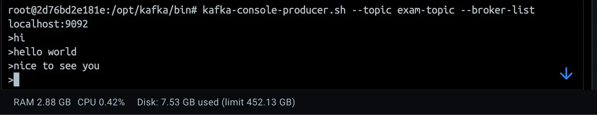
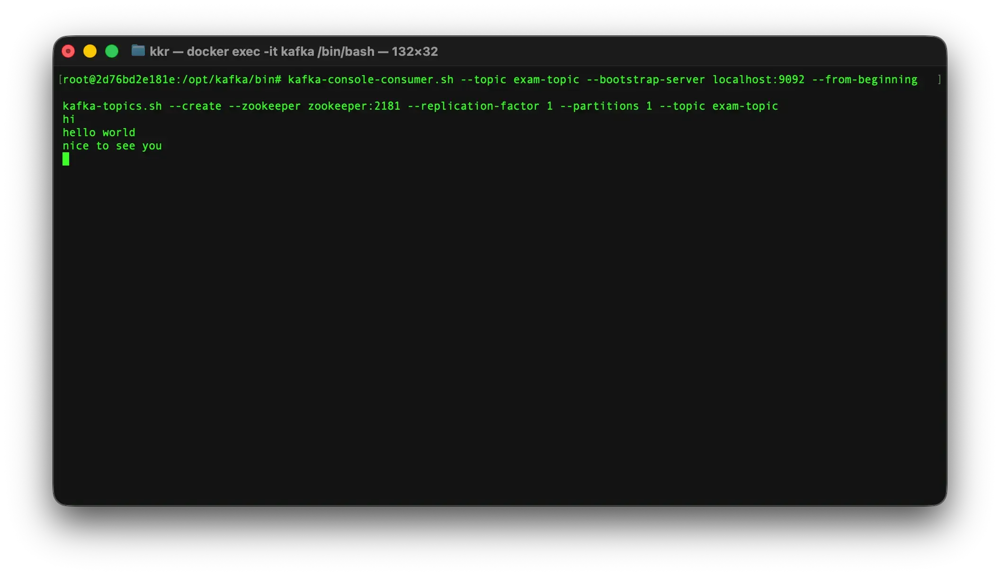
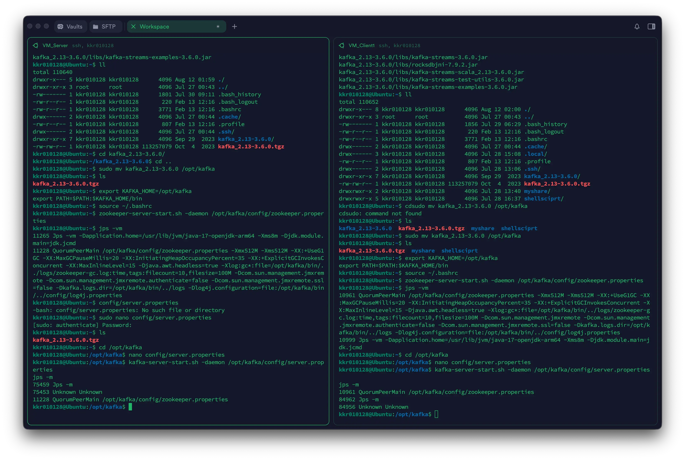

## 1 ) Docker를 이용한 Kafka 실습

---

### 실습 목적

Docker를 이용하여 Kafka와 ZooKeeper를 실행하고 다음 과정을 실습한다.

```text
Kafka / ZooKeeper 실행
	↓
Topic 생성
	↓
Producer 실행
	↓
Message 전송
	↓
Consumer 실행
	↓
Message 확인
```

### Docker Compose 구성

`docker-compose.yml` 파일을 생성한다.

```yaml
version: '3.8'

services:
  zookeeper:
    image: wurstmeister/zookeeper:latest
    container_name: zookeeper
    ports:
      - "2181:2181"

  kafka:
    image: wurstmeister/kafka:latest
    container_name: kafka
    ports:
      - "9092:9092"
    environment:
      KAFKA_ADVERTISED_HOST_NAME: 127.0.0.1
      KAFKA_ZOOKEEPER_CONNECT: zookeeper:2181
    volumes:
      - /var/run/docker.sock:/var/run/docker.sock
```

주요 설정은 다음과 같다.

| 설정 | 의미 |
|---|---|
| `2181:2181` | ZooKeeper가 사용하는 Port를 Host에 연결한다. |
| `9092:9092` | Kafka Broker가 사용하는 Port를 Host에 연결한다. |
| `KAFKA_ADVERTISED_HOST_NAME` | Client에게 알려줄 Kafka Broker의 Host 주소를 설정한다. |
| `KAFKA_ZOOKEEPER_CONNECT` | Kafka가 연결할 ZooKeeper의 주소를 설정한다. |
| `/var/run/docker.sock` | Container에서 Host의 Docker Daemon과 통신할 수 있도록 Docker Socket을 연결한다. |

### Kafka 실행

작성한 Compose 파일을 이용하여 Container를 실행한다.

```bash
docker-compose up -d
```

Kafka와 ZooKeeper가 실행되면 Kafka Container 내부로 접속한다.

```bash
docker exec -it kafka /bin/bash
```

Kafka 명령어가 위치한 디렉터리로 이동한다.

```bash
cd /opt/kafka/bin
```

### Topic 생성

실습에서 사용할 `exam-topic`을 생성한다.

```bash
kafka-topics.sh \
  --create \
  --zookeeper zookeeper:2181 \
  --replication-factor 1 \
  --partitions 1 \
  --topic exam-topic
```

실습에서는 하나의 Kafka Broker를 사용하므로 Replication Factor를 `1`로 지정하고, Partition도 하나만 생성한다.

생성된 Topic을 확인한다.

```bash
kafka-topics.sh \
  --bootstrap-server localhost:9092 \
  --list
```

→ 생성된 `exam-topic`을 확인한다.

Topic을 삭제할 경우 다음 명령을 사용한다.

```bash
kafka-topics.sh \
  --delete \
  --zookeeper zookeeper:2181 \
  --topic exam-topic
```

## 2 ) Producer와 Consumer 실습

---

### Producer 실행

Producer를 실행하여 `exam-topic`으로 Message를 전송한다.

```bash
kafka-console-producer.sh \
  --topic exam-topic \
  --broker-list localhost:9092
```

Producer가 실행되면 Terminal에서 입력한 Message가 `exam-topic`으로 전송된다.

```text
Producer
   │
   │ Message
   ▼
exam-topic
```

### Consumer 실행

별도의 Terminal을 열고 Kafka Container에 다시 접속한다.

```bash
docker exec -it kafka /bin/bash

cd /opt/kafka/bin
```

Consumer를 실행한다.

```bash
kafka-console-consumer.sh \
  --topic exam-topic \
  --bootstrap-server localhost:9092 \
  --from-beginning
```

`--from-beginning`을 사용하면 해당 Consumer가 읽을 위치가 없는 경우 Topic의 처음부터 Record를 읽는다.

전체 흐름은 다음과 같다.

```text
Terminal 1

Producer
   │
   ▼
exam-topic
   │
   ▼
Consumer

Terminal 2
```

Producer Terminal에서 Message를 입력하고 Consumer Terminal에서 해당 Message가 출력되는지 확인한다.




> **중간 정리**
>
> - Docker Compose를 이용하여 Kafka와 ZooKeeper를 함께 실행하였다.
> - Kafka Container 내부에서 CLI를 이용하여 Topic을 생성하고 확인할 수 있다.
> - Producer는 Topic으로 Message를 전송한다.
> - Consumer는 Topic에 저장된 Message를 가져와 처리한다.

## 3 ) Ubuntu에 Kafka 직접 설치

---

Docker Container가 아니라 Ubuntu 환경에 Kafka를 직접 설치하여 실행한다.

Kafka는 Java로 구현되어 있으므로 먼저 JDK를 설치한다.

### JDK 설치

```bash
sudo apt update
sudo apt install openjdk-17-jdk

java -version
```

`java -version`을 이용하여 JDK가 정상적으로 설치되었는지 확인한다.

### Kafka 설치

강의에서는 Kafka `3.6.0` 버전을 사용한다.

```bash
wget https://archive.apache.org/dist/kafka/3.6.0/kafka_2.13-3.6.0.tgz
```

다운로드한 파일의 압축을 해제한다.

```bash
tar xvf kafka_2.13-3.6.0.tgz
```

압축을 해제한 Kafka 디렉터리를 `/opt/kafka`로 이동한다.

```bash
sudo mv kafka_2.13-3.6.0 /opt/kafka
```

### 환경 변수 설정

Kafka 명령어를 경로와 관계없이 사용할 수 있도록 환경 변수를 설정한다.

```bash
export KAFKA_HOME=/opt/kafka
export PATH=$PATH:$KAFKA_HOME/bin
```

변경 사항을 바로 적용한다.

```bash
source ~/.bashrc
```

## 4 ) Kafka Heap Memory 설정

---

### 메모리를 확인해야 하는 이유

> EC와 Cloud Infrastructure의 Instance에 Kafka를 설치할 때는 Memory를 확인해야 한다.

강의에서는 Kafka와 ZooKeeper를 함께 실행하는 데 약 `1.5GB`의 Memory가 필요할 수 있다고 설명하였다.

실습용 Cloud Instance나 VM에 약 `1GB` 정도의 Memory만 할당되어 있다면 Kafka가 정상적으로 실행되지 않을 수 있다.

따라서 더 많은 Memory를 가진 Instance를 사용하거나, 실습 환경에서는 Kafka가 사용하는 Heap Memory를 줄여 실행할 수 있다.

### Heap Memory 제한

`~/.bashrc`를 연다.

```bash
nano ~/.bashrc
```

다음 환경 변수를 추가한다.

```bash
export KAFKA_HEAP_OPTS="-Xmx400m -Xms400m"
```

| 옵션 | 의미 |
|---|---|
| `-Xms400m` | JVM의 초기 Heap Memory를 400MB로 설정한다. |
| `-Xmx400m` | JVM의 최대 Heap Memory를 400MB로 설정한다. |

설정을 적용한다.

```bash
source ~/.bashrc
```

설정된 값을 확인한다.

```bash
echo $KAFKA_HEAP_OPTS
```

→ 다음과 같이 설정되어 있는지 확인한다.

```text
-Xmx400m -Xms400m
```

## 5 ) ZooKeeper와 Kafka Broker 실행

---

### ZooKeeper 실행

강의에서 사용하는 Kafka 구성은 ZooKeeper를 이용하므로 Kafka Broker보다 먼저 ZooKeeper를 실행한다.

```bash
zookeeper-server-start.sh \
  -daemon \
  /opt/kafka/config/zookeeper.properties
```

실행된 Java Process를 확인한다.

```bash
jps -vm
```

ZooKeeper Process가 실행되어 있는지 확인한다.

### Kafka Broker 설정

Kafka의 설정 파일을 수정한다.

```bash
cd /opt/kafka
nano config/server.properties
```

강의에서 수정한 주요 설정은 다음과 같다.

```properties
listeners=PLAINTEXT://:9092

advertised.listeners=PLAINTEXT://127.0.0.1:9092

delete.topic.enable=true

auto.create.topics.enable=true
```

#### `listeners`

```properties
listeners=PLAINTEXT://:9092
```

Kafka Broker가 실제로 요청을 받을 Listener와 Port를 설정한다.

여기서는 `9092` Port에서 Kafka Client의 연결을 받도록 설정한다.

#### `advertised.listeners`

```properties
advertised.listeners=PLAINTEXT://127.0.0.1:9092
```

Kafka Broker가 Producer나 Consumer와 같은 Client에게 알려주는 접속 주소이다.

로컬에서 Kafka를 사용할 경우 `127.0.0.1`을 사용할 수 있다.

> 외부에서 이 Kafka Broker에 접근해야 한다면 `127.0.0.1` 대신 실제로 접근 가능한 IP 주소를 설정해야 한다.

즉, 두 설정의 역할을 구분하면 다음과 같다.

```text
listeners
→ Broker가 어디에서 연결을 받을 것인가?

advertised.listeners
→ Client에게 어떤 주소로 접속하라고 알려줄 것인가?
```

#### `delete.topic.enable`

```properties
delete.topic.enable=true
```

Topic 삭제 기능을 활성화한다.

#### `auto.create.topics.enable`

```properties
auto.create.topics.enable=true
```

존재하지 않는 Topic에 대한 요청이 들어왔을 때 Topic을 자동으로 생성할 수 있도록 설정한다.

### Kafka Broker 실행

설정을 완료한 후 Kafka Broker를 실행한다.

```bash
kafka-server-start.sh \
  -daemon \
  /opt/kafka/config/server.properties
```

실행 상태를 확인한다.

```bash
jps -m
```

ZooKeeper와 Kafka가 모두 실행되어 있는지 확인한다.



```text
Ubuntu

├── ZooKeeper
│
└── Kafka Broker
       │
       └── :9092
```

## 6 ) Python에서 Kafka 사용

---

Kafka CLI를 이용한 Message 송수신에 이어 Python 애플리케이션에서 Kafka의 Producer와 Consumer를 구현한다.

실습에서는 `kafka-python` 패키지를 사용하며, 앞에서 생성한 `exam-topic`을 그대로 사용한다.

전체 흐름은 다음과 같다.

```text
Python Producer
      │
      │ Message 전송
      ▼
  exam-topic
      │
      │ Message 수신
      ▼
Python Consumer
````

### **kafka-python 설치**

Python에서 Kafka를 사용하기 위해 `kafka-python` 패키지를 설치한다.

```bash
pip install kafka-python
```

### **Producer 구현**

`pythonproducer.py` 파일을 생성한다.

```python
from kafka import KafkaProducer
import json


class MessageProducer:
    def __init__(self, broker, topic):
        self.broker = broker
        self.topic = topic

        self.producer = KafkaProducer(
            bootstrap_servers=self.broker,
            value_serializer=lambda x: json.dumps(x).encode("utf-8"),
            acks=0,
            api_version=(2, 5, 0),
            key_serializer=str.encode,
            retries=3
        )

    def send_message(self, msg, auto_close=True):
        try:
            future = self.producer.send(
                self.topic,
                value=msg,
                key="key"
            )

            self.producer.flush()

            if auto_close:
                self.producer.close()

            future.get(timeout=2)

            return {
                "status_code": 200,
                "error": None
            }

        except Exception as exc:
            raise exc


broker = ["localhost:9092"]
topic = "exam-topic"

pd = MessageProducer(broker, topic)

msg = {
    "name": "adam",
    "age": 50
}

res = pd.send_message(msg)

print(res)
```

### **Producer 설정**

`KafkaProducer`를 생성할 때 Kafka Broker와 Message 직렬화 방법 등을 설정한다.

```python
self.producer = KafkaProducer(
    bootstrap_servers=self.broker,
    value_serializer=lambda x: json.dumps(x).encode("utf-8"),
    acks=0,
    api_version=(2, 5, 0),
    key_serializer=str.encode,
    retries=3
)
```

|**설정**|**역할**|
|---|---|
|`bootstrap_servers`|Producer가 연결할 Kafka Broker를 지정한다.|
|`value_serializer`|Python 객체를 JSON 문자열로 변환한 뒤 UTF-8 Byte 형태로 변환한다.|
|`acks=0`|Broker의 Message 수신 확인을 기다리지 않는다.|
|`api_version`|사용할 Kafka API Version을 지정한다.|
|`key_serializer`|Message의 Key를 Byte 형태로 변환한다.|
|`retries=3`|Message 전송에 실패했을 때 재시도 횟수를 지정한다.|

실습에서는 다음 Kafka Broker와 Topic을 사용한다.

```python
broker = ["localhost:9092"]
topic = "exam-topic"
```

전송할 데이터는 Python Dictionary로 작성한다.

```python
msg = {
    "name": "adam",
    "age": 50
}
```

`value_serializer`에 의해 이 객체가 JSON 형태로 직렬화되어 Kafka로 전달된다.

### **Message 전송**

Message는 `send()`를 이용하여 Topic으로 전송한다.

```python
future = self.producer.send(
    self.topic,
    value=msg,
    key="key"
)
```

강의에서는 `send()`가 전송할 Message를 Buffer에 넣고, 실제 전송을 위해 `flush()`를 호출하는 방식으로 구현하였다.

```python
self.producer.flush()
```

전송 후 Producer를 종료한다.

```python
if auto_close:
    self.producer.close()
```

`future.get()`을 이용하여 전송 결과를 기다린다.

```python
future.get(timeout=2)
```

Producer의 흐름을 정리하면 다음과 같다.

```text
Python Dictionary
       ↓
JSON 직렬화
       ↓
UTF-8 Byte 변환
       ↓
KafkaProducer
       ↓
send()
       ↓
Buffer
       ↓
flush()
       ↓
exam-topic
```

### **Consumer 구현**

Producer가 전송한 Message를 읽기 위해 `pythonconsumer.py` 파일을 생성한다.

```python
from kafka import KafkaConsumer
import json


class MessageConsumer:
    def __init__(self, broker, topic):
        self.broker = broker

        self.consumer = KafkaConsumer(
            topic,
            bootstrap_servers=self.broker,
            value_deserializer=lambda x: x.decode("utf-8"),
            group_id="my-group",
            auto_offset_reset="earliest",
            enable_auto_commit=True
        )

    def receive_message(self):
        try:
            for message in self.consumer:
                print(message.value)

        except Exception as exc:
            raise exc


broker = ["localhost:9092"]
topic = "exam-topic"

cs = MessageConsumer(broker, topic)

cs.receive_message()
```

### **Consumer 설정**

Consumer는 `KafkaConsumer`를 이용하여 생성한다.

```python
self.consumer = KafkaConsumer(
    topic,
    bootstrap_servers=self.broker,
    value_deserializer=lambda x: x.decode("utf-8"),
    group_id="my-group",
    auto_offset_reset="earliest",
    enable_auto_commit=True
)
```

|**설정**|**역할**|
|---|---|
|`topic`|Consumer가 Message를 읽을 Topic을 지정한다.|
|`bootstrap_servers`|연결할 Kafka Broker를 지정한다.|
|`value_deserializer`|Kafka에서 읽은 Byte 데이터를 UTF-8 문자열로 변환한다.|
|`group_id`|Consumer가 속할 Consumer Group을 지정한다.|
|`auto_offset_reset="earliest"`|저장된 Offset이 없는 경우 가장 처음 위치부터 읽도록 설정한다.|
|`enable_auto_commit=True`|Consumer가 읽은 Offset을 자동으로 Commit하도록 설정한다.|

### **Message 수신**

생성한 Consumer를 반복하면서 Kafka에서 전달되는 Message를 읽는다.

```python
for message in self.consumer:
    print(message.value)
```

Producer가 다음 데이터를 전송하면,

```python
msg = {
    "name": "adam",
    "age": 50
}
```

Consumer는 `exam-topic`에서 해당 Message를 읽어 출력한다.

전체 동작은 다음과 같다.

```text
pythonproducer.py

{"name": "adam", "age": 50}
            │
            ▼
       KafkaProducer
            │
            ▼
        exam-topic
            │
            ▼
       KafkaConsumer
            │
            ▼
pythonconsumer.py
```

> **중간 정리**
>
> - `kafka-python`을 이용하면 Python 애플리케이션에서 Kafka Producer와 Consumer를 구현할 수 있다.
>
> - `KafkaProducer`는 Message를 직렬화하여 Kafka Topic으로 전송하고, `KafkaConsumer`는 Topic에 저장된 Message를 읽는다.
>
> - 실습에서는 Python Dictionary를 JSON으로 직렬화한 뒤 UTF-8 Byte 형태로 변환하여 `exam-topic`으로 전송한다.
>
> - Producer의 `send()`로 Message를 전송하고 `flush()`를 호출하여 Buffer의 Message를 전송한다.
>
> - Consumer는 `group_id`를 통해 Consumer Group을 지정하며, `auto_offset_reset="earliest"`를 이용하여 저장된 Offset이 없는 경우 처음부터 Message를 읽도록 설정한다.
>
> - Python에서도 CLI 실습과 동일하게 `Producer → Topic → Consumer`의 흐름으로 Kafka Message를 송수신할 수 있다.
## 7 ) Docker와 Ubuntu 실습 비교

---

이번 실습에서는 동일한 Kafka를 두 가지 방법으로 구성하였다.

| 구분        | Docker         | Ubuntu 직접 설치              |
| --------- | -------------- | ------------------------- |
| 실행 환경     | Container      | Ubuntu OS                 |
| Kafka 설치  | Image 사용       | Kafka Binary 직접 설치        |
| JDK 설치    | Image 내부 환경 사용 | 직접 설치                     |
| ZooKeeper | 별도 Container   | 직접 Process 실행             |
| Kafka 설정  | 환경 변수 중심       | `server.properties` 직접 수정 |
| 실행        | Docker Compose | Kafka 실행 Script           |
| 목적        | 빠른 Kafka 환경 구성 | Kafka 실행 환경과 설정 구조 확인     |

Docker를 이용하면 Kafka 실행 환경을 비교적 빠르게 구성할 수 있다.

반면 Ubuntu에 직접 설치하면 JDK, 환경 변수, Heap Memory, ZooKeeper, Kafka Broker 설정 등을 직접 구성하면서 Kafka가 어떤 환경에서 실행되는지 확인할 수 있다.

> **정리**
>
> - Kafka는 **Docker Compose**를 이용해 ZooKeeper와 함께 빠르게 구성할 수도 있고, Ubuntu에 직접 설치하여 실행 환경을 구성할 수도 있다.
>
> - Kafka CLI를 이용하면 **Topic을 생성·조회·삭제**할 수 있으며, Console Producer와 Consumer를 이용하여 Topic을 통한 Message 송수신 과정을 직접 확인할 수 있다.
>
> - Ubuntu에 Kafka를 직접 설치하는 경우 Kafka가 Java 기반으로 동작하므로 **JDK를 먼저 설치**해야 하며, 강의에서 사용한 ZooKeeper 기반 구성에서는 ZooKeeper를 실행한 뒤 Kafka Broker를 실행한다.
>
> - Memory가 제한된 VM이나 Cloud Instance에서는 Kafka 실행에 필요한 Memory를 확인해야 한다. 실습 환경에서는 `KAFKA_HEAP_OPTS`를 이용하여 Kafka JVM의 초기 및 최대 Heap Memory를 조정할 수 있다.
>
> - Kafka Broker 설정에서 `listeners`는 **Broker가 실제 연결을 수신할 주소와 Port**를 지정하고, `advertised.listeners`는 **Producer와 Consumer 등의 Client에게 알려줄 Broker의 접속 주소**를 지정한다.
>
> - Docker 실습은 Kafka 환경을 빠르게 구성하여 기본 동작을 확인하는 데 적합하고, Ubuntu 직접 설치 실습은 **JDK, 환경 변수, Heap Memory, ZooKeeper, Broker 설정과 실행 과정**을 직접 구성하면서 Kafka의 실행 구조를 확인하는 데 의미가 있다.