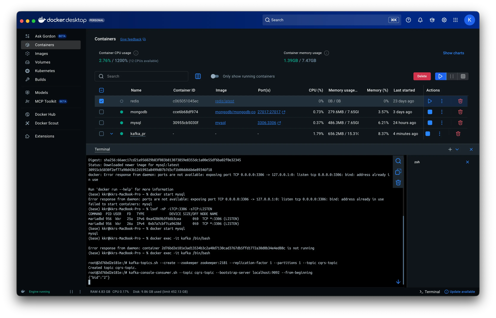
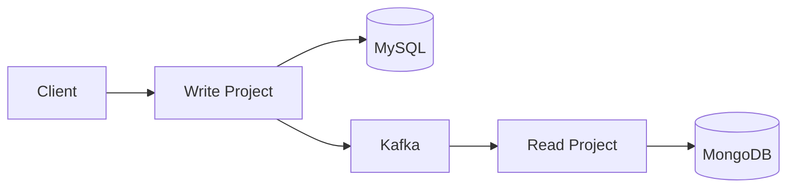
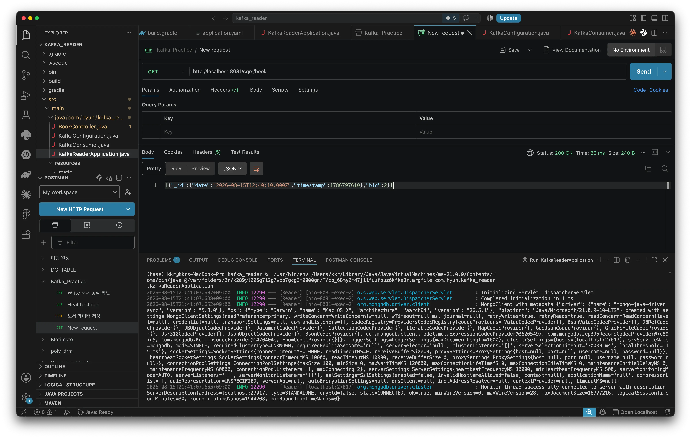

## 1 ) Spring Boot 기반 CQRS 구현

---

CQRS(Command Query Responsibility Segregation)는 데이터를 변경하는 책임과 조회하는 책임을 분리하는 패턴이다.

이번 실습에서는 이 책임을 두 개의 Spring Boot 프로젝트로 나눠서 구현한다.

쓰기 프로젝트는 MySQL을 사용해서 데이터를 저장하고, 읽기 프로젝트는 MongoDB를 사용해서 데이터를 조회한다.

두 프로젝트는 서로 독립적으로 동작하지만, 나중에 Kafka를 연결해서 쓰기 프로젝트에서 발생한 변경 사항이 읽기 프로젝트로 전달되도록 확장한다.

```text
Command
   ↓
Write (MySQL)
   ↓
 Kafka
   ↓
Read (MongoDB)
   ↓
Query
```

### 실습 준비

실습을 시작하기 전에 다음을 준비한다.

| 준비 항목           | 내용         |
| --------------- | ---------- |
| MySQL / MariaDB | 설치 후 접속 확인 |
| Kafka           | 설치         |
| JDK             | 설치         |
| IntelliJ IDEA   | 설치         |

## 2 ) **쓰기 프로젝트 (Write Project)**

---

쓰기 프로젝트는 CQRS에서 Command 영역을 담당한다.

사용자로부터 도서 정보를 받아서 MySQL에 저장하는 역할을 한다.

### 프로젝트 생성

다음 의존성을 포함해서 Spring Boot 프로젝트를 생성한다.

- Spring Boot DevTools
- Lombok
- Spring Web
- Spring Data JPA
- MySQL
- Spring for Apache Kafka (Messaging)

### application.yml 설정

```yaml
server:
  port: 8080

spring:
  application:
    name: Write

  datasource:
    url: jdbc:mysql://localhost:3306/cqrs # cqrs DB
    driver-class-name: com.mysql.cj.jdbc.Driver
    username: root
    password: password

  jpa:
    hibernate:
      ddl-auto: update # Entity 클래스를 기준으로 테이블이 자동 생성 및 수정됨
    properties:
      hibernate:
        format_sql: true
        show_sql: true

logging:
  level:
    org.hibernate.type.description.sql: trace
```

8080번 포트로 실행되고, MySQL의 `cqrs` 데이터베이스에 연결한다.

`ddl-auto: update` 설정 때문에 Entity 클래스를 기준으로 테이블이 자동으로 생성되거나 수정된다.

### Book Entity

`Book`은 MySQL의 `book` 테이블과 매핑되는 Entity 클래스다.

```java
import jakarta.persistence.*;
import lombok.*;

import java.util.Date;

@Entity
@Table(name = "book")
@ToString
@Getter
@Builder
@AllArgsConstructor
@NoArgsConstructor
public class Book {
    @Id
    @GeneratedValue(strategy = GenerationType.AUTO)
    private Long bid;

    @Column(length = 50, nullable = false)
    private String title;
    @Column(length = 50, nullable = false)
    private String author;
    @Column(length = 50, nullable = false)
    private String category;
    @Column
    private int pages;
    @Column
    private int price;
    @Column
    private Date published_date;
    @Column(length = 50, nullable = false)
    private String description;
}
```

`bid`는 `@GeneratedValue(strategy = GenerationType.AUTO)`로 설정되어 있어서 저장할 때 자동으로 생성된다.

### BookDTO

DTO는 계층 사이에서 데이터를 주고받기 위한 객체다.

클라이언트가 보낸 도서 정보를 `BookDTO`로 받는다.

```java
import lombok.Data;

@Data
public class BookDTO {
    private String title;
    private String author;
    private String category;
    private int pages;
    private int price;
    private String published_date;
    private String description;
}
```

이 시점에는 아직 `bid` 필드가 없다.

### BookRepository

```java
import org.springframework.data.jpa.repository.JpaRepository;

public interface BookRepository extends JpaRepository<Book, Long> {
}
```

`JpaRepository`를 상속받는 것만으로 기본적인 CRUD 기능을 사용할 수 있다.

### BookService

`BookDTO`를 `Book` Entity로 변환해서 MySQL에 저장한다.

`published_date`는 문자열로 들어오기 때문에 `SimpleDateFormat`으로 `Date` 타입으로 변환해야 한다.

```java
import lombok.RequiredArgsConstructor;
import org.springframework.stereotype.Service;

import java.text.SimpleDateFormat;
import java.util.Date;
import java.util.Locale;

@Service
@RequiredArgsConstructor
public class BookService {
    private final BookRepository bookRepository;

    public void saveBook(BookDTO bookDTO){
        try {
            SimpleDateFormat formatter = new SimpleDateFormat(
                    "yyyy-MM-dd", Locale.ENGLISH);
            Date published_date = formatter.parse(bookDTO.getPublished_date());
            Book book = Book.builder()
                    .title(bookDTO.getTitle())
                    .author(bookDTO.getAuthor())
                    .category(bookDTO.getCategory())
                    .pages(bookDTO.getPages())
                    .price(bookDTO.getPrice())
                    .published_date(published_date)
                    .description(bookDTO.getDescription())
                    .build();
            bookRepository.save(book);
        }
        catch(Exception e){
            System.out.println(e.getMessage());
        }
    }
}
```

### BookController

```java
import lombok.RequiredArgsConstructor;
import org.springframework.web.bind.annotation.GetMapping;
import org.springframework.web.bind.annotation.PostMapping;
import org.springframework.web.bind.annotation.RequestBody;
import org.springframework.web.bind.annotation.RestController;

@RestController
@RequiredArgsConstructor
public class BookController {
    private final BookService bookService;

    @GetMapping("/")
    public String index(){
        return "homepage";
    }

    @GetMapping("/health")
    public String healthCheck(){
        return "success";
    }

    @PostMapping("/cqrs/book")
    public String saveBook(@RequestBody BookDTO bookDTO){
        bookService.saveBook(bookDTO);
        return "success";
    }
}
```

| Method | Endpoint | 역할 |
|---|---|---|
| GET | `/` | 서버 동작 확인 |
| GET | `/health` | Health Check |
| POST | `/cqrs/book` | 도서 데이터 저장 |

서버를 실행하고 `localhost:8080`으로 접속해서 동작을 확인한다.

데이터 저장이 잘 되는지는 POSTMAN으로 테스트한다. (4번에서 자세히 다룬다.)

## 3 ) **읽기 프로젝트 (Read Project)**

---

읽기 프로젝트는 CQRS에서 Query 영역을 담당한다.

쓰기 프로젝트가 MySQL을 사용한 것과 다르게, 읽기 프로젝트는 MongoDB를 사용한다.

### 프로젝트 생성

다음 의존성을 포함해서 Spring Boot 프로젝트를 생성한다.

- Spring Boot DevTools
- Lombok
- Spring Web
- Spring Data MongoDB
- Spring for Apache Kafka (Messaging)

읽기 프로젝트는 MongoDB만 사용하므로 **Spring Data JPA는 추가하지 않는다.** JPA를 추가하면 사용하지 않는 DataSource의 자동 설정이 동작하여 MySQL 접속 정보가 없을 때 애플리케이션 시작 오류가 발생할 수 있다.

### application.yml 설정

Reader의 `BookController`는 MongoDB 주소를 코드에서 직접 지정하므로 초기 조회 단계에서는 MongoDB 접속 설정이 없어도 된다.

```java
MongoClients.create("mongodb://localhost:27017");
```

그러나 Write와 Reader의 기본 포트는 모두 8080이므로 두 프로젝트를 동시에 실행하면 포트가 충돌한다. Reader에는 최소한 다음 설정을 작성한다.

```yaml
server:
  port: 8081

spring:
  application:
    name: Reader
```

따라서 Write는 8080번 포트, Reader는 8081번 포트에서 실행한다.

### BookController

`/cqrs/book`으로 요청이 들어오면 MongoDB의 `books` Collection을 조회해서 반환한다.

```java
import com.mongodb.client.*;
import lombok.RequiredArgsConstructor;
import org.bson.Document;
import org.springframework.http.HttpStatus;
import org.springframework.http.ResponseEntity;
import org.springframework.web.bind.annotation.GetMapping;
import org.springframework.web.bind.annotation.RestController;
import java.util.ArrayList;
import java.util.List;

@RestController
@RequiredArgsConstructor
public class BookController {
    @GetMapping("/cqrs/book")
    public ResponseEntity<List> getBooks(){
        MongoClient mongoClient = MongoClients.create("mongodb://localhost:27017");
        MongoDatabase database = mongoClient.getDatabase("cqrs");
        MongoCollection<Document> mongo_books =
                database.getCollection("books");
        List<Document> list = new ArrayList<Document>();

        try{
            try(MongoCursor<Document> cur = mongo_books.find().iterator()){
                while(cur.hasNext()){
                    Document doc = cur.next();
                    list.add(doc);
                }
            }
        }catch(Exception e){
            e.printStackTrace();
        }
        finally{
            mongoClient.close();
        }
        return ResponseEntity.status(HttpStatus.OK).body(list);
    }
}
```

`MongoClients.create()`로 MongoDB에 연결하고 `cqrs` 데이터베이스의 `books` Collection을 가져온다.

`find()`로 전체 Document를 조회하고, `MongoCursor`를 순회하면서 `List`에 담는다.

조회가 끝나면 `mongoClient.close()`로 연결을 닫고 결과를 응답으로 반환한다.

MongoDB를 실행한 뒤 Reader 프로젝트를 실행하고 다음 주소에서 정상적으로 조회되는지 확인한다.

```text
http://localhost:8081/cqrs/book
```

이 단계에서는 Kafka Consumer를 아직 작성하지 않았으므로 `spring.kafka` 설정이 없어도 된다.

**중간 정리**

- 쓰기 프로젝트는 MySQL에 도서 데이터를 저장하는 Command 영역을 담당한다.
- 읽기 프로젝트는 MongoDB에서 도서 데이터를 조회하는 Query 영역을 담당한다.
- 현재까지는 두 프로젝트가 완전히 분리되어 있어서, 쓰기 프로젝트에 저장된 데이터가 읽기 프로젝트로 자동으로 전달되지 않는다.
- 이 문제는 이후 Kafka를 연결해서 해결한다.

## 4 ) **쓰기 프로젝트 데이터 삽입 테스트 (POSTMAN)**

---

쓰기 프로젝트가 MySQL에 정상적으로 데이터를 저장하는지 POSTMAN으로 확인한다.

### 요청 설정

- Method: `POST`
- URL: `http://localhost:8080/cqrs/book`
- Headers: `Content-Type: application/json`
- Body: `raw` / `JSON`

```json
{
    "title": "오디세이",
    "author": "호메로스",
    "category": "신화",
    "description": "크리스토퍼 놀란",
    "pages": 356,
    "price": 15000,
    "published_date": "2026-08-13"
}
```

`Send`를 눌러서 요청을 전송한다.

```text
POSTMAN
   ↓
BookController
   ↓
BookService
   ↓
BookRepository
   ↓
MySQL
```

요청이 성공하면 MySQL의 `book` 테이블에 데이터가 저장된다.

데이터베이스를 직접 확인해서 저장 여부를 검증한다.

## 5 ) **Kafka를 이용한 CQRS 연결**

---

쓰기 프로젝트와 읽기 프로젝트는 각각 MySQL, MongoDB를 사용하지만 서로 분리되어 있다.

그래서 쓰기 프로젝트에서 데이터가 바뀌어도 읽기 프로젝트는 그 사실을 알 수 없다.

이 문제를 해결하기 위해 두 프로젝트 사이에 Kafka를 연결한다.

쓰기 프로젝트가 MySQL 저장을 완료하면 Kafka로 Message를 발행하고, 읽기 프로젝트가 그 Message를 받아서 MongoDB에 반영하는 구조다.

```text
POSTMAN
   ↓
Write Project → MySQL
   ↓
Kafka Producer → cqrs-topic → Kafka Consumer
   ↓
Read Project → MongoDB
   ↓
POSTMAN
```

### 쓰기 프로젝트에 Kafka 연결

#### 라이브러리 추가

라이브러리를 프로젝트 생성 당시 추가하지 않았다면 `build.gradle`의 `dependencies`에 다음을 추가한다.

```gradle
implementation 'org.springframework.boot:spring-boot-starter-kafka'
```

추가한 뒤에는 IntelliJ에서 코끼리 아이콘을 눌러서 Gradle을 다시 Build한다.

#### Kafka 설정

`application.yaml`에 Kafka 연결 정보를 추가한다.

```yaml
spring:
  kafka:
    bootstrap-servers: 127.0.0.1:9092
    consumer:
      group-id: hyeon
      auto-offset-reset: earliest
      key-deserializer: org.apache.kafka.common.serialization.StringDeserializer
      value-deserializer: org.apache.kafka.common.serialization.StringDeserializer
    producer:
      key-serializer: org.apache.kafka.common.serialization.StringSerializer
      value-serializer: org.apache.kafka.common.serialization.StringSerializer
```

Message를 문자열로 처리하기 위해 `StringSerializer`, `StringDeserializer`를 사용한다.

> Kafka의 동작 흐름만 확인할 목적으로 실습을 진행하므로, Docker 컨테이너 하나에 브로커를 하나만 올린 상태이다. (고가용성 없음)
> 
> 실제 서비스에서는 브로커가 여러 개일 경우 `bootstrap-servers` 부분에 IP를 `,`로 구분하여 나열한다.
> 
> 이럴 경우 Producer/Consumer가 처음 연결할 때 이 목록 중 하나에 붙어 전체 클러스터 정보를 받아오고, 그다음부터는 어느 브로커가 Leader인지 알게 되는 구조다.


#### KafkaConfiguration

`KafkaTemplate`을 생성하기 위한 설정 클래스를 작성한다.

```java
import org.apache.kafka.clients.producer.ProducerConfig;
import org.springframework.beans.factory.annotation.Value;
import org.springframework.context.annotation.Bean;
import org.springframework.context.annotation.Configuration;
import org.springframework.kafka.core.DefaultKafkaProducerFactory;
import org.springframework.kafka.core.KafkaTemplate;
import org.springframework.kafka.core.ProducerFactory;
import org.apache.kafka.common.serialization.StringSerializer;

import java.util.HashMap;
import java.util.Map;

@Configuration
public class KafkaConfiguration {
    @Value("${spring.kafka.bootstrap-servers}")
    private String bootStrapServers;

    @Bean
    public ProducerFactory<String, String> producerFactory(){
        Map<String, Object> configs = new HashMap<>();
        configs.put(ProducerConfig.BOOTSTRAP_SERVERS_CONFIG, bootStrapServers);
        configs.put(ProducerConfig.KEY_SERIALIZER_CLASS_CONFIG, StringSerializer.class);
        configs.put(ProducerConfig.VALUE_SERIALIZER_CLASS_CONFIG, StringSerializer.class);
        return new DefaultKafkaProducerFactory<>(configs);
    }

    @Bean
    public KafkaTemplate<String, String> kafkaTemplate(){
        return new KafkaTemplate<>(producerFactory());
    }
}
```

`ProducerFactory`는 Kafka Producer를 만들기 위한 설정이고, `KafkaTemplate`은 실제로 Topic에 Message를 보낼 때 사용한다.

#### BookDTO 수정

`bid` 필드를 추가한다.

```java
public class BookDTO {
    private Long bid;
    private String title;
    private String author;
    private String category;
    private int pages;
    private int price;
    private String published_date;
    private String description;
}
```

클라이언트가 `bid`를 직접 보내는 게 아니라, MySQL에 저장한 뒤 생성된 `bid`를 여기에 다시 담아서 Kafka Message에 포함시킨다.

#### KafkaProducer

```java
import lombok.RequiredArgsConstructor;
import org.slf4j.Logger;
import org.slf4j.LoggerFactory;
import org.springframework.beans.factory.annotation.Autowired;
import org.springframework.kafka.core.KafkaTemplate;
import org.springframework.stereotype.Service;

@Service
@RequiredArgsConstructor
public class KafkaProducer {
    private static final String TOPIC = "cqrs-topic";

    @Autowired
    private KafkaTemplate<String, String> kafkaTemplate;
    private final Logger log = LoggerFactory.getLogger(getClass());

    public void sendMessage(BookDTO bookDTO){
        String message = "{\"bid\":" + "\"" + bookDTO.getBid() + "\"}";
        //메시지 전송
        this.kafkaTemplate.send(TOPIC, message);
    }
}
```

`bid`를 `{"bid":"1"}` 형태의 JSON 문자열로 만들어서 `cqrs-topic`으로 전송한다.

여기서는 `bid`만 보낸다. 제목이나 저자 같은 나머지 정보는 Message에 포함되지 않는다.

#### BookService 수정

```java
@Service
@RequiredArgsConstructor
public class BookService {
    private final BookRepository bookRepository;
    private final KafkaProducer kafkaProducer;

    public void saveBook(BookDTO bookDTO){
        try {
            SimpleDateFormat formatter = new SimpleDateFormat(
                    "yyyy-MM-dd", Locale.ENGLISH);
            Date published_date = formatter.parse(bookDTO.getPublished_date());
            Book book = Book.builder()
                    .title(bookDTO.getTitle())
                    .author(bookDTO.getAuthor())
                    .category(bookDTO.getCategory())
                    .pages(bookDTO.getPages())
                    .price(bookDTO.getPrice())
                    .published_date(published_date)
                    .description(bookDTO.getDescription())
                    .build();
            bookRepository.save(book);
            bookDTO.setBid(book.getBid());
            //쓰기 작업을 완료할 때 카프카에게 메시지를 전송
            kafkaProducer.sendMessage(bookDTO); 
        }
        catch(Exception e){
            System.out.println(e.getMessage());
        }
    }
}
```

MySQL 저장 이후 코드 3줄이 Kafka 연결의 핵심이다.

```java
bookRepository.save(book);
bookDTO.setBid(book.getBid());
//쓰기 작업을 완료할 때 카프카에게 메시지를 전송
kafkaProducer.sendMessage(bookDTO);
```

저장하고, 생성된 `bid`를 받아오고, 그 `bid`를 Kafka로 보낸다.

#### cqrs-topic 생성 및 확인

Kafka 컨테이너에 접속한다.

```bash
docker exec -it kafka /bin/bash
```

Topic을 생성한다.

```bash
kafka-topics.sh --create --zookeeper zookeeper:2181 --replication-factor 1 --partitions 1 --topic cqrs-topic
```

Console Consumer로 Message를 확인한다.

```bash
kafka-console-consumer.sh --topic cqrs-topic --bootstrap-server localhost:9092 --from-beginning
```

POSTMAN으로 책을 저장하면 Console Consumer에 다음과 같은 Message가 찍힌다.

```json
{"bid":"1"}
```

이 Message가 보이면 쓰기 프로젝트에서 Kafka까지 연결이 정상적으로 동작하는 것이다.

### 읽기 프로젝트에 Kafka 연결

#### 라이브러리 추가

Kafka에서 받은 JSON 문자열을 처리하기 위해 `build.gradle`에 추가한다.

```gradle
implementation 'org.json:json:20190722'
```

#### Kafka 설정

Reader의 기존 `application.yml`에 Kafka Consumer 설정을 추가한다. `server`와 `spring.application`을 유지한 상태에서 `spring.kafka`를 같은 `spring` 아래에 병합한다.

```yaml
server:
  port: 8081

spring:
  application:
    name: Reader

  kafka:
    bootstrap-servers: 127.0.0.1:9092
    consumer:
      group-id: hyeon
      auto-offset-reset: earliest
      key-deserializer: org.apache.kafka.common.serialization.StringDeserializer
      value-deserializer: org.apache.kafka.common.serialization.StringDeserializer
    producer:
      key-serializer: org.apache.kafka.common.serialization.StringSerializer
      value-serializer: org.apache.kafka.common.serialization.StringSerializer
```

Reader 컨트롤러만 확인하는 단계에는 위 Kafka 설정이 필요하지 않지만, `@KafkaListener`를 작성하여 Consumer를 실행할 때부터 필요하다.

#### KafkaConfiguration

읽기 프로젝트에도 쓰기 프로젝트와 동일한 `KafkaConfiguration` 클래스를 작성한다.

```java
import org.apache.kafka.clients.producer.ProducerConfig;
import org.springframework.beans.factory.annotation.Value;
import org.springframework.context.annotation.Bean;
import org.springframework.context.annotation.Configuration;
import org.springframework.kafka.core.DefaultKafkaProducerFactory;
import org.springframework.kafka.core.KafkaTemplate;
import org.springframework.kafka.core.ProducerFactory;
import org.apache.kafka.common.serialization.StringSerializer;

import java.util.HashMap;
import java.util.Map;

@Configuration
public class KafkaConfiguration {
    @Value("${spring.kafka.bootstrap-servers}")
    private String bootStrapServers;

    @Bean
    public ProducerFactory<String, String> producerFactory(){
        Map<String, Object> configs = new HashMap<>();
        configs.put(ProducerConfig.BOOTSTRAP_SERVERS_CONFIG, bootStrapServers);
        configs.put(ProducerConfig.KEY_SERIALIZER_CLASS_CONFIG, StringSerializer.class);
        configs.put(ProducerConfig.VALUE_SERIALIZER_CLASS_CONFIG, StringSerializer.class);
        return new DefaultKafkaProducerFactory<>(configs);
    }

    @Bean
    public KafkaTemplate<String, String> kafkaTemplate(){
        return new KafkaTemplate<>(producerFactory());
    }
}
```

#### KafkaConsumer

```java
import com.mongodb.client.MongoClient;
import com.mongodb.client.MongoClients;
import com.mongodb.client.MongoCollection;
import com.mongodb.client.MongoDatabase;
import org.bson.Document;
import org.json.JSONObject;
import org.springframework.kafka.annotation.KafkaListener;
import org.springframework.stereotype.Service;

import java.io.IOException;

@Service
public class KafkaConsumer {
    @KafkaListener(topics="cqrs-topic", groupId = "hyeon")
    public void consumer(String message) throws IOException{
        System.out.println("message:" + message);
        //JSON 파싱: JSON문자열로 온 것을 자바 객체로 변환
        JSONObject messageObj = new JSONObject(message);
		
		//JSON 파싱: JSON문자열로 온 것을 자바 객체로 변환
        MongoClient mongoClient = MongoClients.create("mongodb://localhost:27017");
        MongoDatabase database = mongoClient.getDatabase("cqrs");
        MongoCollection<Document> mongo_books =
                database.getCollection("books");
		//받은 데이터로 삽입할 데이터를 생성
        Document book = new Document();
        book.append("bid", messageObj.getLong("bid"));
        mongo_books.insertOne(book);
        mongoClient.close();
    }
}
```

`@KafkaListener`로 `cqrs-topic`을 구독하고 있다가 Message가 오면 동작한다.

받은 문자열을 `JSONObject`로 파싱해서 `bid`를 꺼내고, MongoDB의 `cqrs` 데이터베이스, `books` Collection에 저장한다.

### 전체 구조 및 실행



두 프로젝트를 모두 실행한 상태에서 POSTMAN으로 쓰기 프로젝트에 데이터를 보내면 다음 순서로 처리된다.

```text
POSTMAN
   ↓
BookController (Write)
   ↓
BookService
   ↓
MySQL 저장 → bid 생성
   ↓
KafkaProducer → cqrs-topic
   ↓
KafkaConsumer (Read)
   ↓
MongoDB 저장
```

읽기 프로젝트의 `GET /cqrs/book`으로 조회하면 방금 저장된 `bid`가 MongoDB에 들어있는 것을 확인할 수 있다.



### 실습 메모

지금 구조는 CQRS를 구현해보는 실습 구조로, Kafka로 전달되는 정보는 `bid` 하나뿐이다.

읽기 프로젝트가 나중에 도서의 상세 정보를 조회하려면, `KafkaProducer`에서 `bid`뿐만 아니라 도서 정보 전체를 JSON으로 보내도록 수정해야 한다.

---

> **정리**
>
> - 이번 실습은 CQRS 패턴에 따라 쓰기와 읽기 책임을 두 개의 Spring Boot 프로젝트로 분리하는 것이다. 쓰기 프로젝트는 MySQL에, 읽기 프로젝트는 MongoDB에 도서 데이터를 저장하거나 조회한다.
>
> - 쓰기 프로젝트는 `BookController → BookService → BookRepository` 순서로 요청을 처리해서 MySQL에 `Book` Entity를 저장한다.
>
> - 읽기 프로젝트는 `BookController`에서 `MongoClient`로 MongoDB에 직접 연결해서 `books` Collection을 조회한다.
>
> - 두 프로젝트가 분리되어 있어서 쓰기 프로젝트의 변경 사항이 읽기 프로젝트에 자동으로 전달되지 않는데, 이 문제를 Kafka로 해결한다.
>
> - 쓰기 프로젝트는 MySQL 저장 후 생성된 `bid`를 `KafkaProducer`를 통해 `cqrs-topic`으로 전송한다.
>
> - 읽기 프로젝트는 `@KafkaListener`로 `cqrs-topic`을 구독하고, 받은 `bid`를 MongoDB의 `books` Collection에 저장한다.
