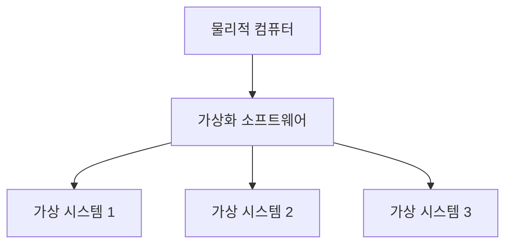

## 1 ) 가상화

---

가상화(Virtualization)는 **물리적 시스템의 CPU, Memory, Storage, Network 같은 자원을 추상화하여 여러 가상 환경에서 사용할 수 있게 하는 기술**이다.

가상화 소프트웨어는 물리적 Hardware의 기능을 논리적으로 분리한다. 하나의 물리적인 Computer에서도 여러 가상 System을 동시에 실행할 수 있으므로 Hardware Resource의 활용도를 높이고 Infrastructure를 유연하게 관리할 수 있다.



### 가상화의 장점

- **효율적인 리소스 사용**
	- 하나의 물리적 System을 여러 환경이 공유하여 Resource를 효율적으로 사용한다.
- **자동화된 IT 관리**
	- 가상 환경의 생성, 배포 및 관리를 자동화하기 쉽다.
- **신속한 재해 복구**
	- Snapshot과 복제된 환경을 이용하여 장애 발생 시 빠르게 복구할 수 있다.

### 가상화 서비스

| 종류 | 설명 |
|---|---|
| Server 가상화 | 하나의 물리적 Server를 여러 가상 Server로 분리 |
| Storage 가상화 | 여러 Storage Resource를 하나의 논리적 Storage처럼 구성 |
| Network 가상화 | 물리적 Network를 논리적으로 분리하고 Software로 제어 |
| Data 가상화 | 여러 위치의 Data를 하나의 Data Source처럼 제공 |
| Application 가상화 | Application을 운영체제와 분리된 환경에서 실행 |
| Desktop 가상화 | Desktop 환경을 중앙 Server에서 제공 |

Network 가상화의 대표적인 기술로 SDN(Software-Defined Networking)이 있다. SDN은 물리적 장비가 담당하던 Traffic 제어 기능을 Software로 분리하여 Routing 정책을 중앙에서 관리한다. 예를 들어 영상 통화 Traffic을 일반 Application Traffic보다 우선 처리하도록 구성할 수 있다.

### 가상화 방식

#### Host OS 가상화

Host OS 위에 가상화 Software를 설치하고 그 위에서 Guest OS를 실행하는 방식이다.

```text
Application
Guest OS
Virtualization Software
Host OS
Hardware
```

Host와 Guest 운영체제의 선택이 비교적 자유롭지만 운영체제 위에서 또 다른 운영체제를 실행하므로 Overhead가 클 수 있다.

#### Hypervisor 가상화

Host OS 없이 Hardware에 Hypervisor를 직접 설치하고 여러 Guest OS를 실행하는 방식이다. Hardware에 직접 설치하는 Hypervisor를 **Bare Metal Hypervisor**라고 하며 Server 가상화에서 주로 사용한다.

```text
Application
Guest OS
Hypervisor
Hardware
```

Host OS를 거치지 않으므로 Host OS 방식보다 Overhead가 작다.

#### Container 가상화

Host OS 위에 Container Runtime을 설치하고 Application 실행 환경을 논리적으로 격리하는 방식이다.

```text
Container A        Container B
App + Library      App + Library
--------------------------------
Container Runtime
Host OS
Hardware
```

Container는 Guest OS 전체를 포함하지 않고 Host OS의 Kernel을 공유한다. 따라서 Virtual Machine보다 가볍고 빠르지만 서로 다른 종류의 Kernel을 요구하는 운영체제를 동시에 실행하기 어렵고, 격리 수준도 완전한 Virtual Machine과 차이가 있다.

Container 가상화 Software에는 OpenVZ, LXC, Linux VServer, Docker, Oracle Solaris Zones 등이 있다.

## 2 ) Container

---

Container는 **Application Code와 실행에 필요한 Library 및 의존성을 하나의 격리된 단위로 묶은 실행 환경**이다. Guest OS Layer가 없으므로 Image 크기가 작고 시작 시간이 빠르다.

### Container의 장점

- Hypervisor와 Guest OS가 필요하지 않아 가볍다.
- Image의 복제, 이관 및 배포가 쉽다.
- Guest OS를 Booting하지 않으므로 Application 시작이 빠르다.
- 동일한 Hardware에서 Virtual Machine보다 많은 Application을 실행할 수 있다.
- Application마다 의존성을 분리하여 Library와 설정의 충돌을 줄인다.

Application 배포 방식은 다음과 같이 변화해 왔다.

```text
운영체제에 직접 배포 → Virtual Machine 기반 배포 → Container 기반 배포
```

## 3 ) Docker

---

Docker는 **Container형 가상화 기술을 구현하는 상주 애플리케이션과 이를 조작하는 명령행 도구**로 구성된다. 애플리케이션과 데이터를 독립된 환경에 격리하여 실행할 수 있게 한다.

### 특징

- Microservice, DevOps, Testing 등 다양한 분야에서 활용된다.
- Linux Container 구현체의 사실상 표준(de facto)이다.
- 가상 머신보다 가볍고 실행 및 배포가 빠르다.

### Docker와 Linux

Docker는 Linux를 전제로 만들어졌다. Windows와 macOS에서도 Docker Desktop을 사용할 수 있지만 내부적으로 Linux 환경을 사용하며, Container에서 실행할 프로그램도 Linux용이다.

### LXC(Linux Containers)

LXC (Linux Containers)는 **OS 수준의 가상화(OS-level Virtualization)**를 구현하는 Linux Container 기술이다.
하나의 Linux System에서 격리된 Container 환경을 실행하며, 이를 위해 여러 Linux 기능을 사용한다.

| 기술        | 역할                                           |
| --------- | -------------------------------------------- |
| `chroot`  | 특정 Directory를 Root처럼 인식시켜 File 영역을 격리        |
| cgroups   | CPU와 Memory 등의 Resource 사용량을 제한하고 격리         |
| Namespace | Process Tree, Network, User ID, Mount 영역을 분리 |

#### chroot

`chroot`는 특정 Directory를 최상위 Directory인 Root로 인식하도록 설정하는 Linux 기능이다.
이를 통해 다음과 같은 영역을 격리할 수 있다.

- User
- File
- Directory

#### cgroups

cgroups (Control Groups)는 **Resource를 제한하고 격리하는 Linux Kernel 기능**이다.

각 Container가 사용할 수 있는 CPU, Memory 등의 Resource를 제한하는 데 사용할 수 있다.

#### Namespace

Namespace는 **Process를 독립시키기 위한 Linux Kernel의 격리 기술**이다.

각 Process가 서로 분리된 운영 환경을 바라볼 수 있도록 하며 다음과 같은 영역을 격리할 수 있다.

- Process Tree
- Network
- User ID
- Mount된 File System

### 프로그램과 데이터를 격리하는 이유

여러 프로그램이 동일한 실행 환경을 사용하면 서로 영향을 줄 수 있다.

예를 들어 여러 프로그램이 특정 Directory를 공유하거나 같은 경로의 설정 정보를 사용하는 경우, 하나의 프로그램을 Update했을 때 다른 프로그램에도 영향을 줄 수 있다.

이러한 문제는 다음과 같은 부분에서 발생할 수 있다.

- 실행 환경
- Library
- Directory
- 설정 파일

여러 프로그램이 같은 Directory, Library, 설정 파일을 공유하면 하나의 변경이 다른 프로그램에 영향을 줄 수 있다. Docker는 실행 환경을 Container 단위로 격리하여 이러한 충돌을 줄인다.

## 4 ) Image와 Container

---

Image는 Container를 만들기 위한 **설계도**, Container는 Image를 실행한 **Instance**에 해당한다.

```text
Image        → Class
Container    → Instance
```

하나의 Image로 동일한 환경의 Container를 여러 개 생성할 수 있고, 실행 중인 Container를 새로운 Image로 만드는 것도 가능하다.

```text
              ┌─ Container 1
Docker Image ─┼─ Container 2
              └─ Container 3
```
### Docker Hub

Docker Hub는 Docker가 제공하는 공식 Image Registry이다. 일반적으로 Docker Hub에서 Base Image를 내려받고 필요한 Layer를 추가하여 새로운 Image를 만든 뒤 배포한다.

### 다양한 형태로 구성할 수 있는 Container

Container는 하나의 애플리케이션으로 구성할 수도 있고 여러 개의 애플리케이션을 묶어서 구성할 수도 있다.
> WordPress를 Apache Web Server와 MySQL로 함께 구성한 사례

### Container와 데이터

Container는 삭제 후 복구할 수 없는 일회성 실행 환경이다. Container 내부에만 저장한 데이터도 함께 사라질 수 있다.

따라서 Container의 Lifecycle과 저장해야 하는 데이터를 구분하여 다루어야 한다. 

보존할 데이터는 Host의 Disk나 Docker Volume을 Mount하여 저장한다.

## 5 ) Docker의 장점과 구성 요소

---

### 장점

- 개발 환경과 운영 환경을 거의 동일하게 재현할 수 있다.
- 물리적 환경과 Server 구성 차이의 영향을 줄일 수 있다.
- 가상 머신보다 가볍고 Image의 복제·이관·배포가 쉽다.
- Cloud Platform과 Container Orchestration 환경에서 활용할 수 있다.

Linux 운영체제 자체의 동작이나 비 Linux 환경이 필요한 경우에는 완전한 Guest OS를 제공하는 Virtual Machine이 더 적합할 수 있다.

Container는 완전한 Guest OS를 제공하는 Virtual Machine과는 구조적으로 차이가 있다.

### 주요 도구

| 도구 | 역할 |
|---|---|
| containerd | Image 전송·저장, Container 실행과 감독 등 Lifecycle 관리 |
| BuildKit | Dockerfile을 기반으로 Docker Image Build |
| Docker CLI | `docker` 명령을 통해 Docker Engine 조작 |
| Docker Compose | YAML로 여러 Container를 하나의 Application처럼 관리 |
| Docker Registry | Image 저장 및 Push/Pull 제공 |
| Docker Swarm | 여러 Docker Host를 Cluster로 관리 |

#### containerd

containerd는 Container를 구동하고 관리하는 Runtime이다.

Linux 및 Windows용 Daemon으로 동작하며 다음과 같은 Container Lifecycle을 관리한다.

- Image 전송 및 저장
- Container 실행
- Container 감독
- Network 연결
- Container Lifecycle 관리

강의에서는 Kubernetes를 학습할 때 Docker와 containerd의 관계를 주의해야 한다고 설명하였다.

> Kubernetes에서는 Docker를 직접 Container Runtime으로 사용하는 방식이 제거되었으며 containerd와 같은 Container Runtime을 사용한다.

#### BuildKit

BuildKit은 Dockerfile의 설정 정보를 이용하여 **Docker Image를 Build하는 Open Source 도구**이다.

Image Build 과정에서 다양한 Architecture와 Build 기능을 제공한다.

강의에서는 현재 Docker가 **Docker Image를 만드는 도구로 많이 사용된다는 점**을 강조하였다.

```text
Dockerfile → BuildKit → Docker Image
```

#### Docker CLI

Docker CLI (Command Line Interface)는 Docker 명령을 실행하기 위한 명령행 도구이다.

Docker CLI를 이용하여 Docker Image와 Container 등을 조작할 수 있다.

### Container와 Orchestration

Container 기술은 PaaS 서비스를 가능하게 하는 Software 개발 환경을 제공하는 데 활용할 수 있다.

하지만 Container의 수가 증가하면 각각의 Container를 직접 관리하기 어려워진다.

Container 수가 많아지면 자동 복구, Traffic Routing, Load Balancing 등을 직접 처리하기 어렵다. 이때 Kubernetes와 같은 Orchestration 도구를 사용한다.

다음과 같은 작업을 자동화하고 관리하기 위해 **Orchestration 도구**가 필요하다.

- Container 자동 관리
- Traffic Routing
- Load Balancing

강의에서는 Container 기반 환경의 구성을 다음과 같이 연결하여 설명하였다.

```text
Container로 구동되는 Application
              ↓
      LXC / Docker 기술
              ↓
 Orchestration Tool
        Kubernetes
              ↓
             IaaS
```

즉, Docker와 같은 Container 기술을 이용하여 애플리케이션 실행 환경을 구성하고, 여러 Container를 운영해야 하는 환경에서는 Kubernetes와 같은 Orchestration 도구를 이용하여 이를 관리한다.


### Docker의 구성 요소

Docker는 Client, Host, Engine을 중심으로 동작하며 Container 구성과 Image 관리, Cluster 관리 등을 위한 여러 도구로 구성된다.

| 구성 요소 | 역할 |
|---|---|
| Docker Client | Docker에 명령을 전달할 수 있는 CLI |
| Docker Host | Docker가 설치되어 실행되는 Server 또는 Virtual Machine |
| Docker Engine | Docker를 이용한 Application 실행 환경을 제공하는 핵심 요소 |
| Docker Compose | 여러 Container의 구성 정보를 YAML로 작성하여 하나의 Application처럼 관리하는 도구 |
| Docker Registry | Docker Image를 Push/Pull할 수 있도록 Image를 저장하고 배포하는 Registry |
| Docker Swarm | 여러 Docker Host를 Cluster로 구성하여 관리하는 Docker Orchestration 도구 |
| Docker Hub | Docker Image를 공유할 수 있는 Cloud 기반 Registry Service |

#### Docker Client

Docker Client는 사용자가 Docker에 명령을 전달하기 위한 CLI (Command Line Interface)이다.

사용자가 `docker` 명령을 실행하면 Docker Client를 통해 Docker Engine에 명령이 전달된다.

#### Docker Host와 Docker Engine

Docker Host는 Docker가 설치되어 있는 Server 또는 Virtual Machine이다.

Docker Host 내부에서는 **Docker Engine**이 동작하며, Docker를 이용한 Application 실행 환경을 제공한다.

Docker Engine은 Docker의 핵심 요소로 Container와 Image를 실행하고 관리한다.

#### Docker Compose

Docker Compose는 서로 의존성을 가지는 여러 Container의 구성 정보를 **YAML 파일**로 작성하여 일원화된 Application 관리가 가능하도록 하는 도구이다.

여러 Container로 구성된 Application의 실행 환경을 하나의 설정 파일에서 관리할 수 있다.

#### Docker Registry와 Docker Hub

Docker Registry는 Docker Image를 저장하고 `push`, `pull`할 수 있도록 하는 Image 저장소이다.

Docker Hub는 Docker Image를 공유할 수 있도록 Docker에서 제공하는 Cloud Service이다.

#### Docker Swarm

Docker Swarm은 여러 Docker Host를 하나의 Cluster로 구성하여 관리할 수 있도록 하는 **Docker Orchestration 도구**이다.

여러 Docker Host에서 실행되는 Container를 하나의 Cluster 단위로 관리할 때 사용할 수 있다.


## 6 ) Docker 설치

---

Docker는 64-bit 운영체제에서 사용한다. Windows와 macOS에서는 Docker Desktop을 설치한다.

### Windows

WSL 2를 설치한 뒤 Docker Desktop을 설치한다.

```powershell
wsl --install
wsl --set-default-version 2
```

### Ubuntu

Ubuntu에서는 Docker 공식 저장소를 등록한 뒤 Docker Engine과 관련 Plugin을 설치한다. 세부 명령은 버전에 따라 달라질 수 있으므로 [Docker 공식 설치 문서](https://docs.docker.com/engine/install/ubuntu/)를 기준으로 진행한다.

```bash
sudo apt update
sudo apt install docker-ce docker-ce-cli containerd.io docker-buildx-plugin docker-compose-plugin
```

설치 후 Version과 Service 상태를 확인한다.

```bash
sudo docker version
sudo systemctl status docker
sudo systemctl enable --now docker
```

현재 사용자가 `sudo` 없이 Docker를 실행하려면 `docker` Group에 추가한 뒤 다시 로그인한다.

```bash
sudo usermod -aG docker "$(whoami)"
```

> Docker Socket의 권한을 `666`으로 변경하면 모든 사용자가 Docker Daemon을 제어할 수 있으므로 사용하지 않는다.

## 7 ) 기본 사용

---

```bash
# Image 다운로드와 확인
docker pull hello-world
docker images

# Container 생성 및 실행
docker run hello-world

# 실행 중인 Container 확인
docker ps

# 모든 Container 확인
docker ps -a

# Docker Version과 System 정보 확인
docker version
docker info
docker system df
```

대화형 Terminal이 필요한 Container는 `-it` Option으로 실행한다.

```bash
docker run -it IMAGE_NAME
```

`docker run`은 Image가 없으면 내려받고, Container를 생성한 뒤 시작한다.
