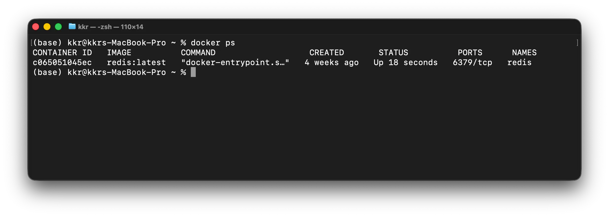

## 1 ) Docker Container

---

Docker Image는 Application 실행에 필요한 File System을 담은 읽기 전용 Template이다. Docker Engine은 Image Layer 위에 읽고 쓸 수 있는 Container Layer를 추가하여 Container를 생성한다.

Container는 독립된 Virtual Machine이 아니라 Host의 Kernel을 공유하면서 격리된 공간에서 실행되는 Process이다. Image가 실행에 필요한 Content를 제공하고, Container의 주 Process가 실제 Application을 실행한다.

```text
Container Layer     ← Read / Write
-----------------
Image Layer         ← Read Only
Image Layer         ← Read Only
Base Image Layer    ← Read Only
```

Container Format과 Runtime의 개방형 업계 표준은 OCI(Open Container Initiative)에서 정의한다. OCI는 Linux Foundation 산하 Project이며, Docker를 포함한 여러 Container 도구가 상호 운용될 수 있는 기반을 제공한다.

## 2 ) Container 생성과 수동 제어

---

Image 다운로드, Container 생성, 시작은 각각 별도의 명령으로 수행할 수 있다.

```bash
# Image 다운로드
docker image pull ubuntu:24.04

# Container 생성
docker container create -it --name container-test1 ubuntu:24.04

# 정지된 Container까지 모두 확인
docker container ls -a

# Container 시작
docker container start container-test1

# 실행 중인 Container 확인
docker container ls

# Container의 표준 입출력에 연결
docker container attach container-test1

# 정지된 Container 삭제
docker container rm container-test1
```

`docker ps`는 `docker container ls`와 같은 역할을 한다. 기본 출력에는 실행 중인 Container만 표시되고, `-a`를 사용하면 정지된 Container도 함께 표시된다.

`attach`는 Container의 주 Process에 연결한다. 연결한 Terminal에서 종료 명령을 실행하면 주 Process와 Container가 함께 종료될 수 있다. 실행 중인 Container에서 별도의 Shell을 사용하려면 `docker container exec`가 더 적합하다.

## 3 ) Container 생명주기

---

Container의 기본 생명주기는 생성, 실행, 중지, 삭제 단계로 구분할 수 있다.

```text
Image
  ↓ create
Created
  ↓ start
Running
  ↓ stop 또는 Process 종료
Stopped
  ↓ rm
Removed
```

### 생성

`docker container create`는 Image를 기반으로 Container를 만들지만 주 Process를 시작하지는 않는다. 생성된 Container에는 이름, Network 설정, Mount 정보와 쓰기 가능한 Container Layer가 준비된다.

### 실행

`docker container start` 또는 `docker container run`으로 Container를 시작하면 Image에 정의된 `ENTRYPOINT`와 `CMD`를 바탕으로 주 Process가 실행된다.

Web Server처럼 계속 동작하는 Process가 실행되면 Container도 실행 상태를 유지한다. 반면 명령을 한 번 수행하고 끝나는 Process라면 해당 Process가 종료될 때 Container도 정지한다.

### 중지

사용자가 Container를 중지하거나 주 Process가 정상 또는 오류 상태로 종료되면 Container는 정지 상태가 된다. 정지된 Container의 쓰기 Layer와 설정은 남아 있으므로 다시 시작할 수 있다.

```bash
docker container stop CONTAINER
docker container start CONTAINER
```

### 삭제

정지된 Container는 명시적으로 삭제하기 전까지 Disk에 남는다. 삭제하면 해당 Container는 다시 시작할 수 없고 쓰기 Layer의 데이터도 사라진다. 보존해야 하는 데이터는 Volume 또는 Bind Mount에 저장한다.

```bash
docker container rm CONTAINER
docker container rm --force CONTAINER
```

## 4 ) Application 실행

---

### docker run

`docker container run`은 필요한 Image가 Local에 없으면 내려받고, 새 Container를 생성한 뒤 바로 시작한다.

```text
docker image pull
        +
docker container create
        +
docker container start
        ↓
docker container run
```

기본 형식은 다음과 같다.

```txt
docker container run [OPTIONS] IMAGE [COMMAND] [ARG...]
```

자주 사용하는 Option은 다음과 같다.

| Option | 설명 |
|---|---|
| `--name NAME` | Container 이름 지정 |
| `-d`, `--detach` | Background에서 실행 |
| `-i`, `--interactive` | 표준 입력을 열린 상태로 유지 |
| `-t`, `--tty` | 가상 Terminal 할당 |
| `-e`, `--env` | 환경 변수 설정 |
| `-p HOST:CONTAINER` | Host Port와 Container Port 연결 |
| `-P`, `--publish-all` | Image가 공개한 Port를 임의의 Host Port에 연결 |
| `-v`, `--volume` | Volume 또는 Host 경로 Mount |
| `--network NETWORK` | Container가 연결될 Network 지정 |
| `--hostname NAME` | Container Hostname 지정 |
| `--restart POLICY` | Container 재시작 정책 지정 |
| `--rm` | Container 종료 시 자동 삭제 |

`-i`와 `-t`는 역할이 다르지만 대화형 Shell을 사용할 때 보통 `-it`로 함께 지정한다.

```bash
docker container run --rm -it ubuntu:24.04 /bin/bash
```

Server Application은 Terminal을 점유하지 않도록 주로 `-d`로 실행한다. 다만 `-d`가 Process를 Daemon으로 바꾸는 것은 아니며, Docker가 Container를 Background에서 실행하고 ID를 반환하는 Option이다.

```bash
docker container run --name nginx -d nginx:1.18
```

`--restart`에는 다음과 같은 정책을 지정할 수 있다.

| 정책 | 동작 |
|---|---|
| `no` | 자동으로 다시 시작하지 않음 |
| `on-failure[:N]` | Process가 오류 상태로 끝나면 지정 횟수까지 재시작 |
| `always` | 종료되면 항상 재시작 |
| `unless-stopped` | 사용자가 직접 중지하지 않았다면 재시작 |

## 5 ) Container 조회와 관리

---

### Container 목록

```bash
docker container ls
docker ps
```



출력 항목의 의미는 다음과 같다.

| 항목             | 설명                           |
| -------------- | ---------------------------- |
| `CONTAINER ID` | Container 식별자의 축약 값          |
| `IMAGE`        | Container 생성에 사용한 Image      |
| `COMMAND`      | Container의 주 Process를 시작한 명령 |
| `CREATED`      | Container를 생성한 뒤 지난 시간       |
| `STATUS`       | 실행, 종료 등 현재 상태               |
| `PORTS`        | 공개 및 연결된 Port 정보             |
| `NAMES`        | Container 이름                 |


주요 Option은 다음과 같다.

| Option | 설명 |
|---|---|
| `-a`, `--all` | 정지된 Container까지 모두 표시 |
| `-q`, `--quiet` | Container ID만 표시 |
| `-l`, `--latest` | 가장 최근에 생성한 Container 표시 |
| `-n NUMBER`, `--last NUMBER` | 최근에 생성한 Container를 지정한 수만큼 표시 |
| `-s`, `--size` | Container File System 크기 표시 |
| `--no-trunc` | ID와 명령을 줄이지 않고 표시 |
| `--filter` | 조건에 맞는 Container만 표시 |
| `--format` | 출력 형식 지정 |

```bash
docker container ls -a
docker container ls -aq
docker container ls --filter status=running
docker container ls --format '{{.ID}} {{.Names}}'
```

여러 Container ID를 명령 치환으로 전달할 수도 있다. 다음 명령은 실행 중인 모든 Container를 중지한 뒤 모든 Container를 삭제한다.

```bash
docker container stop $(docker container ls -q)
docker container rm $(docker container ls -aq)
```

대상이 없으면 명령에 인수가 전달되지 않아 오류가 발생할 수 있다. 실제 환경에서는 목록을 먼저 확인한 뒤 일괄 작업을 수행한다.

### Resource와 Log 확인

`docker container stats`는 CPU, Memory, Network I/O 등 Container의 Resource 사용량을 실시간으로 보여준다.

```bash
docker container stats
docker container stats webserver
```

`docker container logs`는 Container Process가 표준 출력과 표준 오류에 기록한 Log를 확인한다. `-f`를 사용하면 새 Log를 계속 따라간다.

```bash
docker container logs webserver
docker container logs -f webserver
```

## 6 ) Port 공개와 Web Server 실습

---

Container는 격리된 Network 공간에서 실행되므로 Container 내부의 Port가 Host에 자동으로 공개되지는 않는다. 외부에서 Service에 접근하려면 `-p`로 Host Port를 Container Port에 연결한다.

```text
Client → Host:9000 → Container:80 → Web Server
```

### Nginx 실행

```bash
docker container run \
  --name webserver \
  -d \
  -p 9000:80 \
  nginx
```

Browser에서 `http://localhost:9000`에 접속하면 Container의 80번 Port로 요청이 전달된다.

### Apache HTTP Server 실행

```bash
docker container run \
  --name apacheweb \
  -d \
  -p 9000:80 \
  httpd
```

`-p 9000:80`의 왼쪽은 Host Port이고 오른쪽은 Container Port이다. 동일한 Host의 같은 Port를 여러 Container에 동시에 연결할 수는 없다.

## 7 ) Base Image

---

Dockerfile은 목적에 맞는 Base Image에서 시작한다. 필요한 Runtime과 배포 환경을 고려해 적절한 Image와 Version Tag를 선택한다.

| 분류 | 대표 Image |
|---|---|
| Operating System | `ubuntu`, `debian`, `fedora`, `alpine`, `busybox` |
| Web Server | `httpd`, `nginx` |
| Database | `mysql`, `postgres`, `mariadb`, `redis`, `mongo` |
| Language Runtime | `eclipse-temurin`, `python`, `php`, `ruby`, `golang`, `node` |
| Service | `registry`, `nextcloud` |

Alpine과 BusyBox는 크기가 작은 Linux 환경이지만, Library와 Package 구성이 Ubuntu나 Debian과 다르다. 단순히 크기만 비교하지 않고 Application 호환성도 함께 확인한다.

## 8 ) Host와 Container 사이의 파일 복사

---

`docker container cp`는 Host와 Container 사이에서 File 또는 Directory를 복사한다. 앞의 경로가 원본이고 뒤의 경로가 목적지이다.

```bash
# Host에서 Container로 복사
docker container cp HOST_PATH CONTAINER:CONTAINER_PATH

# Container에서 Host로 복사
docker container cp CONTAINER:CONTAINER_PATH HOST_PATH
```

### Apache 기본 Page 변경

Apache HTTP Server Image의 기본 문서 경로는 `/usr/local/apache2/htdocs`이다.

```bash
# Container 실행
docker container run --name webserver -d -p 9000:80 httpd

# 기존 Page를 Host로 복사
docker container cp \
  webserver:/usr/local/apache2/htdocs/index.html \
  index.html

# Host에서 수정한 Page를 다시 Container로 복사
docker container cp \
  index.html \
  webserver:/usr/local/apache2/htdocs/index.html
```

### Nginx 기본 Page 변경

Nginx Image의 기본 문서 경로는 `/usr/share/nginx/html`이다.

```bash
docker container run --name nginx -d -p 9001:80 nginx

docker container cp \
  nginx:/usr/share/nginx/html/index.html \
  nginx.html

docker container cp \
  nginx.html \
  nginx:/usr/share/nginx/html/index.html
```

`docker cp`로 변경한 File은 Container의 쓰기 Layer에 저장되므로 Container를 삭제하면 사라진다. 개발 중 File을 반복해서 수정하거나 데이터를 영구 보관해야 한다면 Bind Mount 또는 Volume을 사용한다.

## 9 ) 실행 중인 Container에서 명령 수행

---

`docker container exec`는 실행 중인 Container 안에서 새로운 명령을 실행한다.

```txt
docker container exec [OPTIONS] CONTAINER COMMAND [ARG...]
```

Container 안에서 대화형 Shell을 실행하는 예시는 다음과 같다.

```bash
docker container run --name ubuntu-server -dit ubuntu:24.04
docker container exec -it ubuntu-server /bin/bash
```

### attach와 exec의 차이 ?

> 두 명령 모두 실행 중인 Container와 상호작용하지만 연결되는 Process가 다르다.

| 구분         | `docker attach`                             | `docker exec`                       |
| ---------- | ------------------------------------------- | ----------------------------------- |
| 동작         | 기존 주 Process의 표준 입력·출력·오류에 Terminal을 연결     | Container 안에서 새로운 Process 실행        |
| 대상         | `ENTRYPOINT`와 `CMD`로 시작된 주 Process          | 사용자가 지정한 Shell 또는 명령                |
| `exit`의 영향 | 주 Process가 Shell이라면 Shell과 Container가 함께 종료 | 새로 실행한 Shell만 종료되고 주 Process는 계속 실행 |
| 주요 용도      | 주 Process와 직접 대화하거나 현재 출력을 확인               | 점검, Debugging, File 확인, 관리 명령 수행    |

Container가 다음과 같이 실행되었다고 가정한다.

```bash
docker container run --name attach-test -dit ubuntu:24.04 /bin/bash
```

이때 `/bin/bash`는 Container를 유지하는 주 Process, 즉 Container 내부의 PID 1이다.

```bash
docker container attach attach-test
```

`attach`는 새 Shell을 만들지 않고 이미 PID 1로 실행 중인 `/bin/bash`에 현재 Terminal을 연결한다. 여기에서 `exit`를 입력하면 PID 1인 Bash가 종료되고, 주 Process가 사라졌으므로 Container도 정지한다. Container를 계속 실행하면서 Terminal만 분리하려면 일반적으로 `Ctrl-p`, `Ctrl-q`를 차례로 입력한다. `Ctrl-c`는 설정과 주 Process의 Signal 처리 방식에 따라 Container를 종료할 수 있으므로 주의한다.

반면 다음 명령은 같은 Container 안에 새로운 Bash Process를 하나 더 실행한다.

```bash
docker container exec -it attach-test /bin/bash
```

이 Shell은 PID 1이 아니다. 따라서 여기서 `exit`를 입력하면 `exec`로 만든 Bash만 종료되고 원래의 PID 1은 계속 실행되므로 Container도 실행 상태를 유지한다.

```text
attach
Terminal ─────────→ PID 1: /bin/bash
                         └─ exit → 주 Process 종료 → Container 정지

exec
PID 1: /bin/bash   ← 계속 실행
└─ 새 Process: /bin/bash ← Terminal 연결
                         └─ exit → 새 Process만 종료
```

Web Server Container도 같은 원리로 동작한다. `attach`를 실행하면 Nginx나 Apache 주 Process의 입출력에 연결될 뿐 Shell이 생기지 않는다. 반면 `exec -it CONTAINER sh`는 점검에 사용할 별도의 Shell을 실행한다. 이 때문에 운영 중인 Service를 중단할 위험이 비교적 작고 원하는 명령을 바로 실행할 수 있는 `exec`를 실무에서 더 자주 사용한다고 한다.

```bash
# Nginx 주 Process에 연결
docker container attach webserver

# Nginx Container 내부에 점검용 Shell을 별도로 실행
docker container exec -it webserver /bin/sh

# Shell 없이 설정 File만 확인
docker container exec webserver nginx -T
```

다만 `exec`는 Container의 주 Process가 실행 중일 때만 사용할 수 있다. Container가 이미 정지했다면 먼저 `docker logs`나 `docker inspect`로 종료 원인을 확인하고 필요에 따라 Container를 다시 시작해야 한다. 단순히 Application Log를 확인하려는 목적이라면 주 Process에 직접 연결하는 `attach`보다 `docker logs`가 안전하고 편리하다.

### Python Program 실행

```bash
docker container run --name python-test -dit python:3
docker container cp lotto.py python-test:/lotto.py
docker container exec -it python-test python /lotto.py
```

### Node.js Program 실행

```bash
docker container run --name nodejs -dit node
docker container cp index.js nodejs:/app-node.js
docker container exec -it nodejs node /app-node.js
```

일회성 Program이라면 Container를 계속 실행해 두고 `exec`하는 대신 Source Code를 Mount하고 `docker run --rm`으로 실행하는 방식도 사용할 수 있다.

## 10 ) Container를 Image로 저장

---

`docker container commit`은 Container의 변경된 File System을 새 Image로 저장한다.

```bash
docker container commit CONTAINER REPOSITORY[:TAG]
docker container commit nodejs my-node-app:1.0
docker image ls my-node-app
```

실습 중 변경 사항을 임시로 보관하거나 상태를 분석할 때 사용할 수 있지만, 실행한 명령과 변경 이유를 재현하기 어렵다. 배포용 Image는 변경 과정을 코드로 관리할 수 있도록 Dockerfile로 Build하는 것이 좋다.

Mount에 저장된 데이터는 Container File System에 포함되지 않으므로 `commit`으로 만든 Image에도 포함되지 않는다.

## 11 ) Docker Volume

---

Container의 쓰기 Layer는 Container 생명주기에 종속된다. Container를 삭제해도 보존해야 하는 Database, Upload File과 같은 데이터는 Container 밖의 Storage에 저장해야 한다.

Docker에서 주로 사용하는 Mount 방식은 Volume Mount와 Bind Mount이다.

| 방식 | 저장 위치 | 관리 주체 | 주요 용도 |
|---|---|---|---|
| Volume Mount | Docker가 관리하는 영역 | Docker Engine | Application Data의 영속적 저장 |
| Bind Mount | Host의 지정된 File 또는 Directory | 사용자 | Source Code, 설정 File 공유 |

### Volume 생성과 연결

```bash
# Volume 생성과 조회
docker volume create my-app-vol-1
docker volume ls
docker volume inspect my-app-vol-1

# Volume을 Mount한 Container 실행
docker container run \
  --name vol-test \
  -d \
  -v my-app-vol-1:/data \
  alpine \
  tail -f /dev/null
```

`-v VOLUME_NAME:CONTAINER_PATH` 형식으로 이름이 있는 Volume을 Container 경로에 연결한다. 동일한 Volume은 새 Container에 다시 Mount할 수 있다.

```bash
docker container exec vol-test sh -c 'echo hello > /data/message.txt'

docker container stop vol-test
docker container rm vol-test

docker container run --rm \
  -v my-app-vol-1:/data \
  alpine \
  cat /data/message.txt
```

Container를 삭제한 뒤에도 `hello`가 출력되므로 데이터가 Volume에 남아 있음을 확인할 수 있다.

사용 중인 Volume은 삭제할 수 없다. Volume을 연결한 Container를 먼저 제거한 뒤 Volume을 삭제한다.

```bash
docker volume rm my-app-vol-1
docker volume prune
```

`docker volume prune`은 사용하지 않는 Volume을 일괄 삭제하므로 대상을 확인한 뒤 실행한다.

## 12 ) Bind Mount

---

Bind Mount는 Host의 기존 File 또는 Directory를 Container 경로에 직접 연결한다. Host에서 File을 수정하면 Container에서도 같은 변경 사항을 바로 확인할 수 있어 개발 중 Source Code나 설정을 공유할 때 유용하다.

```bash
docker container run \
  --name apache \
  -d \
  -p 9000:80 \
  --mount type=bind,src=/home/user/apache,dst=/usr/local/apache2/htdocs \
  httpd
```

짧은 `-v` 형식도 사용할 수 있다.

```bash
docker container run \
  --name apache \
  -d \
  -p 9000:80 \
  -v /home/user/apache:/usr/local/apache2/htdocs \
  httpd
```

`--mount`를 사용할 때 Host 경로가 존재하지 않으면 오류가 발생한다. `-v`는 존재하지 않는 Host 경로를 Directory로 만들 수 있으므로 오타가 새 Directory 생성으로 이어질 수 있다. Bind Mount 전에는 절대 경로와 권한을 확인한다.

Container를 삭제해도 Host의 원본 File과 Directory는 유지된다. 반대로 Container Process도 Mount된 Host File을 변경할 수 있으므로, 읽기만 허용하려면 `readonly` 또는 `ro` Option을 지정한다.

```bash
docker container run \
  --name readonly-web \
  -d \
  -p 9001:80 \
  --mount type=bind,src=/home/user/apache,dst=/usr/local/apache2/htdocs,readonly \
  httpd
```
