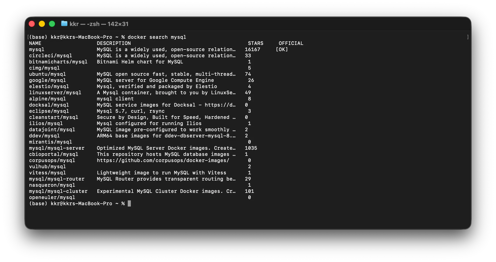

## 1 ) Docker Volume

---

Container의 쓰기 Layer는 Container의 생명주기에 종속된다. Container를 삭제하면 쓰기 Layer에 저장된 데이터도 함께 사라지므로 Database, Upload File, Log처럼 보존해야 하는 데이터는 Container 밖에 저장해야 한다.

Docker는 Container와 분리하여 데이터를 관리할 수 있도록 세 가지 Mount 방식을 제공한다.

| 방식 | 저장 위치 | 관리 주체 | 주요 용도 |
|---|---|---|---|
| Volume Mount | Docker가 관리하는 Host 영역 | Docker Engine | Database 등 영속 데이터 |
| Bind Mount | 사용자가 지정한 Host File 또는 Directory | 사용자 | Source Code, 설정, Log 공유 |
| tmpfs Mount | Host Memory | Host OS | 일시적인 데이터, 민감 정보 |

Volume은 Container를 삭제해도 유지되며 다른 Container에 다시 연결할 수 있다. 직접 Host 경로를 지정하지 않기 때문에 일반적으로 영속 데이터를 저장할 때 권장된다.

## 2 ) Volume 생성과 연결

---

### Volume 생성 및 조회

```bash
docker volume create my-app-vol-1
docker volume ls
docker volume inspect my-app-vol-1
```

`docker volume inspect`를 실행하면 Driver, 생성 시각, Host의 실제 저장 위치인 `Mountpoint` 등을 확인할 수 있다. Docker가 관리하는 경로의 File을 Host에서 직접 수정하기보다는 Container를 통해 다루는 것이 안전하다.

### Container에 Volume Mount

```bash
docker container run \
  --name vol-test \
  -d \
  -v my-app-vol-1:/var/log \
  ubuntu:24.04 \
  sleep infinity
```

`-v VOLUME_NAME:CONTAINER_PATH` 형식으로 Volume을 Container의 경로에 연결한다. 

`--mount`를 사용하면 같은 설정을 더 명확하게 표현할 수 있다.

```bash
docker container run \
  --name vol-test-mount \
  -d \
  --mount type=volume,src=my-app-vol-1,dst=/var/log \
  ubuntu:24.04 \
  sleep infinity
```

### 데이터 영속성 확인

```bash
docker container exec vol-test \
  sh -c 'echo "volume data" > /var/log/message.txt'

docker container stop vol-test vol-test-mount
docker container rm vol-test vol-test-mount

docker container run --rm \
  -v my-app-vol-1:/data \
  ubuntu:24.04 \
  cat /data/message.txt
```

기존 Container를 삭제한 뒤 새 Container에 같은 Volume을 연결해도 `volume data`가 출력된다. Container와 Volume의 생명주기가 서로 분리되어 있기 때문이다.

### Volume 삭제

```bash
docker volume rm my-app-vol-1

# 사용하지 않는 Volume 일괄 삭제
docker volume prune
```

실행 여부와 관계없이 Volume을 참조하는 Container가 남아 있으면 Volume을 삭제할 수 없다. 해당 Container를 먼저 제거해야 한다. 

`docker volume prune`은 사용하지 않는 Volume을 한꺼번에 삭제하므로 삭제 대상을 확인한 뒤 실행한다.

## 3 ) Bind Mount

---

Bind Mount는 Host의 기존 File 또는 Directory를 Container 경로에 직접 연결한다. Host와 Container가 같은 내용을 바로 확인할 수 있어 개발 중 Source Code나 설정 File을 공유하거나 Container의 Log를 Host에 저장할 때 유용하다.

```bash
mkdir -p /home/user/apache

docker container run \
  --name apache \
  -d \
  -p 9000:80 \
  --mount type=bind,src=/home/user/apache,dst=/usr/local/apache2/htdocs \
  httpd:2
```

짧은 `-v` 형식도 사용할 수 있다.

```bash
docker container run \
  --name apache-volume \
  -d \
  -p 9001:80 \
  -v /home/user/apache:/usr/local/apache2/htdocs \
  httpd:2
```

`--mount`는 Host 경로가 없으면 오류를 반환한다. 반면 `-v`는 존재하지 않는 Host 경로를 Directory로 자동 생성할 수 있으며, 생성된 Directory의 소유자가 `root`가 될 수 있다. 경로 오타와 권한 문제를 줄이려면 Mount 전에 Host 경로를 만들고 절대 경로를 확인한다.

Container Process도 Mount된 Host File을 변경할 수 있다. 읽기만 허용하려면 `readonly` 또는 `ro` Option을 지정한다.

```bash
docker container run \
  --name readonly-web \
  -d \
  --mount type=bind,src=/home/user/apache,dst=/usr/local/apache2/htdocs,readonly \
  httpd:2
```

Container를 제거하면 Bind Mount 연결은 해제되지만 Host의 원본 File과 Directory는 그대로 유지된다.

## 4 ) tmpfs Mount

---

tmpfs Mount는 데이터를 Host의 Memory에만 저장한다. Container가 중지되거나 제거되면 데이터가 사라지므로 영속화가 목적이 아닌 임시 작업 File이나 민감한 Runtime Data에 적합하다.

```bash
docker container run \
  --name webserver \
  -dit \
  --tmpfs /var/www/html \
  httpd:2
```


`--mount type=tmpfs,dst=/var/www/html` 형식으로도 지정할 수 있다. tmpfs는 Linux Container에서 사용할 수 있으며 Host의 Memory를 사용하므로 크기 제한 등 Resource 설정을 함께 고려해야 한다.

> **중간 정리**
>
> - Volume Mount는 Docker Engine이 관리하는 영역에 데이터를 저장한다.
>
> - Bind Mount는 Host의 File이나 Directory를 Container에 직접 연결한다.
>
> - tmpfs Mount는 Host Memory를 사용하며 Container가 제거되면 데이터가 사라진다.
>
> - 보존 목적과 Host에서의 직접 관리 여부에 따라 Mount 방식을 선택한다.

## 5 ) MySQL 데이터 영속화

---

MySQL 공식 Image는 `/var/lib/mysql`에 Database Data를 저장한다. 이 경로에 이름이 있는 Volume을 연결하면 Image나 Container를 삭제하고 다시 생성해도 데이터를 유지할 수 있다.

| 항목 | 값 |
|---|---|
| Image | `mysql` |
| 기본 Port | `3306` |
| 데이터 Directory | `/var/lib/mysql` |
| Root 비밀번호 환경 변수 | `MYSQL_ROOT_PASSWORD` |
| 기본 Database 환경 변수 | `MYSQL_DATABASE` |

`docker search mysql`로 Docker Hub의 관련 Repository를 검색할 수 있으며 `OFFICIAL` 항목에서 공식 Image 여부를 확인할 수 있다.



### Container 생성

MySQL Container를 생성하고 Named Volume을 `/var/lib/mysql`에 Mount한다.

```bash
docker container run \
  --name mysql-volume \
  -d \
  -e MYSQL_ROOT_PASSWORD=1234 \
  -e MYSQL_DATABASE=itstudy \
  -v mysql-data-vol:/var/lib/mysql \
  mysql
```

| Option | 설명 |
|---|---|
| `--name mysql-volume` | Container 이름을 `mysql-volume`으로 지정한다. |
| `-d` | Container를 Background에서 실행한다. |
| `-e MYSQL_ROOT_PASSWORD=1234` | MySQL `root` 계정의 비밀번호를 설정한다. |
| `-e MYSQL_DATABASE=itstudy` | Container 최초 실행 시 `itstudy` Database를 생성한다. |
| `-v mysql-data-vol:/var/lib/mysql` | `mysql-data-vol` Named Volume을 MySQL Data 저장 경로에 Mount한다. |
| `mysql` | MySQL Image를 사용한다. |

#### Architecture 확인

Apple Silicon처럼 Host Architecture와 Image가 지원하는 Architecture가 다른 경우에는 Image Tag의 Architecture 지원 여부를 먼저 확인한다.

필요한 경우 다음과 같이 `--platform` Option을 지정할 수 있다.

```bash
--platform linux/amd64
```

다만 Host와 다른 Architecture를 지정하면 Emulation으로 실행될 수 있어 성능이 낮아질 수 있다.

현재 MySQL 공식 Image에는 여러 Architecture를 지원하는 Tag가 있으므로, Mac을 사용한다는 이유만으로 `--platform linux/amd64` Option을 항상 추가할 필요는 없다.

#### 비밀번호 관리

실제 운영 환경에서는 다음과 같이 비밀번호를 명령어나 Source Code에 평문으로 직접 기록하지 않는다.

```bash
-e MYSQL_ROOT_PASSWORD=1234
```

운영 환경에서는 비밀번호와 같은 민감한 정보를 별도의 Secret 관리 수단을 통해 관리한다.

Container와 Volume의 연결 정보는 다음과 같이 확인한다.

```bash

docker container ls -a
docker volume ls
docker volume inspect mysql-data-vol
docker container inspect mysql-volume \
  --format '{{json .Mounts}}' | jq

```

> **중간 정리**
>
> - `-v mysql-data-vol:/var/lib/mysql`을 통해 MySQL Data를 Named Volume에 저장한다.
>
> - Host와 Image의 Architecture가 다르다면 Image의 지원 Architecture를 먼저 확인한다.
>
> - `--platform linux/amd64`는 필요한 경우에만 사용하며, Emulation에 따른 성능 저하가 발생할 수 있다.
>
> - 운영 환경에서는 비밀번호를 명령어나 Source Code에 평문으로 기록하지 않는다.


### Sample Data 생성

```bash
docker container exec -it mysql-volume \
  mysql -uroot -p itstudy
```

```sql
CREATE TABLE mytable (
  num INT,
  name CHAR(30)
);

INSERT INTO mytable VALUES (1, 'adam');
SELECT * FROM mytable;
```

### Container 재생성 후 확인

```bash
docker container stop mysql-volume
docker container rm mysql-volume

docker container run \
  --name mysql-volume \
  -d \
  -e MYSQL_ROOT_PASSWORD=1234 \
  -e MYSQL_DATABASE=itstudy \
  -v mysql-data-vol:/var/lib/mysql \
  mysql

docker container exec -it mysql-volume \
  mysql -uroot -p itstudy
```

```sql
SELECT * FROM mytable;
```

새 Container에서도 앞에서 추가한 Row가 조회되면 데이터가 Volume에 영속적으로 저장된 것이다.

## 6 ) Nginx Log를 Host에 저장

---

Nginx의 Log Directory인 `/var/log/nginx`를 Host Directory에 Bind Mount하면 Container를 삭제한 뒤에도 Access Log와 Error Log를 확인할 수 있다.

```bash
mkdir -p /home/user/logs

docker container run \
  --name nginx-volume \
  -d \
  -p 9000:80 \
  -v /home/user/logs:/var/log/nginx \
  nginx

curl http://localhost:9000
cat /home/user/logs/access.log
```

Host Directory에는 Container의 Nginx Process가 File을 생성하고 쓸 수 있는 권한이 필요하다.

## 7 ) Container 간 데이터 공유

---

하나의 Volume을 여러 Container에 Mount하면 File을 공유할 수 있다.

```bash
docker volume create shared-data

docker container run --rm \
  -v shared-data:/data \
  ubuntu:24.04 \
  sh -c 'echo "container-1" > /data/message.txt'

docker container run --rm \
  -v shared-data:/data:ro \
  ubuntu:24.04 \
  cat /data/message.txt
```

두 번째 Container는 동일한 Volume을 읽기 전용으로 연결한다. 동시에 여러 Container가 같은 데이터를 수정한다면 Application 차원의 동시성 제어가 필요하다.

기존 Container의 Mount 설정을 그대로 물려받는 `--volumes-from`도 사용할 수 있다.

```bash
docker container create \
  --name datavol \
  -v /data-volume \
  ubuntu:24.04

docker container run --rm \
  --volumes-from datavol \
  ubuntu:24.04 \
  sh -c 'echo "shared data" > /data-volume/message.txt'
```

`--volumes-from`은 현재도 지원되지만, Volume 보관만을 위한 Data Volume Container Pattern은 이름이 있는 Volume이 도입되기 전에 주로 사용하던 방식이다. 새 구성에서는 이름이 있는 Volume을 각 Container에 명시적으로 Mount하는 편이 데이터의 위치와 연결 관계를 이해하기 쉽다.

## 8 ) Mount 시 주의 사항

---

Container의 Mount 대상 Directory에 Image가 제공하는 File이 이미 존재하더라도 Volume이나 Bind Mount를 연결하면 해당 File은 Mount 내용에 가려진다.

```text
Image의 /app
├── config.yml
└── default.txt

빈 Volume을 /app에 Mount
└── Mount된 Volume의 내용만 표시
```

가려진 Image File이 삭제된 것은 아니지만 Mount를 해제한 새 Container를 만들기 전에는 해당 경로에서 볼 수 없다. 설정 Directory나 Application Directory 전체를 Mount할 때는 Image의 기본 File이 필요한지 먼저 확인해야 한다.

Host의 File 하나를 Container의 특정 File 경로에 Bind Mount하면 그 File만 Mount 내용으로 대체되고 같은 Directory의 다른 File은 그대로 보인다. Host File을 Container Directory 자체에 Mount하면 File과 Directory Type이 달라 오류가 발생할 수 있으므로 대상에도 File 경로를 명시해야 한다.

```bash
docker container run --rm \
  --mount type=bind,src=/home/user/nginx.conf,dst=/etc/nginx/nginx.conf,readonly \
  nginx
```

> **최종 정리**
>
> - Volume Mount는 Docker가 관리하는 저장 영역을 사용하며 Container를 삭제해도 데이터를 유지한다.
>
> - Bind Mount는 Host의 File이나 Directory를 직접 연결하며 Container를 제거해도 Host 데이터는 남는다.
>
> - tmpfs Mount는 Host Memory를 사용하므로 Container가 제거되면 데이터도 사라진다.
>
> - MySQL 데이터와 Nginx Log처럼 보존해야 하는 데이터는 목적에 맞는 Mount 방식으로 Container 밖에 저장한다.
>
> - 여러 Container가 같은 Volume을 연결하면 데이터를 공유할 수 있다.
>
> - 기존 File이 있는 Container Directory에 Mount하면 Image의 File이 Mount 내용에 가려질 수 있다.
