 
## 요약
> 여러 사용자가 함께 사용하는 Production·Development Ubuntu 서버의 작업 이력을 추적하기 위해 `auditd`와 Slack Webhook을 연동한 명령 로깅 시스템을 구축했습니다. 일반 사용자의 프로그램 실행과 `sudo` 사용 내역을 수집해 서버별, 사용자와 권한별 Slack 채널로 전송하고, Webhook 보호와 `systemd`를 이용한 상시 실행 과정까지 정리합니다.

---
## 1. 아이디어

> 교육장에서 받은 서버와 홈서버를 각각 Production, Development 서버로 두기로 했습니다.
> 이 과정에서 팀원은 모두 개인의 계정을 갖고, `sudo` 를 포함한 명령을 사용하게 되는데 추후 트러블 슈팅 또는 본인의 작업 내역을 확인하기 위한 기록이 필요하다고 느껴 로깅 시스템 구축의 필요성을 느꼈습니다.

먼저 저희가 협업 과정에서 활용할 구조는 다음과 같습니다.
1. Slack - 팀원별 소통 및 웹훅 애플리케이션 관리
2. Jira/Github - 프로젝트 및 이슈 관리
3. DevServer - Ubuntu Server에서 가용 최대 리소스로 개발 및 테스트를 위한 서버로 활용
	- libvirt와 KVM으로 Orbit 호스트 VM 생성해 사용
	- VM 내에서는 각 사용자별 디렉토리 내에서 작업 및 테스트

이 구조에서 각 팀원들의 명령이 `sudo`로 사용될 수 있어야하고, 다른 사용자 환경에도 영향을 미칠 수 있다고 생각했습니다.

또한 개발 및 테스트 과정에서 문제를 해결한 과정 또는 공유할 내용을 그때마다 기록하기에는 어려울 수 있으므로, 대신 명령 시퀀스를 타임라인으로 볼 수 있는 기록이 필요하다고 생각했습니다.

## 2. Slack에 Log 수집 채널 및 Log 애플리케이션 생성

먼저 Slack에 각 서버별, 명령 권한(사용자) 별 로그 수집 채널을 생성해주었습니다.

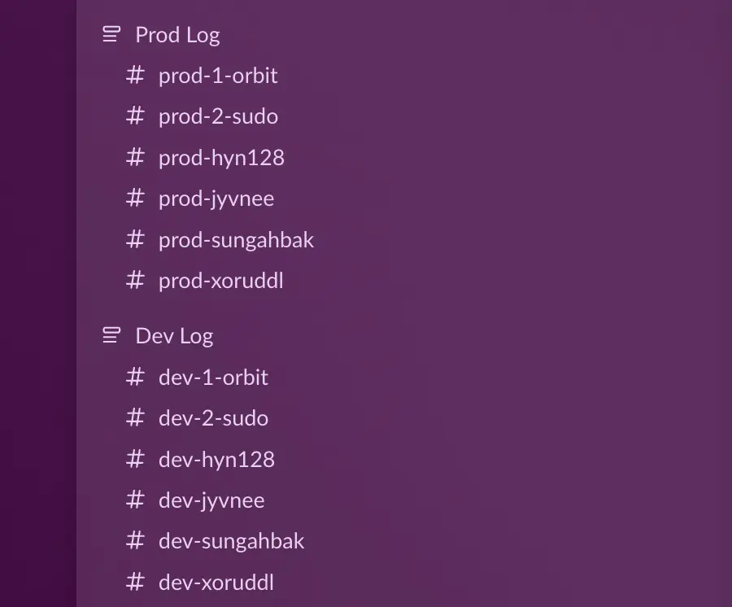


이후 [Slack API](https://api.slack.com/apps) 에서 Application을 생성하고 아래와 같이 진행했습니다.
1. Create New App → Blank App → Continue
2. App Name: Orbit Log
3. 사용할 워크스페이스 선택
4. Create APP


## 3. Webhook 생성

앱이 생성되고 앱 설정 화면으로 넘어가면 왼쪽 메뉴에서 `Features → Incomming Webhooks`로 진입합니다.

이후 같은 페이지에서 `Add New Webhook to Workspace`를 선택해 훅을 수신할 채널을 전부 생성해줍니다.

저희 환경에서는 최종적으로 아래와 같은 구조가 구성됐습니다.

```
Orbit Log (Slack App)
│
├─ webhook → #prod-orbit
├─ webhook → #prod-sudo
├─ webhook → #prod-hyn128
├─ webhook → #prod-jyvnee
├─ webhook → #prod-sungahbak
├─ webhook → #prod-xoruddl
│
├─ webhook → #dev-orbit
├─ webhook → #dev-sudo
├─ webhook → #dev-hyn128
├─ webhook → #dev-jyvnee
├─ webhook → #dev-sungahbak
├─ webhook → #dev-xoruddl
```

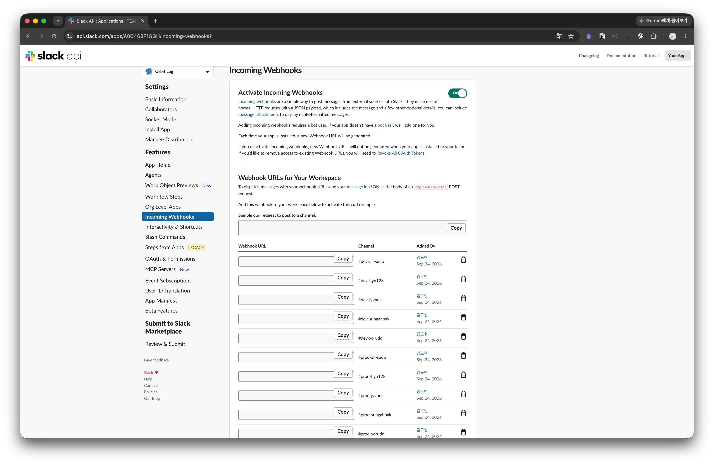

> 생성된 Webhook은 공개 될 경우 URL 만으로도 아주 쉽게 해당 채널로 데이터를 보낼 수 있으므로 공개에 주의합니다.

생성된 Webhook은 `curl`을 이용해 아래처럼 테스트 해볼 수 있습니다.

```bash
curl -X POST \
  -H 'Content-type: application/json' \
  --data '{"text":"[DEV] Ubuntu sudo log test"}' \
  '여기에_WEBHOOK_URL'
```

## 4. Ubuntu에 Webhook 설정 파일 구축 및 패키지 설치

Production 서버와 Development 서버 모두 과정은 비슷하므로, Dev 서버를 기준으로 작성합니다.

개발 서버 기준으로 다시 정리하면 목표는 아래와 같습니다.

```
orbit 명령      → #dev-1-orbit (관리용 계정)
sudo 전체       → #dev-2-sudo
hyn128 명령     → #dev-hyn128
jyvnee 명령     → #dev-jyvnee
sungahbak 명령  → #dev-sungahbak
xoruddl 명령    → #dev-xoruddl
```

### 1) 디렉토리 구성

먼저 스크립트를 담을 디렉토리를 `-p` 옵션으로 일괄 생성하고, 해당 디렉토리로 이동합니다.

```bash
mkdir -p ~/slack-log/scripts
cd ~/slack-log
```


사용하게 될 구조는 다음과 같습니다.

```bash
/home/orbit/slack-log/       # Slack 명령 모니터링 관련 파일 관리
├── webhook.env              # 사용자별 Slack Webhook URL 및 환경변수 저장
└── scripts/
    └── command-monitor.sh   # Audit 로그 감시, 사용자별 명령 분기 및 Slack 전송
```


> **root가 아닌 사용자 디렉토리에 구성하는 이유**
> 
> /root에 스크립트를 두면 수정과 실행 시마다 root 권한이 필요하고, 일반 사용자의 접근도 제한됩니다. 따라서 현재 협업 환경에서는 root 권한이 반드시 필요한 파일이 아니었고, 사용자의 홈 디렉토리에서 관리하여 필요한 작업에만 `sudo`를 사용하는 방식이 권한 관리와 유지보수 측면에서 적절하다고 판단했습니다.

### 2) Webhook 설정

각 채널별 웹훅을 담을 환경변수 파일을 먼저 생성합니다.

```bash
nano webhook.env
```

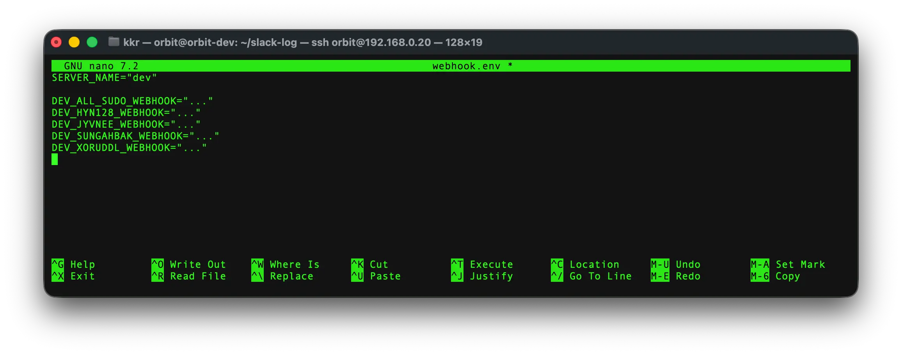

이후 다음처럼 권한을 설정합니다.

```bash
chmod 600 ~/slack-log/webhook.env
```

`webhook.env`는 `Slack Webhook URL` 같은 비밀 값이 들어가므로 `600`으로 설정했습니다.

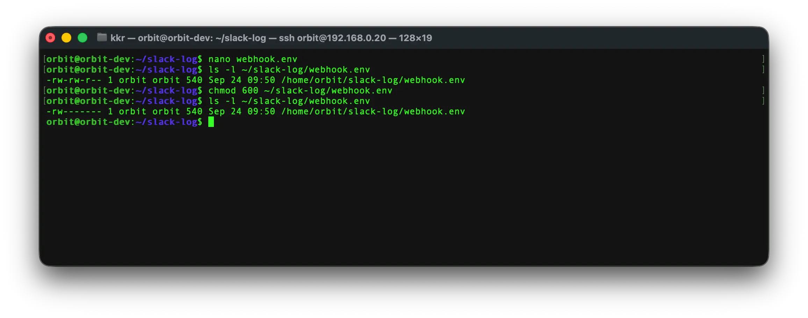

`600`의 상세 권한은 아래와 같습니다.
- 소유자(owner) : 6 = 읽기(r) + 쓰기(w)
- 그룹(group)   : 0 = 권한 없음
- 기타(others) : 0 = 권한 없음

> orbit       → 읽기/수정 가능
> 다른 사용자 → 읽기 불가능

### 3) auditd 설치

다음으로 사용자별 명령 실행 내역을 수집하기 Linux의 감사 패키지인 `auditd`를 설치합니다.

먼저 패키지 목록을 갱신한 후 필요한 패키지를 설치합니다.

```bash
sudo apt update
sudo apt install -y auditd audispd-plugins curl
```

각 패키지의 역할은 다음과 같습니다.

- `auditd` : Linux Audit 데몬으로, 명령 실행 등의 시스템 이벤트를 감사 로그로 기록
- `audispd-plugins` : Audit 이벤트를 다른 프로그램이나 외부 시스템과 연동하기 위한 플러그인 제공
- `curl` : 수집한 로그를 Slack Webhook으로 전송하기 위한 HTTP 요청 도구

설치가 완료되면 `auditd`를 활성화하고 바로 실행합니다.

```bash
sudo systemctl enable --now auditd
```

여기서 `enable`은 서버가 재부팅된 이후에도 `auditd`가 자동으로 실행되도록 설정하며, `--now`는 서비스 활성화와 동시에 현재 세션에서도 바로 실행하도록 합니다.

마지막으로 정상적으로 실행되고 있는지 확인합니다.

```bash
sudo systemctl status auditd
```

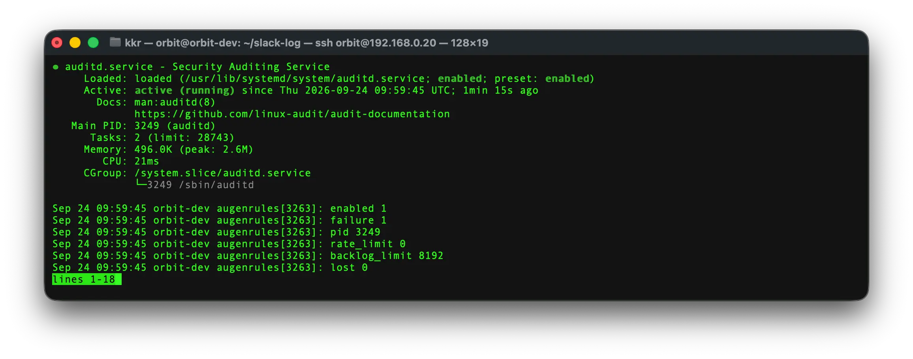
사진과 같이 `active (running)` 로 정상적으로 동작하고 있는 것을 확인할 수 있습니다.

```text
Active: active (running)
```

> **Shell History 대신 auditd를 사용하는 이유**
> 
> `history`는 각 사용자의 Shell 환경에 종속되며 사용자가 직접 기록을 수정하거나 삭제할 수 있습니다. 반면 `auditd`는 Linux Audit 시스템을 통해 시스템 이벤트를 수집하므로, 여러 사용자가 함께 사용하는 서버에서 명령 실행 내역을 감사하기 위한 용도로 더 적합하다고 판단했습니다.


## 5. sudo 명령 Audit 규칙 설정

`auditd` 설치가 완료되었으므로 이제 `sudo` 명령 실행을 감지할 수 있도록 Audit 규칙을 설정합니다.

### **1) Audit 규칙 파일 생성**

`/etc/audit/rules.d/` 디렉토리에 사용자 명령 실행을 감시하기 위한 Audit 규칙 파일을 생성합니다.

```bash
sudo nano /etc/audit/rules.d/command-monitor.rules
```

파일에 다음 내용을 추가합니다.

```bash
-a always,exit -F arch=b64 -S execve -F auid>=1000 -F auid!=unset -k user_command
-a always,exit -F arch=b32 -S execve -F auid>=1000 -F auid!=unset -k user_command
```

각 옵션의 의미는 다음과 같습니다.

- `-a always,exit` : 시스템 콜이 종료될 때 항상 Audit 이벤트를 기록
- `-F arch=b64`, `-F arch=b32` : 각각 64비트와 32비트 시스템 콜을 감시
- `-S execve` : 프로그램 실행에 사용되는 `execve` 시스템 콜을 감시
- `-F auid>=1000` : 일반 사용자 계정에서 발생한 이벤트만 대상으로 지정
- `-F auid!=unset` : 로그인 사용자를 식별할 수 없는 이벤트를 제외
- `-k user_command` : 기록된 이벤트에 `user_command`라는 검색용 키를 부여

즉, 일반 사용자가 실행한 프로그램의 `execve` 이벤트를 Audit 로그에 기록하고, 이후 `user_command` 키를 이용해 해당 로그를 조회할 수 있도록 설정합니다.
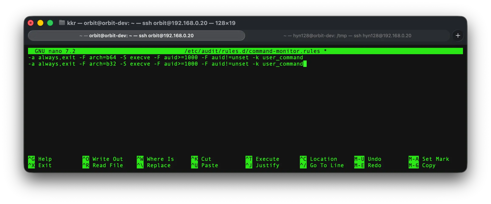

`/etc/audit/rules.d/`는 `auditd`의 영구 Audit 규칙을 관리하는 디렉토리입니다. 이곳에 규칙 파일을 작성하면 재부팅 이후에도 규칙을 다시 적용할 수 있습니다.

### **2) Audit 규칙 적용**

작성한 규칙을 현재 시스템에 적용합니다.

```bash
sudo augenrules --load
```

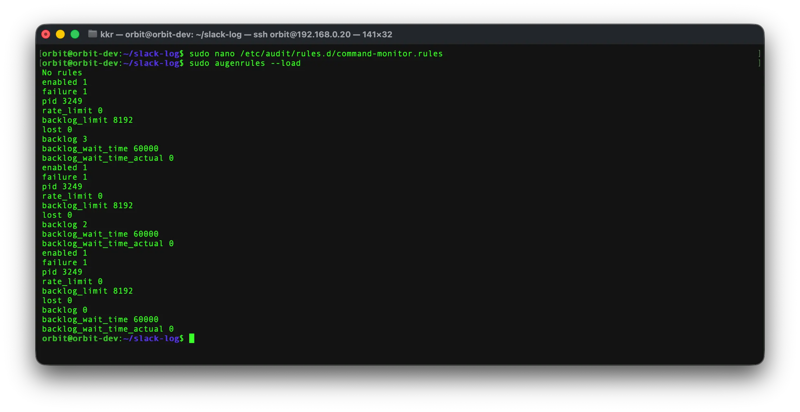
`augenrules`는 `/etc/audit/rules.d/`에 작성된 규칙들을 읽어 Audit 시스템에 적용합니다.

적용된 규칙은 다음 명령으로 확인합니다.

```bash
sudo auditctl -l | grep user_command
```

앞에서 작성한 `user_command` 규칙이 출력된다면 정상적으로 적용된 것입니다.

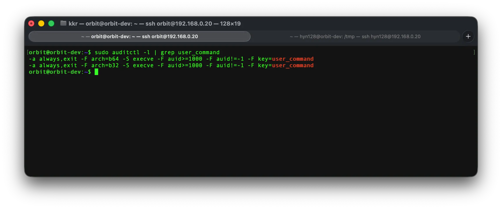

### **3) sudo 실행 및 Audit 로그 확인**

실제로 `sudo` 명령을 실행하여 Audit 이벤트가 기록되는지 확인합니다.

```bash
sudo whoami
```

정상적으로 실행되면 다음과 같이 출력됩니다.

```text
root
```

이후 `sudo_command` 키를 기준으로 최근 Audit 로그를 조회합니다.

```bash
sudo ausearch -k user_command -i --start recent
```

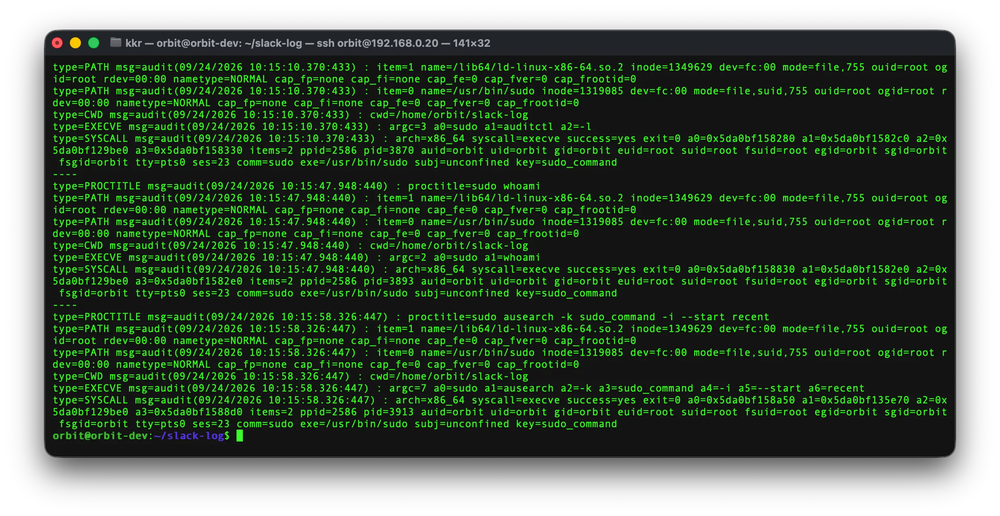

여기서 `-k user_command`는 앞에서 설정한 키를 가진 이벤트만 조회하고, `-i`는 UID 등의 값을 사람이 읽기 쉬운 형태로 변환하여 출력합니다.

현재 단계에서는 Audit 로그가 정상적으로 수집되는지 확인하는 것이 목적입니다. 이후 수집된 원본 로그에서 필요한 정보를 추출하여 Slack으로 전송하도록 구성합니다.

최종적으로 Slack에 전달할 정보는 다음 5개로 정했습니다.

```text
User    : 명령을 실행한 사용자
Time    : 명령 실행 시간
Command : 실행한 명령
PWD     : 명령을 실행한 디렉토리
Run as  : sudo를 통해 명령을 실행한 대상 사용자
```

`TTY`, PID, UID/GID 등의 정보도 Audit 로그에 포함될 수 있지만, Slack에서는 명령 실행 내역과 트러블 슈팅에 필요한 정보만 추출하여 전달하도록 구성합니다.


## 6. 사용자별 명령 Slack 전송 스크립트 작성

앞에서 설정한 `user_command` Audit 로그를 실시간으로 감시하고, 실행한 사용자에 따라 각 Slack 채널로 로그를 전송하도록 스크립트를 작성합니다.

로그는 다음과 같이 분기하도록 구성했습니다.

```text
일반 명령
└─ 해당 사용자 채널

sudo 명령
├─ 해당 사용자 채널
└─ sudo 전용 채널
```

또한 Slack에서 로그를 쉽게 구분할 수 있도록 일반 명령과 `sudo` 명령의 Attachment 색상을 다르게 설정하고, 주요 항목은 굵게 표시하도록 구성했습니다.

스크립트 파일을 생성합니다.

```bash
nano ~/slack-log/scripts/command-monitor.sh
```

다음 내용을 작성합니다.

```bash
#!/bin/bash

set -u

source /home/orbit/slack-log/webhook.env

AUDIT_LOG="/var/log/audit/audit.log"

send_slack() {
    local webhook="$1"
    local type="$2"
    local user="$3"
    local time="$4"
    local command="$5"
    local pwd_value="$6"
    local run_as="$7"

    [ -z "$webhook" ] && return

    local payload

    payload=$(python3 - \
        "$type" \
        "$user" \
        "$time" \
        "$command" \
        "$pwd_value" \
        "$run_as" <<'PY'
import json
import sys

type_, user, time, command, pwd, run_as = sys.argv[1:]

if type_ == "SUDO":
    color = "#E01E5A"
    title = "SUDO Command"
else:
    color = "#2EB67D"
    title = "Command"

payload = {
    "attachments": [
        {
            "color": color,
            "mrkdwn_in": ["text"],
            "text": (
                f"*{title}*\n\n"
                f"*User*\n`{user}`\n\n"
                f"*Run as*\n`{run_as}`\n\n"
                f"*Time*\n{time}\n\n"
                f"*PWD*\n`{pwd}`\n\n"
                f"*Command*\n```{command}```"
            )
        }
    ]
}

print(json.dumps(payload))
PY
)

    curl -fsS \
        -H 'Content-Type: application/json' \
        --data "$payload" \
        "$webhook" \
        >/dev/null 2>&1
}

get_user_webhook() {
    case "$1" in
        orbit)
            echo "$DEV_ORBIT_WEBHOOK"
            ;;
        hyn128)
            echo "$DEV_HYN128_WEBHOOK"
            ;;
        jyvnee)
            echo "$DEV_JYVNEE_WEBHOOK"
            ;;
        sungahbak)
            echo "$DEV_SUNGAHBAK_WEBHOOK"
            ;;
        xoruddl)
            echo "$DEV_XORUDDL_WEBHOOK"
            ;;
        *)
            echo ""
            ;;
    esac
}

tail -Fn0 "$AUDIT_LOG" | while IFS= read -r line; do

    # user_command SYSCALL 이벤트만 처리
    [[ "$line" != type=SYSCALL* ]] && continue
    [[ "$line" != *'key="user_command"'* ]] && continue

    # Audit Event ID 추출
    EVENT_ID=$(printf '%s\n' "$line" |
        sed -n 's/.*msg=audit([^:]*:\([0-9]\+\)).*/\1/p')

    [ -z "$EVENT_ID" ] && continue

    # 현재 읽은 SYSCALL 로그 사용
    SYSCALL_LINE="$line"

    # 실제 로그인 사용자
    USER_NAME=$(printf '%s\n' "$SYSCALL_LINE" |
        sed -n 's/.*AUID="\([^"]*\)".*/\1/p')

    # 실행 파일
    EXE=$(printf '%s\n' "$SYSCALL_LINE" |
        sed -n 's/.*exe="\([^"]*\)".*/\1/p')

    [ -z "$USER_NAME" ] && continue

    # 사용자별 Webhook 선택
    USER_WEBHOOK=$(get_user_webhook "$USER_NAME")

    [ -z "$USER_WEBHOOK" ] && continue

    # EXECVE와 CWD 이벤트가 기록될 시간 확보
    sleep 0.2

    EVENT=$(ausearch -a "$EVENT_ID" -i --just-one 2>/dev/null)

    [ -z "$EVENT" ] && continue

    EXECVE_LINE=$(printf '%s\n' "$EVENT" |
        grep '^type=EXECVE' |
        head -1)

    CWD_LINE=$(printf '%s\n' "$EVENT" |
        grep '^type=CWD' |
        head -1)

    # 명령 실행 위치
    PWD_VALUE=$(printf '%s\n' "$CWD_LINE" |
        sed -n 's/.*cwd=\([^ ]*\).*/\1/p')

    [ -z "$PWD_VALUE" ] && PWD_VALUE="unknown"

    # EXECVE 인자를 하나의 명령으로 조합
    COMMAND=$(printf '%s\n' "$EXECVE_LINE" |
        grep -oE 'a[0-9]+=[^ ]+' |
        sed -E 's/^a[0-9]+=//' |
        paste -sd ' ' -)

    [ -z "$COMMAND" ] && continue

    TIME=$(date '+%Y-%m-%d %H:%M:%S')

    # sudo 명령 처리
    if [ "$EXE" = "/usr/bin/sudo" ]; then

        SUDO_COMMAND="${COMMAND#sudo}"
        SUDO_COMMAND="${SUDO_COMMAND# }"

        RUN_AS="root"

        # sudo -u user command 처리
        if [[ "$SUDO_COMMAND" == "-u "* ]]; then

            RUN_AS=$(printf '%s\n' "$SUDO_COMMAND" |
                awk '{print $2}')

            SUDO_COMMAND=$(printf '%s\n' "$SUDO_COMMAND" |
                cut -d' ' -f3-)
        fi

        # 사용자 개인 채널
        send_slack \
            "$USER_WEBHOOK" \
            "SUDO" \
            "$USER_NAME" \
            "$TIME" \
            "$SUDO_COMMAND" \
            "$PWD_VALUE" \
            "$RUN_AS"

        # sudo 공통 채널
        send_slack \
            "$DEV_ALL_SUDO_WEBHOOK" \
            "SUDO" \
            "$USER_NAME" \
            "$TIME" \
            "$SUDO_COMMAND" \
            "$PWD_VALUE" \
            "$RUN_AS"

    else

        # sudo 내부에서 실행된 root 명령의 중복 전송 방지
        EUID_NAME=$(printf '%s\n' "$SYSCALL_LINE" |
            sed -n 's/.*EUID="\([^"]*\)".*/\1/p')

        if [ "$EUID_NAME" = "root" ]; then
            continue
        fi

        send_slack \
            "$USER_WEBHOOK" \
            "COMMAND" \
            "$USER_NAME" \
            "$TIME" \
            "$COMMAND" \
            "$PWD_VALUE" \
            "$USER_NAME"

    fi

done
```

스크립트에서는 Audit 로그의 `SYSCALL`, `EXECVE`, `CWD` 이벤트를 이용해 다음 정보를 추출합니다.

```text
User    : 명령을 실행한 로그인 사용자
Run as  : 실제 명령을 실행하는 사용자
Time    : 명령 실행 시간
PWD     : 명령을 실행한 디렉토리
Command : 실행한 명령과 인자
```

Slack 메시지는 일반 명령과 `sudo` 명령을 쉽게 구분할 수 있도록 다음과 같이 표시합니다.

```text
일반 명령 → 초록색 Attachment
sudo 명령 → 빨간색 Attachment
```

일반 명령은 해당 사용자의 개인 채널에만 전송됩니다.

예를 들어 `hyn128` 사용자가 다음 명령을 실행하면,

```bash
ls -al
```

`#dev-hyn128` 채널에 다음 정보가 표시됩니다.

```text
Command

User
hyn128

Run as
hyn128

Time
2026-09-24 22:10:00

PWD
/home/hyn128

Command
ls --color=auto -al
```

반면 다음과 같이 `sudo`를 사용하면,

```bash
sudo whoami
```

동일한 로그가 `#dev-hyn128`과 `#dev-all-sudo`에 전송됩니다.

```text
SUDO Command

User
hyn128

Run as
root

Time
2026-09-24 22:11:00

PWD
/home/hyn128

Command
whoami
```

### **1) 실행 권한 설정**

작성한 스크립트에 실행 권한을 추가합니다.

```bash
chmod +x ~/slack-log/scripts/command-monitor.sh
```

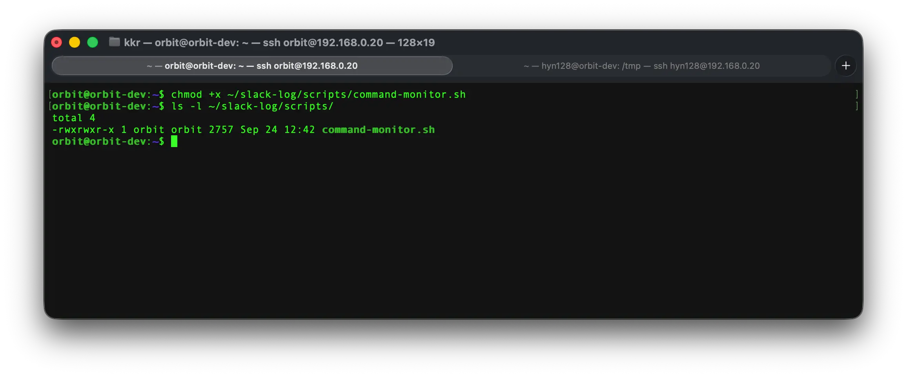

## 7. 모니터링 스크립트 systemd 서비스 등록

`command-monitor.sh`를 터미널에서 직접 실행하면 해당 터미널을 계속 점유하며, SSH 연결이 종료되거나 서버가 재부팅되었을 때 모니터링도 중단됩니다.

따라서 스크립트를 `systemd` 서비스로 등록하여 백그라운드에서 계속 실행되도록 구성합니다.

서비스 파일을 생성합니다.

```bash
sudo nano /etc/systemd/system/command-monitor.service
```

다음 내용을 작성합니다.

```ini
[Unit]
Description=Orbit Slack Command Monitor
After=auditd.service network-online.target

[Service]
Type=simple
User=root
ExecStart=/home/orbit/slack-log/scripts/command-monitor.sh
Restart=always
RestartSec=3

[Install]
WantedBy=multi-user.target
```

서비스 설정을 적용합니다.

```bash
sudo systemctl daemon-reload
sudo systemctl enable --now command-monitor.service
```

서비스 상태를 확인합니다.

```bash
sudo systemctl status command-monitor.service
```

정상적으로 실행되고 있다면 다음과 같이 표시됩니다.

```text
Active: active (running)
```

스크립트를 수정한 이후에는 서비스를 다시 시작하여 변경 사항을 적용합니다.

```bash
sudo systemctl restart command-monitor.service
```

## 8. 동작 테스트

다른 사용자 계정으로 접속하여 일반 명령을 실행합니다.

```bash
ls -al
```

해당 사용자의 개인 Slack 채널에 일반 명령 로그가 전송되는지 확인합니다.

이후 `sudo` 명령을 실행합니다.

```bash
sudo whoami
```

정상적으로 동작한다면 다음과 같이 분기됩니다.

```text
ls -al
└─ #dev-hyn128

sudo whoami
├─ #dev-hyn128
└─ #dev-all-sudo
```

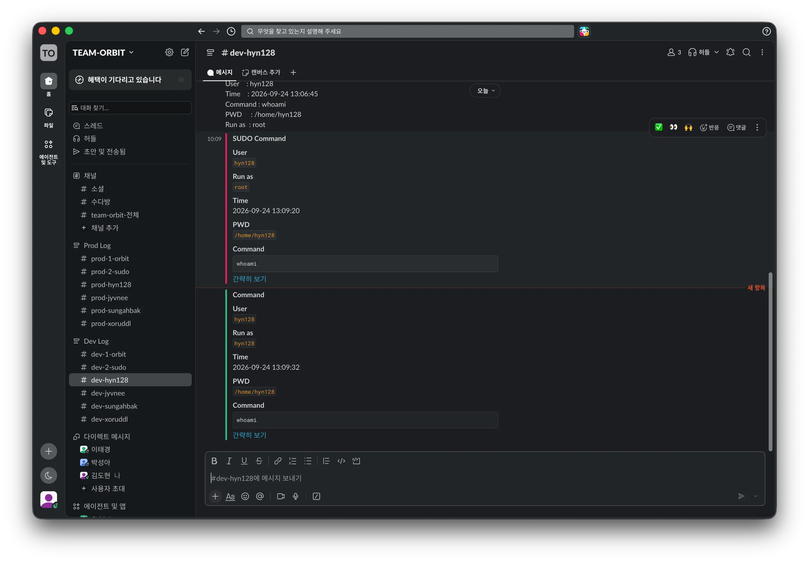

이를 통해 사용자별 일반 명령과 `sudo` 명령을 Slack에서 실시간으로 확인할 수 있으며, 서버 재부팅 이후에도 `command-monitor.service`가 자동으로 실행되어 모니터링을 계속 수행합니다.