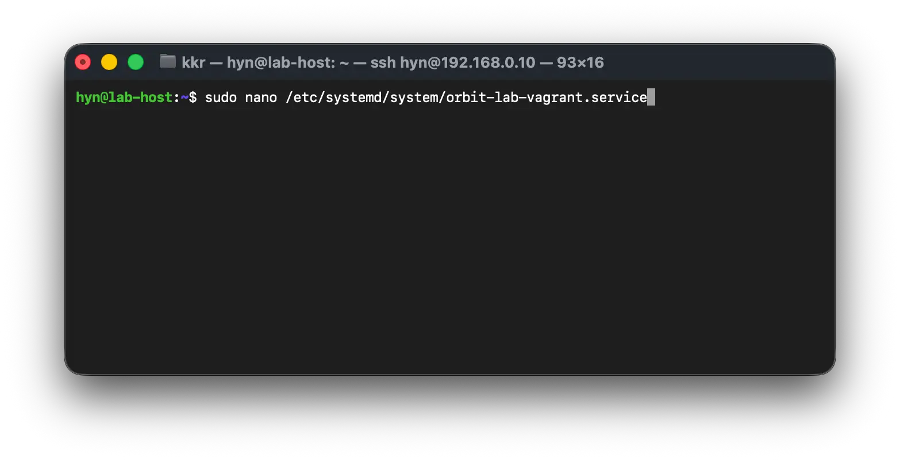
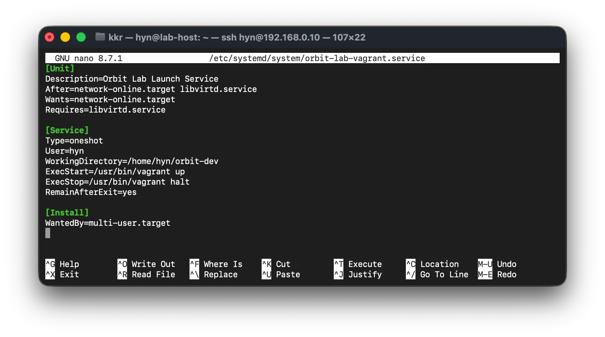
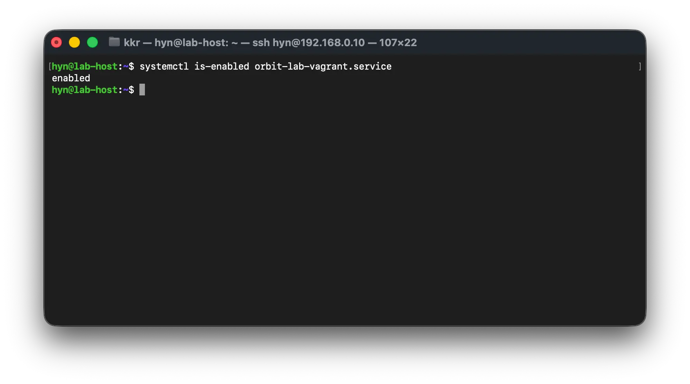
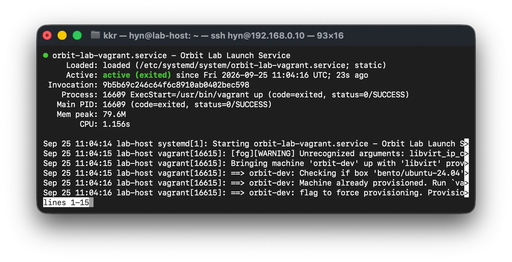
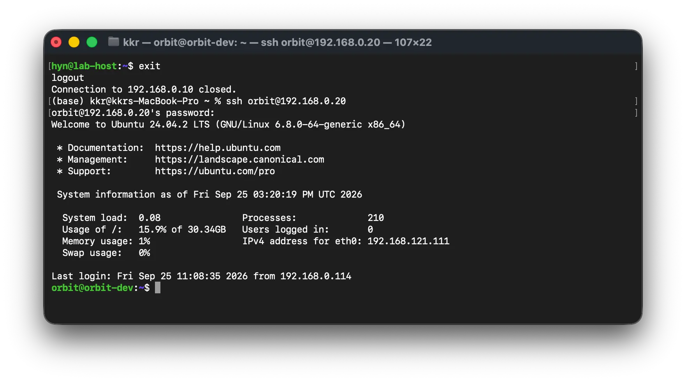

## 1. 아이디어

> 현재 홈서버를 WOL로 원격 부팅 후, SSH에 접속하여 Dev 서버의 Virtual Machine을 Host 서버에서 띄워주는 방식을 사용중이었습니다. 따라서 매번 Dev 서버를 띄우기 위해 반복 되는 수작업이 많아 Systemctl을 이용해 호스트 부팅 시 백그라운드 서비스를 실행할 필요를 느꼈습니다.

### Dev Server VM 구동 과정

#### 변경 전

1. 홈 네트워크 VPN 접속
2. 호스트 서버로 WOL 매직 패킷 전송
3. 부팅 대기 및 호스트 서버 SSH 접속
4. Dev VM의 `Vagrantfile` 이 위치한 디렉토리로 이동
5. `vagrant up` 명령 수행
6. ping 또는 ssh로 실행 확인

#### 변경 후

1. 홈 네트워크 VPN 접속
2. 호스트 서버로 WOL 매직 패킷 전송
3. 부팅 후 자동 `vagrant up` 수행
4. ~~Slack으로의 서버 부팅 알림 전송(Prometheus/Grafana 구축 후 예정)~~

## 2. 서비스 파일 작성 및 등록

### 1) 서비스 파일 생성

우분투에서 사용자 지정 프로그램을 백그라운드 서비스(데몬)로 등록하고, `systemctl` 로 관리하려면

`/etc/systemd/system/` 경로에 `.service` 파일을 작성해야 합니다.

먼저 데몬을 실행할 호스트 서버에 접속해 새 서비스 파일을 생성합니다.

```bash
sudo nano /etc/systemd/system/orbit-lab-vagrant.service
```



### 2) 서비스 파일 작성

파일 안에 아래와 같이 systemd 데몬 내용을 작성합니다.

```bash
[Unit]
Description=Orbit Lab Launch Service
After=network-online.target libvirtd.service
Wants=network-online.target
Requires=libvirtd.service

[Service]
Type=oneshot
User=hyn
WorkingDirectory=/home/hyn/orbit-dev
ExecStart=/usr/bin/vagrant up
ExecStop=/usr/bin/vagrant halt
RemainAfterExit=yes

[Install]
WantedBy=multi-user.target
```



아래는 작성한 파일의 세부 내용입니다.

|**항목**|**설정값**|**설명**|
|---|---|---|
|`[Unit]`|-|서비스의 기본 정보 및 다른 Unit과의 관계를 정의하는 영역|
|`Description`|`Orbit Lab Launch Service`|서비스의 설명을 지정. `systemctl status` 등에서 표시됨|
|`[Service]`|-|서비스가 어떤 방식으로 실행되고 종료되는지 정의하는 영역|
|`Type`|`oneshot`|명령을 한 번 실행하고 완료될 때까지 기다리는 방식. `vagrant up`처럼 실행 후 명령 자체는 종료되는 작업에 적합|
|`User`|`hyn`|서비스를 `hyn` 사용자 권한으로 실행|
|`WorkingDirectory`|`/home/hyn/orbit-dev`|명령을 실행할 작업 디렉터리. 해당 디렉터리의 `Vagrantfile`을 기준으로 Vagrant가 동작|
|`ExecStart`|`/usr/bin/vagrant up`|서비스 시작 시 실행할 명령. Vagrant VM을 시작|
|`ExecStop`|`/usr/bin/vagrant halt`|서비스 중지 시 실행할 명령. Vagrant VM을 정상 종료|
|`RemainAfterExit`|`yes`|`vagrant up` 명령이 종료된 이후에도 systemd에서 서비스를 `active (exited)` 상태로 유지|
|`[Install]`|-|`systemctl enable` 실행 시 서비스를 어떤 target에 등록할지 정의하는 영역|
|`WantedBy`|`multi-user.target`|일반적인 다중 사용자 부팅 단계에서 서비스를 자동으로 시작하도록 등록. `systemctl enable`을 가능하게 함|

## 3. 서비스 시작

먼저 생성된 파일(데몬)을 아래 명렁을 통해 불러옵니다.

```bash
sudo systemctl daemon-reload
```

작성된 서비스를 부팅 시 자동 시작하도록 등롱합니다.

```bash
sudo systemctl enable orbit-lab-vagrant.service
```



등록된 서비스를 즉시 재시작합니다.

```bash
sudo systemctl start orbit-lab-vagrant.service
```



이 외의 주요 systemctl 명령은 다음과 같습니다.

```bash
# 상태 확인
sudo systemctl status orbit-lab-vagrant.service

# 중지
sudo systemctl stop orbit-lab-vagrant.service

# 재시작
suto systemctl restart orbit-lab-vagrant.service

# 자동 시작 해제
sudo systemctl disable orbit-lab-vagrant.service
```

## 4. 재부팅 후 VM 접속 확인

작성된 서비스가 부팅 후 systemctl로 정상실행이 되었고 그 과정에서 문제가 없었다면, VM에 접속이 가능해야 합니다.

따라서 `sudo reboot` 으로 호스트를 재시작, VM으로 접속을 시도해 아래와 같은 부팅이 정상적으로 완료된 화면을 확인할 수 있었습니다.

